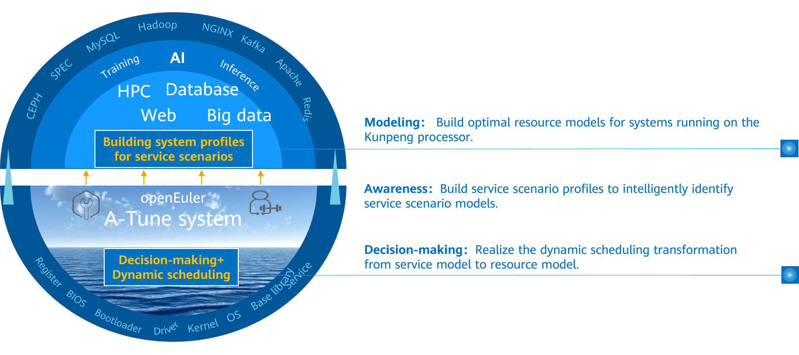
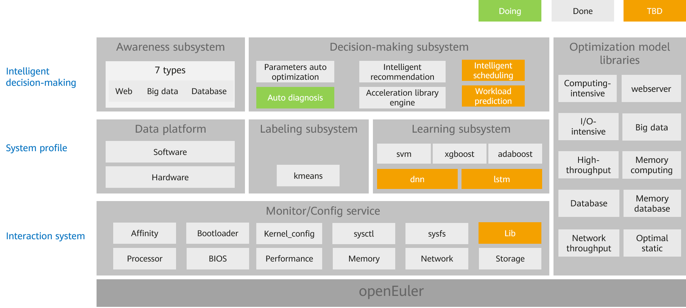

# Getting to Know A-Tune

-   [Getting to Know A-Tune](#getting-to-know-a-tune)
    -   [Introduction](#introduction)
    -   [Architecture](#architecture)
    -   [Supported Features and Service Models](#supported-features-and-service-models)

## Introduction

An operating system \(OS\) is basic software that connects applications and hardware. It is critical for users to adjust OS and application configurations and make full use of software and hardware capabilities to achieve optimal service performance. However, numerous workload types and varied applications run on the OS, and the requirements on resources are different. Currently, the application environment composed of hardware and software involves more than 7000 configuration objects. As the service complexity and optimization objects increase, the time cost for optimization increases exponentially. As a result, optimization efficiency decreases sharply. Optimization becomes complex and brings great challenges to users.

Second, as infrastructure software, the OS provides a large number of software and hardware management capabilities. The capability required varies in different scenarios. Therefore, capabilities need to be enabled or disabled depending on scenarios, and a combination of capabilities will maximize the optimal performance of applications.

In addition, the actual business embraces hundreds and thousands of scenarios, and each scenario involves a wide variety of hardware configurations for computing, network, and storage. The lab cannot list all applications, business scenarios, and hardware combinations.

To address the preceding challenges, openEuler launches A-Tune.

A-Tune is an AI-based engine that optimizes system performance. It uses AI technologies to precisely profile business scenarios, discover and infer business characteristics, so as to make intelligent decisions, match with the optimal system parameter configuration combination, and give recommendations, ensuring the optimal business running status.

## Architecture

The following figure shows the A-Tune core technical architecture, which consists of intelligent decision-making, system profile, and interaction system.

-   Intelligent decision-making layer: consists of the awareness and decision-making subsystems, which implements intelligent awareness of applications and system optimization decision-making, respectively.
-   System profile layer: consists of the labeling and learning subsystems. The labeling subsystem is used to cluster service models, and the learning subsystem is used to learn and classify service models.
-   Interaction system layer: monitors and configures various system resources and executes optimization policies.

## Supported Features and Service Models

### Supported Features

[Table 1](#table1919220557576)  describes the main features supported by A-Tune, feature maturity, and usage suggestions.

**Table  1**  Feature maturity

<table><thead align="left"><tr id="row81921355135715"><th class="cellrowborder" valign="top" width="33.33333333333333%" id="mcps1.2.4.1.1">
<strong id="b175661223205512">Feature</strong>

</th>
<th class="cellrowborder" valign="top" width="33.33333333333333%" id="mcps1.2.4.1.2">
<strong id="b1386461334120">Maturity</strong>

</th>
<th class="cellrowborder" valign="top" width="33.33333333333333%" id="mcps1.2.4.1.3">
<strong id="b135113227419">Usage Suggestion</strong>

</th>
</tr>
</thead>
<tbody><tr id="row519275518572"><td class="cellrowborder" valign="top" width="33.33333333333333%" headers="mcps1.2.4.1.1 ">
Auto optimization of 11 applications in seven workload types

</td>
<td class="cellrowborder" valign="top" width="33.33333333333333%" headers="mcps1.2.4.1.2 ">
Tested

</td>
<td class="cellrowborder" valign="top" width="33.33333333333333%" headers="mcps1.2.4.1.3 ">
Pilot

</td>
</tr>
<tr id="row919217552579"><td class="cellrowborder" valign="top" width="33.33333333333333%" headers="mcps1.2.4.1.1 ">
User-defined workload types and service models

</td>
<td class="cellrowborder" valign="top" width="33.33333333333333%" headers="mcps1.2.4.1.2 ">
Tested

</td>
<td class="cellrowborder" valign="top" width="33.33333333333333%" headers="mcps1.2.4.1.3 ">
Pilot

</td>
</tr>
<tr id="row71921155165711"><td class="cellrowborder" valign="top" width="33.33333333333333%" headers="mcps1.2.4.1.1 ">
Automatic parameter optimization

</td>
<td class="cellrowborder" valign="top" width="33.33333333333333%" headers="mcps1.2.4.1.2 ">
Tested

</td>
<td class="cellrowborder" valign="top" width="33.33333333333333%" headers="mcps1.2.4.1.3 ">
Pilot

</td>
</tr>
</tbody>
</table>

### Supported Service Models

Based on the workload characteristics of applications, A-Tune classifies services into seven types. For details about the workload characteristics of each type and the applications supported by A-Tune, see  [Table 2](#table2819164611311).

**Table  2**  Supported workload types and applications

<table><thead align="left"><tr id="row49114466133"><th class="cellrowborder" valign="top" width="22.12%" id="mcps1.2.5.1.1">
<strong id="b15640174472810">Workload</strong>

</th>
<th class="cellrowborder" valign="top" width="12.959999999999999%" id="mcps1.2.5.1.2">
<strong id="b155287539280">Type</strong>

</th>
<th class="cellrowborder" valign="top" width="37.269999999999996%" id="mcps1.2.5.1.3">
<strong id="b1378654312217">Workload Characteristic</strong>

</th>
<th class="cellrowborder" valign="top" width="27.650000000000002%" id="mcps1.2.5.1.4">
<strong id="b1191411502021">Supported Application</strong>

</th>
</tr>
</thead>
<tbody><tr id="row17911114651318"><td class="cellrowborder" valign="top" width="22.12%" headers="mcps1.2.5.1.1 ">
default

</td>
<td class="cellrowborder" valign="top" width="12.959999999999999%" headers="mcps1.2.5.1.2 ">
Default type

</td>
<td class="cellrowborder" valign="top" width="37.269999999999996%" headers="mcps1.2.5.1.3 ">
The usage of CPU, memory bandwidth, network, and I/O resources is low.

</td>
<td class="cellrowborder" valign="top" width="27.650000000000002%" headers="mcps1.2.5.1.4 ">
N/A

</td>
</tr>
<tr id="row791164631318"><td class="cellrowborder" valign="top" width="22.12%" headers="mcps1.2.5.1.1 ">
webserver

</td>
<td class="cellrowborder" valign="top" width="12.959999999999999%" headers="mcps1.2.5.1.2 ">
HTTPS application

</td>
<td class="cellrowborder" valign="top" width="37.269999999999996%" headers="mcps1.2.5.1.3 ">
The CPU usage is high.

</td>
<td class="cellrowborder" valign="top" width="27.650000000000002%" headers="mcps1.2.5.1.4 ">
Nginx

</td>
</tr>
<tr id="row13911946141311"><td class="cellrowborder" valign="top" width="22.12%" headers="mcps1.2.5.1.1 ">
big_database

</td>
<td class="cellrowborder" valign="top" width="12.959999999999999%" headers="mcps1.2.5.1.2 ">
Database

</td>
<td class="cellrowborder" valign="top" width="37.269999999999996%" headers="mcps1.2.5.1.3 "><ul id="ul3724104521013"><li>Relational database
Read: The usage of CPU, memory bandwidth, and network is high.

Write: The usage of I/O is high.

</li></ul>
<ul id="ul26021547101013"><li>Non-relational database
The usage of CPU and I/O is high.

</li></ul>
</td>
<td class="cellrowborder" valign="top" width="27.650000000000002%" headers="mcps1.2.5.1.4 ">
MongoDB, MySQL, PostgreSQL, and MariaDB

</td>
</tr>
<tr id="row3911174641312"><td class="cellrowborder" valign="top" width="22.12%" headers="mcps1.2.5.1.1 ">
big_data

</td>
<td class="cellrowborder" valign="top" width="12.959999999999999%" headers="mcps1.2.5.1.2 ">
Big data

</td>
<td class="cellrowborder" valign="top" width="37.269999999999996%" headers="mcps1.2.5.1.3 ">
The usage of CPU and I/O is high.

</td>
<td class="cellrowborder" valign="top" width="27.650000000000002%" headers="mcps1.2.5.1.4 ">
Hadoop and Spark

</td>
</tr>
<tr id="row591112462132"><td class="cellrowborder" valign="top" width="22.12%" headers="mcps1.2.5.1.1 ">
in-memory_computing

</td>
<td class="cellrowborder" valign="top" width="12.959999999999999%" headers="mcps1.2.5.1.2 ">
Memory-intensive application

</td>
<td class="cellrowborder" valign="top" width="37.269999999999996%" headers="mcps1.2.5.1.3 ">
The usage of CPU and memory bandwidth is high.

</td>
<td class="cellrowborder" valign="top" width="27.650000000000002%" headers="mcps1.2.5.1.4 ">
SPECjbb2015

</td>
</tr>
<tr id="row59121246181320"><td class="cellrowborder" valign="top" width="22.12%" headers="mcps1.2.5.1.1 ">
in-memory_database

</td>
<td class="cellrowborder" valign="top" width="12.959999999999999%" headers="mcps1.2.5.1.2 ">
Computing- and network-intensive application

</td>
<td class="cellrowborder" valign="top" width="37.269999999999996%" headers="mcps1.2.5.1.3 ">
The usage of a single-core CPU is high, and the network usage is high in multi-instance scenarios.

</td>
<td class="cellrowborder" valign="top" width="27.650000000000002%" headers="mcps1.2.5.1.4 ">
Redis

</td>
</tr>
<tr id="row1891264641315"><td class="cellrowborder" valign="top" width="22.12%" headers="mcps1.2.5.1.1 ">
single_computer_intensive_jobs

</td>
<td class="cellrowborder" valign="top" width="12.959999999999999%" headers="mcps1.2.5.1.2 ">
Computing-intensive application

</td>
<td class="cellrowborder" valign="top" width="37.269999999999996%" headers="mcps1.2.5.1.3 ">
The usage of a single-core CPU is high, and the usage of memory bandwidth of some subitems is high.

</td>
<td class="cellrowborder" valign="top" width="27.650000000000002%" headers="mcps1.2.5.1.4 ">
SPECCPU2006

</td>
</tr>
<tr id="row2912184671312"><td class="cellrowborder" valign="top" width="22.12%" headers="mcps1.2.5.1.1 ">
communication

</td>
<td class="cellrowborder" valign="top" width="12.959999999999999%" headers="mcps1.2.5.1.2 ">
Network-intensive application

</td>
<td class="cellrowborder" valign="top" width="37.269999999999996%" headers="mcps1.2.5.1.3 ">
The usage of CPU and network is high.

</td>
<td class="cellrowborder" valign="top" width="27.650000000000002%" headers="mcps1.2.5.1.4 ">
Dubbo

</td>
</tr>
<tr id="row1991224641317"><td class="cellrowborder" valign="top" width="22.12%" headers="mcps1.2.5.1.1 ">
idle

</td>
<td class="cellrowborder" valign="top" width="12.959999999999999%" headers="mcps1.2.5.1.2 ">
System in idle state

</td>
<td class="cellrowborder" valign="top" width="37.269999999999996%" headers="mcps1.2.5.1.3 ">
The system is in idle state and no applications are running.

</td>
<td class="cellrowborder" valign="top" width="27.650000000000002%" headers="mcps1.2.5.1.4 ">
N/A

</td>
</tr>
</tbody>
</table>

