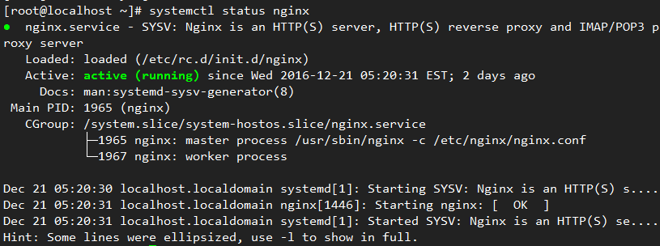
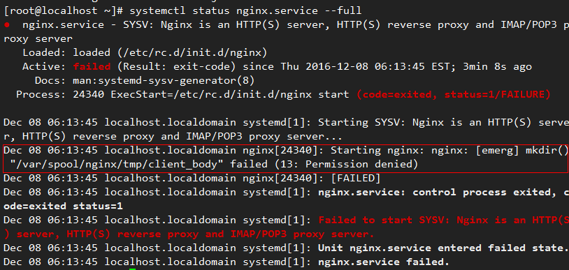
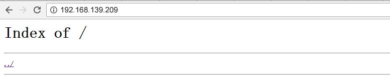

# Configuring the Repo Server

> **NOTE:** 
> openEuler provides multiple repo sources for users online. For details about the repo sources, see [System Installation](../Releasenotes/installing-the-os.html). If you cannot obtain the openEuler repo source online, you can use the ISO release package provided by openEuler to create a local openEuler repo source. This section uses the  **openEuler-20.03-LTS-aarch64-dvd.iso**  file as an example. Modify the ISO file as required.
 
<!-- TOC -->

- [Configuring the Repo Server](#configuring-the-repo-server)
    - [Overview](#overview)
    - [Creating or Updating a Local Repo Source](#creating-or-updating-a-local-repo-source)
        - [Obtaining the ISO File](#obtaining-the-iso-file)
        - [Mounting an ISO File to Create a Repo Source](#mounting-an-iso-file-to-create-a-repo-source)
        - [Creating a Local Repo Source](#creating-a-local-repo-source)
        - [Updating the Repo Source](#updating-the-repo-source)
    - [Deploying the Remote Repo Source](#deploying-the-remote-repo-source)
        - [Installing and Configuring Nginx](#installing-and-configuring-nginx)
        - [Starting Nginx](#starting-nginx)
        - [Deploying the Repo Source](#deploying-the-repo-source)
    - [Using the repo Source](#using-the-repo-source)
        - [Configuring repo as the yum Source](#configuring-repo-as-the-yum-source)
        - [repo Priority](#repo-priority)
        - [Related Commands of dnf](#related-commands-of-dnf)

<!-- /TOC -->
## Overview

Create the  **openEuler-20.03-LTS-aarch64-dvd.iso**  file provided by openEuler as the repo source. The following uses Nginx as an example to describe how to deploy the repo source and provide the HTTP service.

## Creating or Updating a Local Repo Source

Mount the openEuler ISO file  **openEuler-20.03-LTS-aarch64-dvd.iso**  to create and update a repo source.

### Obtaining the ISO File

Obtain the openEuler ISO file from the following website:

[https://repo.openeuler.org/openEuler-20.03-LTS/ISO/](https://repo.openeuler.org/openEuler-20.03-LTS/ISO/)

### Mounting an ISO File to Create a Repo Source

Run the mount command as the **root** user to mount the ISO file.

The following is an example:

```
# mount /home/openEuler/openEuler-20.03-LTS-aarch64-dvd.iso /mnt/
```

The mounted mnt directory is as follows:

```
.
│── boot.catalog
│── docs
│── EFI
│── images
│── Packages
│── repodata
│── TRANS.TBL
└── RPM-GPG-KEY-openEuler
```

In the preceding command,  **Packages**  indicates the directory where the RPM package is stored,  **repodata**  indicates the directory where the repo source metadata is stored, and  **RPM-GPG-KEY-openEuler**  indicates the public key for signing openEuler.

### Creating a Local Repo Source

You can copy related files in the ISO file to a local directory to create a local repo source. The following is an example:

```
# mount /home/openEuler/openEuler-20.03-LTS-aarch64-dvd.iso /mnt/
$ mkdir -p ~/srv/repo/
$ cp -r /mnt/Packages ~/srv/repo/
$ cp -r /mnt/repodata ~/srv/repo/
$ cp -r /mnt/RPM-GPG-KEY-openEuler ~/srv/repo/
```

The local repo directory is as follows:

```
.
│── Packages
│── repodata
└── RPM-GPG-KEY-openEuler
```

**Packages**  indicates the directory where the RPM package is stored,  **repodata**  indicates the directory where the repo source metadata is stored, and  **RPM-GPG-KEY-openEuler**  indicates the public key for signing openEuler.

### Updating the Repo Source

You can update the repo source in either of the following ways:

- Use the ISO file of the new version to update the existing repo source. The method is the same as that for creating a repo source. That is, mount the ISO file or copy the ISO file to the local directory.

- Add rpm packages to the Packages directory of the repo source and run the createrepo command to update the repo source.
  
  ```
  $ createrepo --update --workers=10 ~/srv/repo
  ```

In this command, --update indicates the update, and --workers indicates the number of threads, which can be customized.

>  **NOTE:**  
If the command output contains "createrepo: command not found", run the **dnf install createrepo** command as the **root** user to install the **createrepo** softeware.

## Deploying the Remote Repo Source

Install openEuler OS and deploy the repo source using Nginx on openEuler OS.

### Installing and Configuring Nginx

1. Download the Nginx tool and install it as the **root** user.

2. After installing Nginx, configure /etc/nginx/nginx.conf as the **root** user.
   
   >  **NOTE:**  
The configuration content in this document is for reference only. You can configure the content based on the site requirements (for example, security hardening requirements).
   
   ```
   user  nginx;
   worker_processes auto;                             # You are advised to set this parameter to core-1.
   error_log /var/log/nginx/error.log warn;            # log storage location
   pid        /var/run/nginx.pid;
   
   events {
       worker_connections  1024;
   }
   
   http {
       include       /etc/nginx/mime.types;
       default_type  application/octet-stream;
   
       log_format  main  '$remote_addr - $remote_user [$time_local] "$request" '
                         '$status $body_bytes_sent "$http_referer" '
                         '"$http_user_agent" "$http_x_forwarded_for"';
   
       access_log  /var/log/nginx/access.log  main;
       sendfile        on;
       keepalive_timeout  65;
   
       server {
           listen       80;
   		server_name localhost;                         #Server name (URL)
           client_max_body_size 4G;
   		root /usr/share/nginx/repo;                 #Default service directory
   
           location / {
   			autoindex on;	# Enable the access to lower-layer files in the directory.
               autoindex_exact_size on;
               autoindex_localtime  on; 
           }
   
       }
   
   }
   ```

### Starting Nginx

1. Run the systemd command as the **root** user to start the Nginx service.
   
   ```
   # systemctl enable nginx
   # systemctl start nginx
   ```

2. You can run the following command to check whether the Nginx is started successfully:
   
   ```
   $ systemctl status nginx
   ```
   
   - [Figure 1](#en-us_topic_0151920971_fd25e3f1d664b4087ae26631719990a71)  indicates that the Nginx service is started successfully.
     
     **Figure  1**  The Nginx service is successfully started.<a name="en-us_topic_0151920971_fd25e3f1d664b4087ae26631719990a71"></a>  

   
   - If the Nginx service fails to be started, view the error information.
   
   ```
   $ systemctl status nginx.service --full
   ```
   
       **Figure  2**  Nginx startup failure<a name="en-us_topic_0151920971_f1f9f3d086e454b9cba29a7cae96a4c54"></a>  
       
   
   As shown in  [Figure 2](#en-us_topic_0151920971_f1f9f3d086e454b9cba29a7cae96a4c54), the Nginx service fails to be created because the /var/spool/nginx/tmp/client\_body directory fails to be created. You need to manually create the directory as the **root** user. Similar problems are solved as follows:
   
   ```
   # mkdir -p /var/spool/nginx/tmp/client_body
   # mkdir -p /var/spool/nginx/tmp/proxy
   # mkdir -p /var/spool/nginx/tmp/fastcgi
   # mkdir -p /usr/share/nginx/uwsgi_temp
   # mkdir -p /usr/share/nginx/scgi_temp
   ```

### Deploying the Repo Source

1. Run the following command as the **root** user to create the /usr/share/nginx/repo directory specified in the Nginx configuration file /etc/nginx/nginx.conf:
   
   ```
   # mkdir -p /usr/share/nginx/repo
   ```

2. Run the followding command as the **root** user to modify the /usr/share/nginx/repo directory permission:
   
   ```
   # chmod -R 755 /usr/share/nginx/repo
   ```

3. Configure firewall rules as the **root** user to enable the port (port 80) configured for Nginx.
   
   ```
   # firewall-cmd --add-port=80/tcp --permanent
   # firewall-cmd --reload
   ```
   
   Check whether port 80 is enabled as the **root** user. If the output is **yes**, port 80 is enabled.
   
   ```
   # firewall-cmd --query-port=80/tcp
   ```
   
   You can also enable port 80 using iptables as the **root** user.
   
   ```
   # iptables -I INPUT -p tcp --dport 80 -j ACCEPT
   ```

4. After the Nginx service is configured, you can use the IP address to access the web page, as shown in  [Figure 3](#en-us_topic_0151921017_fig1880404110396).
   
   **Figure  3**  Nginx deployment succeeded<a name="en-us_topic_0151921017_fig1880404110396"></a>  


5. Use either of the following methods to add the repo source to the /usr/share/nginx/repo directory:
   
   - Copy related files in the image to the /usr/share/nginx/repo directory as the **root** user.
     
     ```
     # mount /home/openEuler/openEuler-20.03-LTS-aarch64-dvd.iso  /mnt/
     # cp -r /mnt/Packages /usr/share/nginx/repo/
     # cp -r /mnt/repodata /usr/share/nginx/repo/
     # cp -r /mnt/RPM-GPG-KEY-openEuler /usr/share/nginx/repo/
     # chmod -R 755 /usr/share/nginx/repo
     ```
     
     The  **openEuler-20.03-LTS-aarch64-dvd.iso**  file is stored in the  **/home/openEuler**  directory.
   
   - Create a soft link for the repo source in the /usr/share/nginx/repo directory as the **root** user.
     
     ```
     # ln -s /mnt /usr/share/nginx/repo/os
     ```
     
     /mnt is the created repo source, and /usr/share/nginx/repo/os points to /mnt.

## Using the repo Source

The repo source can be configured as a yum source. Yellow dog Updater,Modified (yum for short) is a shell front-end software package manager. Based on the Redhat package manager (RPM), YUM can automatically download the rpm package from the specified server, install the package, and process dependent relationship. It supports one-off installation for all dependent software packages.

### Configuring repo as the yum Source

You can configure the built repo as the yum source and create the \*\*\*.repo configuration file (the extension .repo is mandatory) in the /etc/yum.repos.d/ directory as the **root** user. You can configure the yum source on the local host or HTTP server.

- Configuring the local yum source.
  
  Create the  **openEuler.repo**  file in the  **/etc/yum.repos.d**  directory and use the local repository as the yum source. The content of the  **openEuler.repo**  file is as follows:
  
  ```
  [base]
  name=base
  baseurl=file:///home/openEuler/srv/repo
  enabled=1
  gpgcheck=1
  gpgkey=file:///home/openEuler/srv/repo/RPM-GPG-KEY-openEuler
  ```
  
  >  **NOTE:**
  > 
  > - The repoid in \[repoid\] indicates the ID of the software repository. Repoids in all .repo configuration files must be unique. In the example, repoid is set to **base**.
  > - **name** indicates the string that the software repository describes.
  > - **baseurl** indicates the address of the software repository.
  > - **enabled** indicates whether to enable the software source repository. The value can be **1** or **0**. The default value is **1**, indicating that the software source repository is enabled.
  > - **gpgcheck** indicates whether to enable the GNU privacy guard (GPG) to check the validity and security of sources of RPM packages.  **1**  indicates GPG check is enabled.  **0**  indicates the GPG check is disabled. If this option is not specified, the GPG check is enabled by default.
  > - **gpgkey** is the public key used to verify the signature.

- Configuring the yum source for the HTTP server
  
  Create the **openEuler.repo** file in the **/etc/yum.repos.d** directory.
  
  - If the repo source of the HTTP server deployed by the user is used as the yum source, the content of **openEuler.repo** is as follows:
    
    ```
    [base]
    name=base
    baseurl=http://192.168.139.209/
    enabled=1
    gpgcheck=1
    gpgkey=http://192.168.139.209/RPM-GPG-KEY-openEuler
    ```
    
    >  **NOTE:**  
    > 192.168.139.209 is an example. Replace it with the actual IP address.
  
  - If the openEuler repo source provided by openEuler is used as the yum source, the content of **openEuler.repo** is as follows (the aarch64-based OS repo source is used as an example):
    
    ```
    [base]
    name=base
    baseurl=http://repo.openeuler.org/openEuler-20.03-LTS/OS/aarch64/
    enabled=1
    gpgcheck=1
    gpgkey=http://repo.openeuler.org/openEuler-20.03-LTS/OS/aarch64/RPM-GPG-KEY-openEuler
    ```

### repo Priority

If there are multiple repo sources, you can set the repo priority in the .repo file. If the priority is not set, the default priority is 99. If the same RPM package exists in the sources with the same priority, the latest version is installed.  **1**  indicates the highest priority and  **99**  indicates the lowest priority. For example, set the priority of  **openEuler.repo**  to  **2**.

```
[base]
name=base
baseurl=http://192.168.139.209/
enabled=1
priority=2
gpgcheck=1
gpgkey=http://192.168.139.209/RPM-GPG-KEY-openEuler
```

### Related Commands of dnf

The dnf command can automatically parse the dependency between packages during installation and upgrade. The common usage method is as follows:

```
dnf <command> <packages name>
```

Common commands are as follows:

- Installation
  
  Run the following command as the **root** user.
  
  ```
  # dnf install <packages name>
  ```

- Upgrade
  
  Run the following command as the **root** user.
  
  ```
  # dnf update <packages name>
  ```

- Rollback
  
  Run the following command as the **root** user.
  
  ```
  # dnf downgrade <packages name>
  ```

- Checking for update
  
  ```
  $ dnf check-update
  ```

- Uninstallation
  
  Run the following command as the **root** user.
  
  ```
  # dnf remove <packages name>
  ```

- Query
  
  ```
  $ dnf search <packages name>
  ```

- Local installation
  
  Run the following command as the **root** user.
  
  ```
  # dnf localinstall <absolute path to package name>
  ```

- Viewing historical records
  
  ```
  $ dnf history
  ```

- Clearing cache records
  
  ```
  $ dnf clean all
  ```

- Updating cache
  
  ```
  $ dnf makecache
  ```