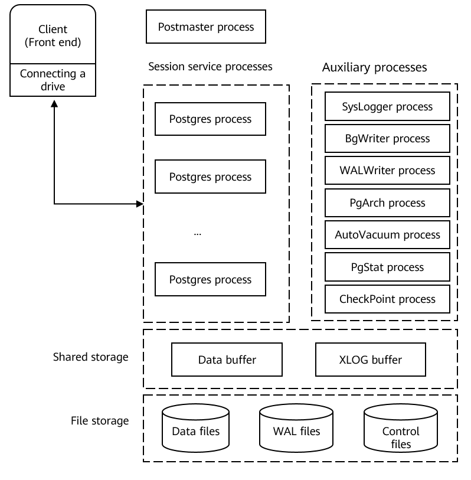
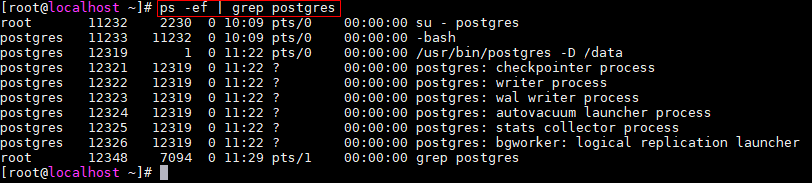
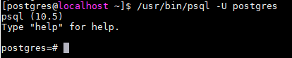
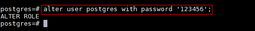
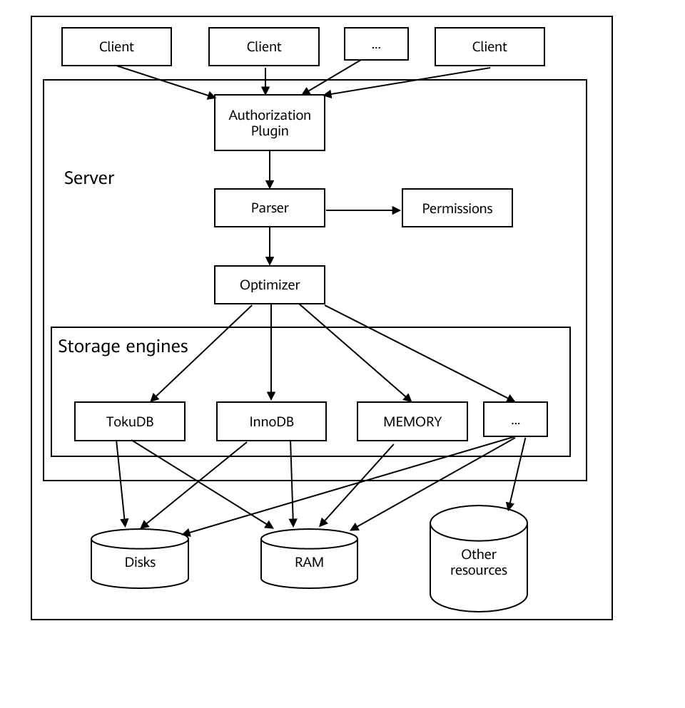
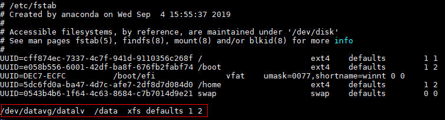
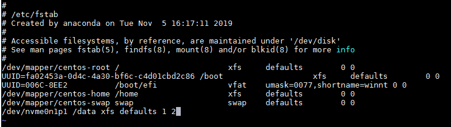
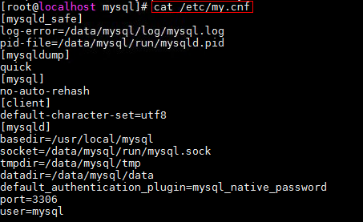
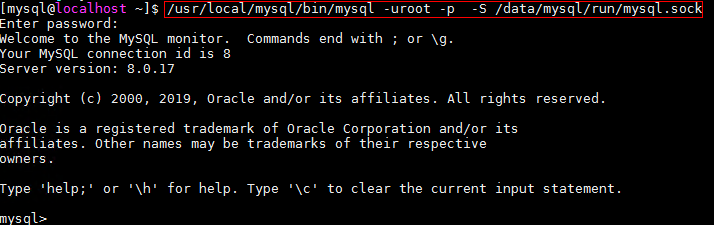
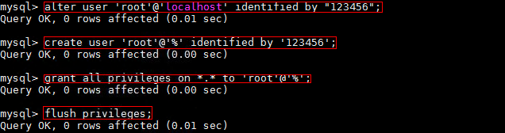

# Setting Up the Database Server
<!-- TOC -->

- [Setting Up the Database Server](#setting-up-the-database-server)
    - [PostgreSQL Server](#postgresql-server)
        - [Software Description](#software-description)
        - [Configuring the Environment](#configuring-the-environment)
        - [Installing, Running, and Uninstalling PostgreSQL](#installing-running-and-uninstalling-postgresql)
        - [Managing Database Roles](#managing-database-roles)
        - [Managing Databases](#managing-databases)
    - [MariaDB Server](#mariadb-server)
        - [Software Description](#software-description-1)
        - [Configuring the Environment](#configuring-the-environment-1)
        - [Installing, Running, and Uninstalling MariaDB Server](#installing-running-and-uninstalling-mariadb-server)
        - [Managing Database Users](#managing-database-users)
        - [Managing Databases](#managing-databases-1)
    - [MySQL Server](#mysql-server)
        - [Software Description](#software-description-2)
        - [Configuring the Environment](#configuring-the-environment-2)
        - [Installing, Running, and Uninstalling MySQL](#installing-running-and-uninstalling-mysql)
        - [Managing Database Users](#managing-database-users-1)
        - [Managing Databases](#managing-databases-2)

<!-- /TOC -->

## PostgreSQL Server


### Software Description

[Figure 1](#fig26022387391)  shows the PostgreSQL architecture and  [Table 1](#table62020913417)  describes the main processes.

**Figure  1**  PostgreSQL architecture<a name="fig26022387391"></a>  


**Table  1**  Main processes in PostgreSQL

<a name="table62020913417"></a>
<table><thead align="left"><tr id="row23365171"><th class="cellrowborder" valign="top" width="7.07%" id="mcps1.2.4.1.1"><p id="p13530737"><a name="p13530737"></a><a name="p13530737"></a>Process Type</p>
</th>
<th class="cellrowborder" valign="top" width="21.21%" id="mcps1.2.4.1.2"><p id="p22247923"><a name="p22247923"></a><a name="p22247923"></a>Process Name</p>
</th>
<th class="cellrowborder" valign="top" width="71.72%" id="mcps1.2.4.1.3"><p id="p57251362"><a name="p57251362"></a><a name="p57251362"></a>Description</p>
</th>
</tr>
</thead>
<tbody><tr id="row6848741"><td class="cellrowborder" valign="top" width="7.07%" headers="mcps1.2.4.1.1 "><p id="p17877157"><a name="p17877157"></a><a name="p17877157"></a>Main process</p>
</td>
<td class="cellrowborder" valign="top" width="21.21%" headers="mcps1.2.4.1.2 "><p id="p38763593"><a name="p38763593"></a><a name="p38763593"></a>Postmaster</p>
</td>
<td class="cellrowborder" valign="top" width="71.72%" headers="mcps1.2.4.1.3 "><p id="p52843322"><a name="p52843322"></a><a name="p52843322"></a>Postmaster process controls all database instances in general and is responsible for starting and stopping database instances.</p>
</td>
</tr>
<tr id="row5827850"><td class="cellrowborder" valign="top" width="7.07%" headers="mcps1.2.4.1.1 "><p id="p2293848"><a name="p2293848"></a><a name="p2293848"></a>Resident process</p>
</td>
<td class="cellrowborder" valign="top" width="21.21%" headers="mcps1.2.4.1.2 "><p id="p51584039"><a name="p51584039"></a><a name="p51584039"></a>Postgres (resident process)</p>
</td>
<td class="cellrowborder" valign="top" width="71.72%" headers="mcps1.2.4.1.3 "><p id="p17557663"><a name="p17557663"></a><a name="p17557663"></a>This process manages backend resident processes and is also called postmaster. By default, this process listens Unix domain sockets and the 5432 port of TCP/IP and waits for the front end to process the connections. You can change the listening port number in the <strong id="b9212646143411"><a name="b9212646143411"></a><a name="b9212646143411"></a>postgresql.conf</strong> file of PostgreSQL.</p>
</td>
</tr>
<tr id="row23801241"><td class="cellrowborder" valign="top" width="7.07%" headers="mcps1.2.4.1.1 "><p id="p48852384"><a name="p48852384"></a><a name="p48852384"></a>Subprocess</p>
</td>
<td class="cellrowborder" valign="top" width="21.21%" headers="mcps1.2.4.1.2 "><p id="p64729060"><a name="p64729060"></a><a name="p64729060"></a>Postgres (subprocess)</p>
</td>
<td class="cellrowborder" valign="top" width="71.72%" headers="mcps1.2.4.1.3 "><p id="p8562508"><a name="p8562508"></a><a name="p8562508"></a>The subprocess determines whether to allow the connection according to the security policy defined by the <strong id="b12671436153517"><a name="b12671436153517"></a><a name="b12671436153517"></a>pg_hba.conf</strong> file. According to the security policy, the subprocess rejects certain IP addresses and networks, allows only certain users to connect to the databases, or allows only certain databases to be connected.</p>
<p id="p9953713"><a name="p9953713"></a><a name="p9953713"></a>Postgres receives the query from the front end, searches the database, and returns the results. Sometimes, it also updates the database. The updated data is recorded in transaction logs (WAL logs for PostgreSQL). This method is used when the system is powered off, the server breaks down, or the server is restarted. In addition, the logs can also be used for data recovery in other scenarios. In PostgreSQL 9.0 or later, WAL logs can be transferred to other PostgreSQL systems to replicate database in real-time.</p>
</td>
</tr>
<tr id="row22474561"><td class="cellrowborder" rowspan="7" valign="top" width="7.07%" headers="mcps1.2.4.1.1 "><p id="p8500138"><a name="p8500138"></a><a name="p8500138"></a>Auxiliary processes</p>
</td>
<td class="cellrowborder" valign="top" width="21.21%" headers="mcps1.2.4.1.2 "><p id="p17422576"><a name="p17422576"></a><a name="p17422576"></a>SysLogger (system log)</p>
</td>
<td class="cellrowborder" valign="top" width="71.72%" headers="mcps1.2.4.1.3 "><p id="p1942522"><a name="p1942522"></a><a name="p1942522"></a>The main process starts the Syslogger auxiliary process only when <strong id="b4436165755314"><a name="b4436165755314"></a><a name="b4436165755314"></a>logging_collection</strong> in the <strong id="b24371257165319"><a name="b24371257165319"></a><a name="b24371257165319"></a>Postgres.conf</strong> file is set to <strong id="b1343715714533"><a name="b1343715714533"></a><a name="b1343715714533"></a>on</strong>.</p>
</td>
</tr>
<tr id="row17482700"><td class="cellrowborder" valign="top" headers="mcps1.2.4.1.1 "><p id="p6812600"><a name="p6812600"></a><a name="p6812600"></a>BgWriter (background write)</p>
</td>
<td class="cellrowborder" valign="top" headers="mcps1.2.4.1.2 "><p id="p14949724"><a name="p14949724"></a><a name="p14949724"></a>This process writes dirty pages from the shared memory to the drive. The purpose is to improve the performance of inserting, updating, and deleting data.</p>
</td>
</tr>
<tr id="row329795"><td class="cellrowborder" valign="top" headers="mcps1.2.4.1.1 "><p id="p26713455"><a name="p26713455"></a><a name="p26713455"></a>WALWriter (write-ahead log)</p>
</td>
<td class="cellrowborder" valign="top" headers="mcps1.2.4.1.2 "><p id="p16306280"><a name="p16306280"></a><a name="p16306280"></a>This process writes modification operations into drives before data is modified so that the data does not need to be persisted into files in subsequent real-time data updates.</p>
</td>
</tr>
<tr id="row12538797"><td class="cellrowborder" valign="top" headers="mcps1.2.4.1.1 "><p id="p9009603"><a name="p9009603"></a><a name="p9009603"></a>PgArch (archive)</p>
</td>
<td class="cellrowborder" valign="top" headers="mcps1.2.4.1.2 "><p id="p58689242"><a name="p58689242"></a><a name="p58689242"></a>write-ahead logs (WALs) are recycled. The PgArch process backs up WALs before archiving them. After the entire database is backed up, the Point in Time Recovery (PITR) technology can be used to archive WALs. The database can be restored to any point after the full backup by using the full backup data and the subsequently archived WALs.</p>
</td>
</tr>
<tr id="row58441133"><td class="cellrowborder" valign="top" headers="mcps1.2.4.1.1 "><p id="p36111336"><a name="p36111336"></a><a name="p36111336"></a>AutoVacuum (automatic cleanup)</p>
</td>
<td class="cellrowborder" valign="top" headers="mcps1.2.4.1.2 "><p id="p39337079"><a name="p39337079"></a><a name="p39337079"></a>In the PostgreSQL database, after a DELETE operation is performed on a table, old data is not immediately deleted. When new data is added, the system creates a data row instead of overwriting the old data. The old data is only marked as deleted and will be cleared only when no other concurrent transactions are reading the data. In this case, the data is cleared by the AutoVacuum process.</p>
</td>
</tr>
<tr id="row18489394"><td class="cellrowborder" valign="top" headers="mcps1.2.4.1.1 "><p id="p21245915"><a name="p21245915"></a><a name="p21245915"></a>PgStat (statistics collection)</p>
</td>
<td class="cellrowborder" valign="top" headers="mcps1.2.4.1.2 "><p id="p43197516"><a name="p43197516"></a><a name="p43197516"></a>This process collects data statistics. It is used to estimate the cost during query optimization, including the number of insertions update, and deletion operations performed on a table or index, the number of drive block read and write operations, and the number of row read operations. <strong id="b1147814611311"><a name="b1147814611311"></a><a name="b1147814611311"></a>pg_statistic</strong> stores the information collected by the PgStat.</p>
</td>
</tr>
<tr id="row53233327"><td class="cellrowborder" valign="top" headers="mcps1.2.4.1.1 "><p id="p16932256"><a name="p16932256"></a><a name="p16932256"></a>CheckPoint (checkpoint)</p>
</td>
<td class="cellrowborder" valign="top" headers="mcps1.2.4.1.2 "><p id="p29335534"><a name="p29335534"></a><a name="p29335534"></a>A checkpoint is a transaction sequence point set by the system. It is used to ensure that log information before a checkpoint written into the drives.</p>
</td>
</tr>
</tbody>
</table>

### Configuring the Environment

> **NOTE:**   
>The following environment configuration is for reference only. Configure the environment based on the site requirements.  


#### Disabling the Firewall and Automatic Startup

> **NOTE:**   
>It is recommended that firewall be disabled in the test environment to prevent network impact. Configure the firewall based on actual requirements.  

1.  Stop the firewall service as the **root** user.

    ```
    # systemctl stop firewalld
    ```

2.  Disable the firewall service as the **root** user.

    ```
    # systemctl disable firewalld
    ```

    > **NOTE:**   
    >The automatic startup is automatically disabled as the firewall is disabled.  


#### Disabling SELinux

1.  Modify the configuration file as the **root** user.

    ```
    # sed -i 's/SELINUX=enforcing/SELINUX=disabled/g' /etc/sysconfig/selinux
    ```


#### Creating a User Group and a User

> **NOTE:**   
>In the server environment, independent users are assigned to each process to implement permission isolation for security purposes. The user group and user are created for the OS, not for the database.  

1.  Create a PostgreSQL user or user group as the **root** user.

    ```
    # groupadd  postgres
    ```

    ```
    # useradd  -g postgres postgres
    ```

2.  Set the postgres user password as the **root** user. \(Enter the password twice for confirmation.\)

    ```
    #passwd postgres
    ```


#### Creating Data Drives

> **NOTE:**   
>-   When testing the ultimate performance, you are advised to attach NVMe SSDs with better I/O performance to create PostgreSQL test instances to avoid the impact of disk I/O on the performance test result. This section uses NVMe SSDs as an example. For details, see Step 1 to Step 4.  
>-   In a non-performance test, run the following command as the **root** user to create a data directory. Then skip this section.  
>    \# mkdir /data  

1.  Create a file system \(xfs is used as an example as the **root** user. Create the file system based on the site requirements.\). If a file system has been created for a disk, an error will be reported when you run this command. You can use the  **-f**  parameter to forcibly create a file system.

    ```
    # mkfs.xfs /dev/nvme0n1
    ```

2.  Create a data directory.

    ```
    # mkdir /data
    ```

3.  Mount disks.

    ```
    # mount -o noatime,nobarrier /dev/nvme0n1 /data
    ```


#### Data Directory Authorization

1.  Modify the directory permission as the **root** user.

    ```
    # chown -R postgres:postgres /data/
    ```


### Installing, Running, and Uninstalling PostgreSQL


#### Installing PostgreSQL

1.  Configure the local yum source. For details, see  [Configuring the Repo Server](configuring-the-repo-server.html).
2.  Clear the cache.

    ```
    $ dnf clean all
    ```

3.  Create a cache.

    ```
    $ dnf makecache
    ```

4.  Install the PostgreSQL server as the **root** user.

    ```
    #dnf install postgresql-server
    ```

5.  Check the installed RPM package.

    ```
    $ rpm -qa | grep postgresql
    ```


#### Running PostgreSQL


##### Initializing the Database

> **NOTICE:**   
>Perform this step as the postgres user.  

1.  Switch to the created PostgreSQL user.

    ```
    # su - postgres
    ```

2.  Initialize the database. In the command,  **/usr/bin**  is the directory where the  **initdb**  command is located.

    ```
    $ /usr/bin/initdb -D /data/
    ```


##### Starting the Database

1.  Enable the PostgreSQL database.

    ```
    $ /usr/bin/pg_ctl -D /data/ -l /data/logfile start
    ```

2.  Check whether the PostgreSQL database process is started properly.

    ```
    $ ps -ef | grep postgres
    ```

    If the following information is displayed, the PostgreSQL processes have been started.

    


##### Logging In to the Database

1.  Log in to the database.

    ```
    $ /usr/bin/psql -U postgres
    ```

    

    > **NOTE:**   
    >You do not need to enter a password when logging in to the database for the first time.  


##### Configuring the Database Accounts and Passwords

1.  After login, set the postgres user password.

    ```
    postgres=#alter user postgres with password '123456';
    ```

    


##### Exiting the Database

1.  Run  **\\q**  to exit from the database.

    ```
    postgres=# \q
    ```


##### Stopping the Database

1.  Stop the PostgreSQL database.

    ```
    $/usr/bin/pg_ctl -D /data/ -l /data/logfile stop
    ```


#### Uninstalling PostgreSQL

1.  Stop the database as the postgres user.

    ```
    $ /usr/bin/pg_ctl -D /data/ -l /data/logfile stop
    ```

2.  Run the  **dnf remove postgresql-server**  command as the user  **root**  to uninstall the PostgreSQL database.

    ```
    # dnf remove postgresql-server
    ```


### Managing Database Roles


#### Creating a Role

You can use the  **CREATE ROLE**  statement or  **createuser**  command to create a role. The  **createuser**  command encapsulates the  **CREATE ROLE**  statement and needs to be executed on the shell GUI instead of the database GUI.

```
CREATE ROLE rolename [ [ WITH ] option [ ... ] ];
```

```
createuser rolename
```

In the preceding information:

-   **rolename**: indicates a role name.
-   Parameters of the  _option_  are as follows:
    -   **SUPERUSER | NOSUPERUSER**: determines whether a new role is a superuser. If this parameter is not specified, the default value **NOSUPERUSER**  is used, indicating that the role is not a superuser.
    -   **CREATEDB | NOCREATEDB**: specifies whether a role can create a database. If this parameter is not specified, the default value  **NOCREATEDB**  is used, indicating that the role cannot create a database.
    -   **CREATEROLE | NOCREATEROLE**: determines whether a role can create roles. If this parameter is not specified, the default value  **NOCREATEROLE**  is used, indicating that the role cannot create roles.
    -   **INHERIT | NOINHERIT**: determines whether a role inherits the other roles' permissions in the group to which the role belongs. A role with the INHERIT attribute can automatically use any permissions that have been assigned to its direct or indirect group. If this parameter is not specified, the default value  **INHERIT**  is used.
    -   **LOGIN | NOLOGIN**: determines whether a role can log in. A role with the LOGIN attribute can be considered as a user. A role without this attribute can be used to manage database permissions but is not a user. If this attribute is not specified, the default value  **NOLOGIN**  is used. However, if  **CREATE USER**  instead of  **CREATE ROLE**  is used to create a role, the LOGIN attribute is used by default.
    -   **\[ENCRYPTED | UNENCRYPTED\] PASSWORD'password'**: password of a role. The password is valid only for roles with the LOGIN attribute.  **ENCRYPTED | UNENCRYPTED**: determines whether to encrypt the password. If this parameter is not specified, the value  **ENCRYPTED**  is used, that is, the password is encrypted.
    -   **VALID UNTIL'timestamp'**: specifies the timestamp when the password of a role expires. If this parameter is not specified, the password is permanently valid.
    -   **IN ROLE rolename1**: lists one or more existing roles. The new role  _rolename_  will be added to and become a member of  **rolename1**.
    -   **ROLE rolename2**: lists one or more existing roles. These roles will be automatically added as members of the new role  _rolename_. That is, the new role is a user group.


To run this command, you must have the CREATEROLE permission or is the database superuser.

##### Example
\#Create a role  **roleexample1**  who can log in.

```
postgres=# CREATE ROLE roleexample1 LOGIN;
```

\#Create a role  **roleexample2**  with the password  **123456**.

```
postgres=# CREATE ROLE roleexample2 WITH LOGIN PASSWORD '123456';
```

\#Create a role named  **roleexample3**.

```
[postgres@localhost ~]$ createuser roleexample3
```

#### Viewing Roles

You can run the  **SELECT**  statement or the PostgreSQL meta-command  **\\du**  to view the role.

```
SELECT rolename FROM pg_roles;
```

```
\du
```

In the preceding command,  _rolename_  indicates the role name.

##### Example
\#View the  **roleexample1**  role.

```
postgres=# SELECT roleexample1 from pg_roles;
```

\#View the existing roles.

```
postgres=# \du
```

#### Modifying a Role

##### Modifying a Username
Use the  **ALTER ROLE**  statement to modify an existing role name.

```
ALTER ROLE oldrolername RENAME TO newrolename;
```

In the preceding information:

-   _oldrolername_: original role name.
-   _newrolename_: new role name.

##### Example of Modifying a User
\#Change the role name  **roleexample1**  to  **roleexapme2**.

```
postgres=# ALTER ROLE roleexample1 RENAME TO roleexample2;
```

##### Modifying a User Password
Use the  **ALTER ROLE**  statement to modify the login password of a role.

```
ALTER ROLE rolename PASSWORD 'password'
```

In the preceding information:

-   _rolename_: indicates a role name.
-   _password_: password.

##### Example of Modifying the Password of a Role
\#Modify the password of  **roleexample1**  to  **456789**.

```
postgres=# ALTER ROLE roleexample1 WITH PASSWORD '456789';
```

#### Deleting a Role

You can use the  **DROP ROLE**  statement or  **dropuser**  command to delete a role. The  **dropuser**  command encapsulates the  **DROP ROLE**  statement and needs to be executed on the shell GUI instead of the database GUI.

```
DROP ROLE rolename;
```

```
dropuser rolename
```

In the preceding command,  _rolename_  indicates the role name.

##### Example
\#Delete the  **userexample1**  role.

```
postgres=# DROP ROLE userexample1;
```

\#Delete the  **userexample2**  role.

```
[postgres@localhost ~]$ dropuser userexample2
```

#### Role Permissions

You can use the  **GRANT**  statement to grant permissions to a role.

Grant the table operation permission to a role.

```
GRANT { { SELECT | INSERT | UPDATE | DELETE | REFERENCES | TRIGGER } [,...] | ALL [ PRIVILEGES ] } ON [ TABLE ] tablename [, ...] TO { rolename | GROUP groupname | PUBLIC } [, ...] [ WITH GRANT OPTION ]
```

Grant the sequence operation permission to a role.

```
GRANT { { USAGE | SELECT | UPDATE } [,...] | ALL [ PRIVILEGES ] } ON SEQUENCE sequencename [, ...] TO { rolename | GROUP groupname | PUBLIC } [, ...] [ WITH GRANT OPTION ] 
```

Grant the database operation permission to a role.

```
GRANT { { CREATE | CONNECT | TEMPORARY | TEMP } [,...] | ALL [ PRIVILEGES ] } ON DATABASE databasename [, ...] TO { rolename | GROUP groupname | PUBLIC } [, ...] [ WITH GRANT OPTION ]  
```

Grant the function operation permission to a role.

```
GRANT { EXECUTE | ALL [ PRIVILEGES ] } ON FUNCTION funcname ( [ [ argmode ] [ argname ] argtype [, ...] ] ) [, ...] TO { rolename | GROUP groupname | PUBLIC } [, ...] [ WITH GRANT OPTION ]  
```

Grant the operation permission of the procedural language to a role.

```
GRANT { USAGE | ALL [ PRIVILEGES ] } ON LANGUAGE langname [, ...] TO { rolename | GROUP groupname | PUBLIC } [, ...] [ WITH GRANT OPTION ]  
```

Grant the schema operation permission to a role.

```
GRANT { { CREATE | USAGE } [,...] | ALL [ PRIVILEGES ] } ON SCHEMA schemaname [, ...] TO { rolename | GROUP groupname | PUBLIC } [, ...] [ WITH GRANT OPTION ]  
```

Grant the tablespace operation permission to a role.

```
GRANT { CREATE | ALL [ PRIVILEGES ] } ON TABLESPACE tablespacename [, ...] TO { rolename | GROUP groupname | PUBLIC } [, ...] [ WITH GRANT OPTION ] 
```

Assign the member relationship of rolename1 to rolename2.

```
GRANT rolename1 [, ...] TO rolename2 [, ...] [ WITH ADMIN OPTION ]
```

In the preceding information:

-   **SELECT**,  **INSERT**,  **UPDATE**,  **DELETE**,  **REFERENCES**,  **TRIGGER**,  **USAGE**,  **CREATE**,  **CONNECT**,  **TEMPORARY**,  **TEMP**,  **EXECUTE**, and  **ALL \[**_PRIVILEGES_**\]**  indicate user operation permissions.  **ALL \[**_PRIVILEGES_**\]**  indicates all permissions, the  _PRIVILEGES_  keyword is optional in PostgreSQL, but it is required in strict SQL statements.
-   **ON**  clause: specifies the object on which the permission is granted.
-   **tablename**: table name.
-   **TO**  clause: specifies the role to which the permission is granted.
-   **rolename**,  **rolename1**, and  **rolename2**: role names.
-   **groupname**: name of a role group.
-   **PUBLIC**: indicates that the permission is granted to all roles, including users who may be created later.
-   **WITH GRANT OPTION**: indicates that the recipient of a permission can grant the permission to others. This option cannot be assigned to PUBLIC.
-   **sequencename**: sequence name.
-   **databasename**: database name.
-   **funcname \(\[\[argmode\] \[argname\] argtype \[, ...\]\]\)**: function name and its parameters.
-   **langname**: procedural language name.
-   **schemaname**: schema name.
-   **tablespacename**: tablespace name.
-   **WITH ADMIN OPTION**: A member can assign the member relationship of a role to other roles and cancel the member relationship of other roles.

##### Example
\#Grant the CREATE permission on database1 to userexample.

```
postgres=# GRANT CREATE ON DATABASE database1 TO userexample; 
```

\#Grant all permissions on table1 to all users.

```
postgres=# GRANT ALL PRIVILEGES ON TABLE table1 TO PUBLIC; 
```

#### Deleting User Permissions

You can use the  **REVOKE**  statement to revoke the permissions previously granted to one or more roles.

Revoke the table operation permission from a role.

```
REVOKE [ GRANT OPTION FOR ] { { SELECT | INSERT | UPDATE | DELETE | REFERENCES | TRIGGER } [,...] | ALL [ PRIVILEGES ] } ON [ TABLE ] tablename [, ...] FROM { rolename | GROUP groupname | PUBLIC } [, ...]
```

Revoke the sequence operation permission from a role.

```
REVOKE [ GRANT OPTION FOR ] { { USAGE | SELECT | UPDATE } [,...] | ALL [ PRIVILEGES ] } ON SEQUENCE sequencename [, ...] FROM { rolename | GROUP groupname | PUBLIC } [, ...] [ CASCADE | RESTRICT ]  
```

Revoke the database operation permission from a role.

```
REVOKE [ GRANT OPTION FOR ] { { CREATE | CONNECT | TEMPORARY | TEMP } [,...] | ALL [ PRIVILEGES ] } ON DATABASE databasename [, ...] FROM { rolename | GROUP groupname | PUBLIC } [, ...] [ CASCADE | RESTRICT ] 
```

Revoke the function operation permission from a role.

```
REVOKE [ GRANT OPTION FOR ] { EXECUTE | ALL [ PRIVILEGES ] } ON FUNCTION funcname ( [ [ argmode ] [ argname ] argtype [, ...] ] ) [, ...] FROM { rolename | GROUP groupname | PUBLIC } [, ...] [ CASCADE | RESTRICT ] 
```

Revoke the procedural language operation permission from a role.

```
REVOKE [ GRANT OPTION FOR ] { USAGE | ALL [ PRIVILEGES ] } ON LANGUAGE langname [, ...] FROM { rolename | GROUP groupname | PUBLIC } [, ...] [ CASCADE | RESTRICT ] 
```

Revoke the schema operation permission from a role.

```
REVOKE [ GRANT OPTION FOR ] { { CREATE | USAGE } [,...] | ALL [ PRIVILEGES ] } ON SCHEMA schemaname [, ...] FROM { rolename | GROUP groupname | PUBLIC } [, ...] [ CASCADE | RESTRICT ]  
```

Revoke the tablespace operation permission from a role.

```
REVOKE [ GRANT OPTION FOR ] { CREATE | ALL [ PRIVILEGES ] } ON TABLESPACE tablespacename [, ...] FROM { rolename | GROUP groupname | PUBLIC } [, ...] [ CASCADE | RESTRICT ] 
```

Revoke the member relationship of rolename1 from rolename2.

```
REVOKE [ ADMIN OPTION FOR ] rolename1 [, ...] FROM rolename2 [, ...] [ CASCADE | RESTRICT ]
```

In the preceding information:

-   **GRANT OPTION FOR**: The permission cannot be granted to others, but permission itself is not revoked.
-   **SELECT**,  **INSERT**,  **UPDATE**,  **DELETE**,  **REFERENCES**,  **TRIGGER**,  **USAGE**,  **CREATE**,  **CONNECT**,  **TEMPORARY**,  **TEMP**,  **EXECUTE**, and  **ALL \[**_PRIVILEGES_**\]**  indicate user operation permissions.  **ALL \[**_PRIVILEGES_**\]**  indicates all permissions, the  _PRIVILEGES_  keyword is optional in PostgreSQL, but it is required in strict SQL statements.
-   **ON**  clause: specifies the object on which the permission is revoked.
-   _tablename_: table name.
-   **FROM**  clause: specifies the role whose permission is revoked.
-   _rolename_,  _rolename1_, and  _rolename2_: role names.
-   _groupname_: name of a role group.
-   **PUBLIC**: revokes the implicitly defined groups that have all roles. However, this does not mean that all roles lose the permissions. The permissions directly obtained and the permissions obtained through a group are still valid.
-   _sequencename_: sequence name.
-   **CASCADE**: revokes all dependent permissions.
-   **RESTRICT**: does not revoke all dependent permissions.
-   _databasename_: database name.
-   **funcname \(**_\[\[argmode\] \[argname\] argtype \[, ...\]\]_**\)**: function name and its parameters.
-   _langname_: procedural language name.
-   _schemaname_: schema name.
-   _tablespacename_: tablespace name.
-   **ADMIN OPTION FOR**: The transferred authorization is not automatically revoked.

##### Example
\#Grant the CREATE permission on database1 to userexample.

```
postgres=# GRANT CREATE ON DATABASE database1 TO userexample; 
```

\#Grant all permissions on table1 to all users.

```
postgres=# GRANT ALL PRIVILEGES ON TABLE table1 TO PUBLIC; 
```

### Managing Databases


#### Creating a Database

You can use the  **CREATE DATABASE**  statement or the  **createdb**  command to create a role. The  **createdb**  command encapsulates the  **CREATE DATABASE**  statement and needs to be executed on the shell GUI instead of the database GUI.

```
CREATE DATABASE databasename;
```

```
createdb databasename
```

In the preceding command,  **databasename**  indicates the database name.

To use this command, you must have the CREATEDB permission.

##### Example
\# Create a database named  **database1**.

```
postgres=# CREATE DATABASE database1;
```

#### Selecting a Database

Use the  **\\c**  statement to select a database.

```
\c databasename;
```

In the preceding command,  **databasename**  indicates the database name.

##### Example
\#Select the  **databaseexample**  database.

```
postgres=# \c databaseexample;
```

#### Viewing a Database

Use the  **\\l**  statement to view the database.

```
\l;
```

##### Example
\#View all databases.

```
postgres=# \l;
```

#### Deleting a Database

You can run the  **DROP DATABASE**  statement or  **dropdb**  command to delete a database. The  **dropdb**  command encapsulates the  **DROP DATABASE**  statement and needs to be executed on the shell GUI instead of the database GUI.

> **CAUTION:**   
>Exercise caution when deleting a database. Once a database is deleted, all tables and data in the database will be deleted.  

```
DROP DATABASE databasename;
```

```
dropdb databasename
```

In the preceding command,  **databasename**  indicates the database name.

The  **DROP DATABASE**  statement deletes the system directory items of the database and the file directories that contain data.

**DROP DATABASE**  can be executed only by the super administrator or database owner.

##### Example
\#Delete the  **databaseexample**  database.

```
postgres=# DROP DATABASE databaseexample;
```

#### Backing Up a Database

Run the  **pg\_dump**  command to back up the database and dump the database to a script file or another archive file.

```
pg_dump [option]... [databasename] > outfile
```

In the preceding information:

-   _databasename_: database name. If this parameter is not specified, the environment variable  **PGDATABASE**  is used. If that environment variable is not specified, use the username that initiates the connection.
-   _outfile_: database backup file.
-   _option_: parameter option of the  **pg\_dump**  command. Multiple parameters can be separated by spaces. The common parameters of the  **pg\_dump**  command are as follows:
    -   **-f, \-\-file**= _filename_: specified output file. If this parameter is ignored, the standard output is used.
    -   **-d, \-\-dbname**= _databasename_: database to be dumped.
    -   **-h, \-\-host**= _hostname_: specifies the hostname.
    -   **-p, \-\-port**= _portnumber_: port number.
    -   **-U, \-\-username**= _username_: username of the connection.
    -   **-W, \-\-password**: forces PostgreSQL to prompt for a password before connecting to a database.


##### Example
\#Back up the database1 database of user  **postgres**  on port  **3306**  of the host whose IP address is  **192.168.202.144**  to the  **db1.sql**  file.

```
[postgres@localhost ~]$ pg_dump -h 192.168.202.144 -p 3306 -U postgres -W database1 > db1.sql
```

#### Restoring a Database

Run the  **psql**  command to restore the database.

```
psql [option]... [databasename [username]] < infile
```

In the preceding information:

-   _databasename_: database name. If this parameter is not specified, the environment variable  **PGDATABASE**  is used. If that environment variable is not specified, use the username that initiates the connection.
-   _username_: name of a user.
-   _infile_:  **outfile**  parameter in the  **pg\_dump**  command.
-   _option_: parameter option of the  **psql**  command. Multiple parameters can be separated by spaces. The common parameters of the  **psql**  command are as follows:
    -   **-f, \-\-file**= _filename_: specified output file. If this parameter is ignored, the standard output is used.
    -   **-d, \-\-dbname**= _databasename_: database to be dumped.
    -   **-h, \-\-host**= _hostname_: specifies the hostname.
    -   **-p, \-\-port**= _portnumber_: port number.
    -   **-U, \-\-username**= _username_: username of the connection.
    -   **-W, \-\-password**: forces PostgreSQL to prompt for a password before connecting to a database.


The  **psql**  command cannot be used to automatically create the  **databasename**  database. Therefore, you need to create the  **databasename**  database before running the  **psql**  command to restore the database.

##### Example
\#Import the  **db1.sql**  script file to the newdb database of the postgres user on the host  **192.168.202.144**  through port  **3306**.

```
[postgres@localhost ~]$ createdb newdb
[postgres@localhost ~]$ psql -h 192.168.202.144 -p 3306 -U postgres -W -d newdb < db1.sql
```

## MariaDB Server


### Software Description

The MariaDB database management system is a branch of MySQL and is maintained by the open-source community. The MariaDB database management system uses the General Public License \(GPL\). MariaDB is designed to be fully compatible with MySQL, including APIs and command lines, so that it can easily replace MySQL. MariaDB also provides many new features.

[Figure 2](#fig13492418164520)  shows the MariaDB architecture.

**Figure  2**  MariaDB logical architecture<a name="fig13492418164520"></a>  


When MariaDB receives a SQL statement, the execution process is as follows:

1.  When a client connects to MariaDB, the hostname, username, and password of the client are authenticated. The authentication function can be implemented as a plug-in.
2.  If the login is successful, the client sends SQL commands to the server. The parser parses the SQL statements.
3.  The server checks whether the client has the permission to obtain the required resources.
4.  If the query has been stored in the query cache, the result is returned immediately.
5.  The optimizer will find the fastest execution policy or plan. That is, the optimizer can determine which tables will be read, which indexes will be accessed, and which temporary tables will be used. A good policy can reduce a large number of disk access and sorting operations.
6.  Storage engines read and write data and index files. Caches are used to accelerate these operations. Other features such as transactions and foreign keys are processed at the storage engine layer.

Storage engines manage and control data at the physical layer. They manage data files, data, indexes, and caches, making data management and reading more efficient. Each table has a .frm file that contains table definitions.

Each storage engine manages and stores data in different ways, and supports different features and performance. For example:

-   MyISAM: suitable for environments with more reads and fewer writes. It does not support transactions and supports full-text indexes.
-   noDB: supports transactions, row locks, and foreign keys.
-   MEMORY: stores data in the memory.
-   CSV: stores data in CSV format.

### Configuring the Environment

> **NOTE:**   
>The following environment configuration is for reference only. Configure the environment based on the site requirements.  


#### Disabling the Firewall and Automatic Startup

> **NOTE:**   
>It is recommended that firewall be disabled in the test environment to prevent network impact. Configure the firewall based on actual requirements.  

1.  Stop the firewall service as the **root** user.

    ```
    # systemctl stop firewalld
    ```

2.  Disable the firewall service as the **root** user.

    ```
    # systemctl disable firewalld
    ```

    > **NOTE:**   
    >The automatic startup is automatically disabled as the firewall is disabled.  


#### Disabling SELinux

1.  Modify the configuration file as the **root** user.

    ```
    # sed -i 's/SELINUX=enforcing/SELINUX=disabled/g' /etc/sysconfig/selinux
    ```


#### Creating a User Group and a User

> **NOTE:**   
>In the server environment, independent users are assigned to each process to implement permission isolation for security purposes. The user group and user are created for the OS, not for the database.  

1.  Create a MySQL user or user group as the **root** user.

    ```
    # groupadd mysql
    ```

    ```
    # useradd -g mysql mysql
    ```

2.  Set the user password as the **root** user.

    ```
    # passwd mysql
    ```

    Enter the password twice for confirmation.


#### Creating Data Drives

> **NOTE:**   
>-   If a performance test needs to be performed, an independent drive is required for the data directory. You need to format and mount the drive. For details, see Method 1 or Method 2.  
>-   In a non-performance test, run the following command as the **root** user to create a data directory. Then skip this section.  
>    \# mkdir /data  

##### Method 1: Using fdisk for Drive Management as the **root** user
1.  Create a partition, for example,  **/dev/sdb**.

    ```
    # fdisk /dev/sdb
    ```

2.  Enter  **n**  and press  **Enter**.
3.  Enter  **p**  and press  **Enter**.
4.  Enter  **1**  and press  **Enter**.
5.  Retain the default settings and press  **Enter**.
6.  Retain the default settings and press  **Enter**.
7.  Enter  **w**  and press  **Enter**.
8.  Create a file system, for example,  **xfs**.

    ```
    # mkfs.xfs /dev/sdb1
    ```

9.  Mount the partition to  **/data**  for the OS.

    ```
    # mkdir /data
    ```

    ```
    # mount /dev/sdb1 /data
    ```

10. Run the  **vi /etc/fstab**  command and edit the  **/etc/fstab**  file to enable the data drive to be automatically mounted after the system is restarted. For example, add the content in the last line, as shown in the following figure.

    In the last line,  **/dev/nvme0n1p1**  is only an example.

    


##### Method 2: Using LVM for Drive Management as the **root** user
> **NOTE:**   
>Install the LVM2 package in the image as follows:  
>1.  Configure the local yum source. For details, see  [Configuring the Repo Server](configuring-the-repo-server.html). If the repository has been configured, skip this step.  
>2.  Install LVM2.  
>    **\# yum install lvm2**  

1.  Create a physical volume, for example,  **sdb**.

    ```
    # pvcreate /dev/sdb
    ```

2.  Create a physical volume group, for example,  **datavg**.

    ```
    # vgcreate datavg  /dev/sdb
    ```

3.  Create a logical volume, for example,  **datalv**  of 600 GB.

    ```
    # lvcreate -L 600G -n datalv datavg
    ```

4.  Create a file system.

    ```
    # mkfs.xfs /dev/datavg/datalv
    ```

5.  Create a data directory and mount it.

    ```
    # mkdir /data
    ```

    ```
    # mount /dev/datavg/datalv /data
    ```

6.  Run the  **vi /etc/fstab**  command and edit the  **/etc/fstab**  file to enable the data drive to be automatically mounted after the system is restarted. For example, add the content in the last line, as shown in the following figure.

    In the last line,  **/dev/datavg/datalv**  is only an example.

    


#### Creating a Database Directory and Granting Permissions

1.  In the created data directory  **/data**, create directories for processes and grant permissions to the MySQL group or user created as the **root** user.

    ```
    # mkdir -p /data/mariadb
    # cd /data/mariadb
    # mkdir data tmp run log
    # chown -R mysql:mysql /data
    ```


### Installing, Running, and Uninstalling MariaDB Server


#### Installing MariaDB

1.  Configure the local yum source. For details, see  [Configuring the Repo Server](configuring-the-repo-server.html).
2.  Clear the cache.

    ```
    $ dnf clean all
    ```

3.  Create a cache.

    ```
    $ dnf makecache
    ```

4.  Install the MariaDB server.

    ```
    # dnf install mariadb-server
    ```

5.  Check the installed RPM package.

    ```
    $ rpm -qa | grep mariadb
    ```


#### Running MariaDB Server

1.  Start the MariaDB server as the **root** user.

    ```
    # systemctl start mariadb
    ```

2.  <a name="li197143190587"></a>Initialize the database as the **root** user.

    ```
    # /usr/bin/mysql_secure_installation
    ```

    During the command execution, you need to enter the password of the database user  **root**. If no password is set, press  **Enter**. Then, set the password as prompted.

3.  Log in to the database.

    ```
    $ mysql -u root -p
    ```

    After the command is executed, the system prompts you to enter the password. The password is the one set in  [2](#li197143190587).

    > **NOTE:**   
    >Run the  **\\q**  or  **exit**  command to exit the database.  


#### Uninstalling MariaDB

1.  Stop the database process as the **root** user.

    ```
    $ ps -ef | grep mysql
    # kill -9 PID
    ```

2.  Run the  **dnf remove mariadb-server**  command as the **root** user to uninstall MariaDB.

    ```
    # dnf remove mariadb-server
    ```


### Managing Database Users


#### Creating Users

Run the  **CREATE USER**  statement to create one or more users and set corresponding passwords.

```
CREATE USER 'username'@'hostname' IDENTIFIED BY 'password';
```

In the preceding information:

-   _username_: name of a user.
-   _host_: hostname, that is, the name of the host where the user connects to the database. As a local user, you can set the parameter to  **localhost**. If the host name is not specified during user creation, the host name is  **%**  by default, indicating a group of hosts.
-   _password_: password for logging in to the server. The password can be null. If the password is null, the user can log in to the server without entering the password. This method, however, is not recommended because it provides low security.

To use the  **CREATE USER**  statement, you must have the INSERT permission on the database or the global CREATE USER permission.

After a user account is created using the  **CREATE USER**  statement, a record is added to the user table in the database. If the account to be created exists, an error will occur during statement execution.

A new user has few permissions and can perform only operations that do not require permissions. For example, a user can run the  **SHOW**  statement to query the list of all storage engines and character sets.

##### Example
\#Create a local user whose password is 123456 and username is userexample1.

```
> CREATE USER 'userexample1'@'localhost' IDENTIFIED BY '123456';
```

\#Create a user whose password is 123456, username is userexample2, and hostname is 192.168.1.100.

```
> CREATE USER 'userexample2'@'192.168.1.100' IDENTIFIED BY '123456';
```

#### Viewing Users

Run the  **SHOW GRANTS**  or  **SELECT**  statement to view one or more users.

View a specific user:

```
SHOW GRANTS [FOR 'username'@'hostname'];
```

```
SELECT USER,HOST,PASSWORD FROM mysql.user WHERE USER='username';
```

View all users:

```
SELECT USER,HOST,PASSWORD FROM mysql.user;
```

In the preceding information:

-   _username_: name of a user.
-   _hostname_: host name.

##### Example
\#View the user userexample1.

```
> SHOW GRANTS FOR 'userexample1'@'localhost';
```

\#View all users in the MySQL database.

```
> SELECT USER,HOST,PASSWORD FROM mysql.user;
```

#### Modifying Users

##### Modifying a Username
Run the  **RENAME USER**  statement to change one or more existing usernames.

```
RENAME USER 'oldusername'@'hostname' TO 'newusername'@'hostname';
```

In the preceding information:

-   _oldusername_: original username.
-   _newusername_: new username.
-   _hostname_: host name.

The  **RENAME USER**  statement is used to rename an existing account. If the original account does not exist in the system or the new account exists, an error will occur when the statement is executed.

To use the  **RENAME USER**  statement, you must have the UPDATE permission on the database or the global CREATE USER permission.

##### Example of Modifying a User
\# Change the username  **userexample1**  to  **userexample2**  and change the hostname to  **locahost**.

```
> RENAME USER 'userexample1'@'localhost' TO 'userexample2'@'localhost';
```

##### Modifying a User Password
Use the  **SET PASSWORD**  statement to modify the login password of a user.

```
SET PASSWORD FOR 'username'@'hostname' = PASSWORD('newpassword');
```

In the preceding information:

-   **FOR 'username'@'hostname'**: specifies the username and hostname whose password is to be changed. This parameter is optional.
-   **PASSWORD\('newpassword'\)**: indicates that the  **PASSWORD\(\)**  function is used to set a new password. That is, the new password must be transferred to the  **PASSWORD\(\)**  function for encryption.

> **CAUTION:**   
>The  **PASSWORD\(\)**  function is a unidirectional encryption function. Once encrypted, the original plaintext cannot be decrypted.  

If the  **FOR**  clause is not added to the  **SET PASSWORD**  statement, the password of the current user is changed.

The  **FOR**  clause must be given in the format of  **'**_username_**'@'**_hostname_**'**, where  _username_  indicates the username of the account and  _hostname_  indicates the hostname of the account.

The account whose password is to be changed must exist in the system. Otherwise, an error occurs when the statement is executed.

##### Example of Changing a User Password
\#Change the password of user  **userexample**  whose hostname is  **locahost**  to  **0123456**.

```
> SET PASSWORD FOR 'userexample'@'localhost' = PASSWORD('0123456') ;
```

#### Deleting Users

Use the  **DROP USER**  statement to delete one or more user accounts and related permissions.

```
DROP USER 'username1'@'hostname1' [,'username2'@'hostname2']...;
```

> **CAUTION:**   
>The deletion of users does not affect the tables, indexes, or other database objects that they have created, because the database does not record the accounts that have created these objects.  

The  **DROP USER**  statement can be used to delete one or more database accounts and their original permissions.

To use the  **DROP USER**  statement, you must have the DELETE permission on the database or the global CREATE USER permission.

In the  **DROP USER**  statement, if the hostname of an account is not specified, the hostname is  **%**  by default.

##### Example
\#Delete the local user  **userexample**.

```
> DROP USER 'userexample'@'localhost';
```

#### Granting Permissions to a User

Run the  **GRANT**  statement to grant permissions to a new user.

```
GRANT privileges ON databasename.tablename TO 'username'@'hostname';
```

In the preceding information:

-   **ON**  clause: specifies the object and its level on which the permission is granted.
-   **privileges**: indicates the operation permissions of a user, such as  **SELECT**, INSERT, and  **UPDATE**. To grant all permissions to a user, use  **ALL**.
-   _databasename_: database name.
-   _tablename_: table name.
-   **TO**  clause: sets the user password and specifies the user to whom the permission is granted.
-   _username_: name of a user.
-   _hostname_: host name.

To grant the user the permission to operate all databases and tables, use asterisks \(\*\), for example,  **\*.\***.

If you specify a password for an existing user in the  **TO**  clause, the new password will overwrite the original password.

If the permission is granted to a non-existent user, a  **CREATE USER**  statement is automatically executed to create the user, but the password must be specified for the user.

##### Example
\#Grant the SELECT and INSERT permissions to local user userexample.

```
> GRANT SELECT,INSERT ON *.* TO 'userexample'@'localhost'; 
```

#### Deleting User Permissions

Run the  **REVOKE**  statement to delete the permissions of a user, but the user will not be deleted.

```
REVOKE privilege ON databasename.tablename FROM 'username'@'hostname';
```

The parameters in the  **REVOKE**  statement are the same as those in the  **GRANT**  statement.

To use the  **REVOKE**  statement, you must have the global CREATE USER or UPDATE permission for the database.

##### Example
\#Delete the INSERT permission of local user userexample.

```
> REVOKE INSERT ON *.* FROM 'userexample'@'localhost';
```

### Managing Databases


#### Creating a Database

Run the  **CREATE DATABASE**  statement to create a database.

```
CREATE DATABASE databasename;
```

In the preceding command,  _databasename_  can be replaced with the database name, which is case insensitive.

##### Example
\#Create a database named  **databaseexample**.

```
> CREATE DATABASE databaseexample;
```

#### Viewing a Database

Run the  **SHOW DATABASES**  statement to view a database.

```
SHOW DATABASES;
```

##### Example
\#View all databases.

```
> SHOW DATABASES;
```

#### Selecting a Database

Generally, you need to select a target database before creating or querying a table. Use the  **USE**  statement to select a database.

```
USE databasename;
```

In the preceding command,  **databasename**  indicates the database name.

##### Example
\#Select the  **databaseexample**  database.

```
> USE databaseexample;
```

#### Deleting a Database

You can run the  **DROP DATABASE**  statement to delete a database.

> **CAUTION:**   
>Exercise caution when deleting a database. Once a database is deleted, all tables and data in the database will be deleted.  

```
DROP DATABASE databasename;
```

In the preceding command,  **databasename**  indicates the database name.

The  **DROP DATABASE**  command is used to delete an existing database. After this command is executed, all tables in the database are deleted, but the user permissions of the database are not automatically deleted.

To use  **DROP DATABASE**, you need the  **DROP**  permission on the database.

**DROP SCHEMA**  is a synonym of  **DROP DATABASE**.

##### Example
\#Delete the  **databaseexample**  database.

```
> DROP DATABASE databaseexample;
```

#### Backing Up a Database

Run the  **mysqldump**  command as the **root** user to back up the database.

Back up one or more tables.

```
mysqldump [options] databasename [tablename ...] > outfile
```

Back up one or more databases:

```
mysqldump [options] -databases databasename ... > outfile
```

Back up all databases:

```
mysqldump [options] -all-databases > outputfile
```

In the preceding information:

-   _databasename_: database name.
-   _tablename_: name of a data table.
-   _outfile_: database backup file.
-   _options_: parameter option of the  **mysqldump**  command. Multiple parameters can be separated by spaces. The common parameters of the  **mysqldump**  command are as follows:
    -   **-u, \-\-user**= _username_: specifies the username.
    -   **-p, \-\-password**\[= _password_\]: specifies the password.
    -   **-P, \-\-port**= _portnumber_: specifies the port number.
    -   **-h, \-\-host**= _hostname_: specifies the hostname.
    -   **-r, \-\-result-file**= _filename_: saves the export result to a specified file, which is equivalent to  **\>**.
    -   **-t**: backs up data only.
    -   **-d**: backs up the table structure only.


##### Example
\#Back up all the databases of the user  **root**  on the host  **192.168.202.144**  through port  **3306**  to the  **alldb.sql**  file.

```
# mysqldump -h 192.168.202.144 -P 3306 -uroot -p123456 --all-databases > alldb.sql
```

\#Back up the db1 database of the user  **root**  on the host  **192.168.202.144**  through port  **3306**  to the  **db1.sql**  file.

```
# mysqldump -h 192.168.202.144 -P 3306 -uroot -p123456 --databases db1 > db1.sql
```

\#Back up the tb1 table of the db1 database of the user  **root**  on the host  **192.168.202.144**  through port  **3306** to the  **db1tb1.sql**  file.

```
# mysqldump -h 192.168.202.144 -P 3306 -uroot -p123456 db1 tb1 > db1tb1.sql
```

\#Back up only the table structure of the db1 database of user  **root**  on port  **3306**  of the host whose IP address is  **192.168.202.144**  to the  **db1.sql**  file.

```
# mysqldump -h 192.168.202.144 -P 3306 -uroot -p123456 -d db1 > db1.sql
```

\#Back up only the data of the db1 database of the user  **root**  on the host  **192.168.202.144**  through port  **3306** to the  **db1.sql**  file.

```
# mysqldump -h 192.168.202.144 -P 3306 -uroot -p123456 -t db1 > db1.sql
```

#### Restoring a Database

Run the  **mysql**  command as the **root** user to restore the database.

Back up one or more tables:

```
mysql -h hostname -P portnumber -u username -ppassword databasename < infile
```

In the preceding information:

-   _hostname_: host name.
-   _portnumber_: port number.
-   _username_: name of a user.
-   _password_: password.
-   _databasename_: database name.
-   _infile_:  **outfile**  parameter in the  **mysqldump** command.

##### Example
\#Restore a database.

```
# mysql -h 192.168.202.144 -P 3306 -uroot -p123456 -t db1 < db1.sql
```

## MySQL Server


### Software Description

MySQL is a relational database management system \(RDBMS\) developed by the Swedish company MySQL AB, which was bought by Sun Microsystems \(now Oracle\). It is one of the most popular Relational Database Management Systems \(RDBMSs\) in the industry, especially for web applications.

A relational database stores data in different tables instead of in a large data warehouse to improve efficiency and flexibility.

The Structured Query Language \(SQL\) used by MySQL is the most common standard language for accessing databases. MySQL uses dual-licensing distribution and is available in two editions: Community Edition and Commercial Edition. MySQL is optimal for small or medium-sized websites because of its small size, fast speed, low cost, and especially the open source code.

### Configuring the Environment

> **NOTE:**   
>The following environment configuration is for reference only. Configure the environment based on the site requirements.  


#### Disabling the Firewall and Automatic Startup

> **NOTE:**   
>It is recommended that firewall be disabled in the test environment to prevent network impact. Configure the firewall based on actual requirements.  

1.  Stop the firewall service as the **root** user.

    ```
    # systemctl stop firewalld
    ```

2.  Disable the firewall service as the **root** user.

    ```
    # systemctl disable firewalld
    ```

    > **NOTE:**   
    >The automatic startup is automatically disabled as the firewall is disabled.  


#### Disabling SELinux

1.  Modify the configuration file as the **root** user.

    ```
    # sed -i 's/SELINUX=enforcing/SELINUX=disabled/g' /etc/sysconfig/selinux
    ```


#### Creating a User Group and a User

> **NOTE:**   
>In the server environment, independent users are assigned to each process to implement permission isolation for security purposes. The user group and user are created for the OS, not for the database.  

1.  Create a MySQL user or user group as the **root** user.

    ```
    # groupadd mysql
    ```

    ```
    # useradd -g mysql mysql
    ```

2.  Set the user password as the **root** user.

    ```
    # passwd mysql
    ```

    Enter the password twice for confirmation.


#### Creating Data Drives

> **NOTE:**   
>-   If a performance test needs to be performed, an independent drive is required for the data directory. You need to format and mount the drive. For details, see Method 1 or Method 2.  
>-   In a non-performance test, run the following command as the **root** user to create a data directory. Then skip this section.  
>    \# mkdir /data  

##### Method 1: Using fdisk for Drive Management as the **root** user
1.  Create a partition, for example,  **/dev/sdb**.

    ```
    # fdisk /dev/sdb
    ```

2.  Enter  **n**  and press  **Enter**.
3.  Enter  **p**  and press  **Enter**.
4.  Enter  **1**  and press  **Enter**.
5.  Retain the default settings and press  **Enter**.
6.  Retain the default settings and press  **Enter**.
7.  Enter  **w**  and press  **Enter**.
8.  Create a file system, for example,  **xfs**.

    ```
    # mkfs.xfs /dev/sdb1
    ```

9.  Mount the partition to  **/data**  for the OS.

    ```
    # mkdir /data
    ```

    ```
    # mount /dev/sdb1 /data
    ```

10. Run the  **vi /etc/fstab**  command and edit the  **/etc/fstab**  file to enable the data drive to be automatically mounted after the system is restarted. For example, add the content in the last line, as shown in the following figure.

    In the last line,  **/dev/nvme0n1p1**  is only an example.

    


##### Method 2: Using LVM for Drive Management as the **root** user
> **NOTE:**   
>Install the LVM2 package in the image as follows:  
>1.  Configure the local yum source. For details, see  [Configuring the Repo Server](configuring-the-repo-server.html). If the repository has been configured, skip this step.  
>2.  Install LVM2.  
>    **\# yum install lvm2**  

1.  Create a PV, for example,  **sdb**.

    ```
    # pvcreate /dev/sdb
    ```

2.  Create a physical VG, for example,  **datavg**.

    ```
    # vgcreate  datavg  /dev/sdb
    ```

3.  Create an LV, for example,  **datalv**  of 600 GB.

    ```
    # lvcreate -L 600G -n datalv datavg
    ```

4.  Create a file system.

    ```
    # mkfs.xfs /dev/datavg/datalv
    ```

5.  Create a data directory and mount it.

    ```
    # mkdir /data
    ```

    ```
    #mount /dev/datavg/datalv /data
    ```

6.  Run the  **vi /etc/fstab**  command and edit the  **/etc/fstab**  file to enable the data drive to be automatically mounted after the system is restarted. For example, add the content in the last line, as shown in the following figure.

    In the last line,  **/dev/datavg/datalv**  is only an example.

    


#### Creating a Database Directory and Granting Permissions

1.  In the created data directory  **/data**, create directories for processes and grant permissions to the MySQL group or user created as the **root** user.

    ```
    # mkdir -p /data/mysql
    # cd /data/mysql
    # mkdir data tmp run log
    # chown -R mysql:mysql /data
    ```


### Installing, Running, and Uninstalling MySQL


#### Installing MySQL

1.  Configure the local yum source. For details, see  [Configuring the Repo Server](configuring-the-repo-server.html).
2.  Clear the cache.

    ```
    $ dnf clean all
    ```

3.  Create a cache.

    ```
    $ dnf makecache
    ```

4.  Install the MySQL server as the **root** user.

    ```
    # dnf install mysql
    ```

5.  Check the installed RPM package.

    ```
    $ rpm -qa | grep mysql
    ```


#### Running MySQL

1.  Modify the configuration file.
    1.  Create the  **my.cnf**  file as the **root** user and change the file paths \(including the software installation path  **basedir**  and data path  **datadir**\) based on the actual situation.

        ```
        # vi /etc/my.cnf
        ```

        Edit the  **my.cnf**  file as follows:

        ```
        [mysqld_safe]
        log-error=/data/mysql/log/mysql.log
        pid-file=/data/mysql/run/mysqld.pid
        [mysqldump]
        quick
        [mysql]
        no-auto-rehash
        [client]
        default-character-set=utf8
        [mysqld]
        basedir=/usr/local/mysql
        socket=/data/mysql/run/mysql.sock
        tmpdir=/data/mysql/tmp
        datadir=/data/mysql/data
        default_authentication_plugin=mysql_native_password
        port=3306
        user=mysql
        ```

    2.  Ensure that the  **my.cnf**  file is correctly modified.

        ```
        $ cat /etc/my.cnf
        ```

        

        > **CAUTION:**   
        >In the configuration file,  **basedir**  specifies the software installation path. Change it based on actual situation.  

    3.  Change the group and user of the  **/etc/my.cnf**  file to  **mysql:mysql** as the **root** user.

        ```
        # chown mysql:mysql /etc/my.cnf
        ```

2.  Configure environment variables.
    1.  Add the path of the MySQL binary files to the  **PATH**  parameter as the **root** user.

        ```
        # echo export  PATH=$PATH:/usr/local/mysql/bin  >> /etc/profile
        ```

        > **CAUTION:**   
        >In the command,  **/usr/local/mysql/bin**  is the absolute path of the  **bin**  files in the MySQL software installation directory. Change it based on actual situation.  

    2.  Run the following command as the **root** user to make the environment variables take effect:

        ```
        # source /etc/profile
        ```

3.  <a name="li15634560582"></a>Initialize the database as the **root** user.

    > **NOTE:**   
    >The second line from the bottom contains the initial password, which will be used when you log in to the database.  

    ```
    # mysqld --defaults-file=/etc/my.cnf --initialize
    2020-03-18T03:27:13.702385Z 0 [System] [MY-013169] [Server] /usr/local/mysql/bin/mysqld (mysqld 8.0.17) initializing of server in progress as process 34014
    2020-03-18T03:27:24.112453Z 5 [Note] [MY-010454] [Server] A temporary password is generated for root@localhost: iNat=)#V2tZu
    2020-03-18T03:27:28.576003Z 0 [System] [MY-013170] [Server] /usr/local/mysql/bin/mysqld (mysqld 8.0.17) initializing of server has completed
    ```

    If the command output contains "initializing of server has completed", the database has been initialized. In the command output, "iNat=\)\#V2tZu" in "A temporary password is generated for root@localhost: iNat=\)\#V2tZu" is the initial password.

4.  Start the database.

    > **CAUTION:**   
    >Start MySQL as user  **mysql**  if it is the first time to start the database service. If you start MySQL as user  **root**, a message will be displayed indicating that the  **mysql.log**  file is missing. If you start MySQL as user  **mysql**, the  **mysql.log**  file will be generated in the  **/data/mysql/log**  directory. No error will be displayed if you start the database as user  **root**  again.  

    1.  Modify the file permission as the **root** user.

        ```
        # chmod 777 /usr/local/mysql/support-files/mysql.server
        ```

    2.  Start MySQL as the **root** user.

        ```
        # cp /usr/local/mysql/support-files/mysql.server /etc/init.d/mysql
        # chkconfig mysql on
        ```

        Start MySQL as user  **mysql**.

        ```
        # su - mysql
        $ service mysql start
        ```

5.  Log in to the database.

    > **NOTE:**   
    >-   Enter the initial password generated during database initialization \([3](#li15634560582)\).  
    >-   If MySQL is installed by using an RPM package obtained from the official website, the  **mysqld**  file is located in the  **/usr/sbin**  directory. Ensure that the directory specified in the command is correct.  

    ```
    $ /usr/local/mysql/bin/mysql -uroot -p  -S /data/mysql/run/mysql.sock
    ```

    

6.  Configure the database accounts and passwords.
    1.  After logging in to the database, change the password of user  **root**  for logging in to the database.

        ```
        mysql>alter user 'root'@'localhost' identified by "123456";
        ```

    2.  Create a user  **root**  for all the other hosts in the domain.

        ```
        mysql>create user 'root'@'%' identified by '123456';
        ```

    3.  Grant permissions to the user  **root**.

        ```
        mysql>grant all privileges on *.* to 'root'@'%';
        mysql>flush privileges;
        ```

        

7.  Exit the database.

    Run the  **\\q**  or  **exit**  command to exit the database.

    ```
    mysql>exit
    ```

    


#### Uninstalling MySQL

1.  Stop the database process as the **root** user.

    ```
    $ ps -ef | grep mysql
    # kill -9 PID
    ```

2.  Run the  **dnf remove mysql**  command as the **root** user to uninstall MySQL.

    ```
    # dnf remove mysql
    ```


### Managing Database Users


#### Creating Users

Run the  **CREATE USER**  statement to create one or more users and set corresponding passwords.

```
CREATE USER 'username'@'hostname' IDENTIFIED BY 'password';
```

In the preceding information:

-   _username_: name of a user.
-   _host_: hostname, that is, the name of the host where the user connects to the database. As a local user, you can set the parameter to  **localhost**. If the host name is not specified during user creation, the host name is  **%**  by default, indicating a group of hosts.
-   _password_: password for logging in to the server. The password can be null. If the password is null, the user can log in to the server without entering the password. This method, however, is not recommended because it provides low security.

To use the  **CREATE USER**  statement, you must have the  **INSERT**  permission on the database or the global  **CREATE USER**  permission.

After a user account is created using the  **CREATE USER**  statement, a record is added to the user table in the database. If the account to be created exists, an error will occur during statement execution.

A new user has few permissions and can perform only operations that do not require permissions. For example, a user can run the  **SHOW**  statement to query the list of all storage engines and character sets.

##### Example
\#Create a local user whose password is  **123456**  and username is  **userexample1**.

```
> CREATE USER 'userexample1'@'localhost' IDENTIFIED BY '123456';
```

\#Create a user whose password is  **123456**, username is  **userexample2**, and hostname is  **192.168.1.100**.

```
> CREATE USER 'userexample2'@'192.168.1.100' IDENTIFIED BY '123456';
```

#### Viewing Users

Run the  **SHOW GRANTS**  or  **SELECT**  statement to view one or more users.

View a specific user:

```
SHOW GRANTS [FOR 'username'@'hostname'];
```

```
SELECT USER,HOST,PASSWORD FROM mysql.user WHERE USER='username';
```

View all users:

```
SELECT USER,HOST FROM mysql.user;
```

In the preceding information:

-   _username_: name of a user.
-   _hostname_: host name.

##### Example
\#View the user  **userexample1**.

```
> SHOW GRANTS FOR 'userexample1'@'localhost';
```

\#View all users in the MySQL database.

```
> SELECT USER,HOST FROM mysql.user;
```

#### Modifying Users

##### Modifying a Username
Run the  **RENAME USER**  statement to change one or more existing usernames.

```
RENAME USER 'oldusername'@'hostname' TO 'newusername'@'hostname';
```

In the preceding information:

-   _oldusername_: original username.
-   _newusername_: new username.
-   _hostname_: host name.

The  **RENAME USER**  statement is used to rename an existing account. If the original account does not exist in the system or the new account exists, an error will occur when the statement is executed.

To use the  **RENAME USER**  statement, you must have the  **UPDATE**  permission on the database or the global  **CREATE USER**  permission.

##### Example of Modifying a User
\# Change the username  **userexample1**  to  **userexample2**  and change the hostname to  **locahost**.

```
> RENAME USER 'userexample1'@'localhost' TO 'userexample2'@'localhost';
```

##### Modifying a User Password
Use the  **SET PASSWORD**  statement to modify the login password of a user.

```
SET PASSWORD FOR 'username'@'hostname' = 'newpassword';
```

In the preceding information:

-   **FOR'**_username_**'@'**_hostname_**'**: specifies the username and hostname whose password is to be changed. This parameter is optional.
-   _newpassword_: new password.

If the  **FOR**  clause is not added to the  **SET PASSWORD**  statement, the password of the current user is changed.

The  **FOR**  clause must be given in the format of  **'**_username_**'@'**_hostname_**'**, where  _username_  indicates the username of the account and  _hostname_  indicates the hostname of the account.

The account whose password is to be changed must exist in the system. Otherwise, an error occurs when the statement is executed.

##### Example of Changing a User Password
\#Change the password of user  **userexample**  whose hostname is  **locahost**  to  **0123456**.

```
> SET PASSWORD FOR 'userexample'@'localhost' = '0123456';
```

#### Deleting Users

Use the  **DROP USER**  statement to delete one or more user accounts and related permissions.

```
DROP USER 'username1'@'hostname1' [,'username2'@'hostname2']...;
```

> **CAUTION:**   
>The deletion of users does not affect the tables, indexes, or other database objects that they have created, because the database does not record the accounts that have created these objects.  

The  **DROP USER**  statement can be used to delete one or more database accounts and their original permissions.

To use the  **DROP USER**  statement, you must have the  **DELETE**  permission on the database or the global  **CREATE USER**  permission.

In the  **DROP USER**  statement, if the hostname of an account is not specified, the hostname is  **%**  by default.

##### Example
\#Delete the local user  **userexample**.

```
> DROP USER 'userexample'@'localhost';
```

#### Granting Permissions to a User

Run the  **GRANT**  statement to grant permissions to a new user.

```
GRANT privileges ON databasename.tablename TO 'username'@'hostname';
```

In the preceding information:

-   **ON**  clause: specifies the object and level on which the permission is granted.
-   _privileges_: indicates the operation permissions of a user, such as  **SELECT**, INSERT, and  **UPDATE**. To grant all permissions to a user, use  **ALL**.
-   _databasename_: database name.
-   _tablename_: table name.
-   **TO**  clause: sets the user password and specifies the user to whom the permission is granted.
-   _username_: name of a user.
-   _hostname_: host name.

To grant the user the permission to operate all databases and tables, use asterisks \(\*\), for example,  **\*.\***.

If you specify a password for an existing user in the  **TO**  clause, the new password will overwrite the original password.

If the permission is granted to a non-existent user, a  **CREATE USER**  statement is automatically executed to create the user, but the password must be specified for the user.

##### Example
\#Grant the  **SELECT**  and  **INSERT**  permissions to local user  **userexample**.

```
> GRANT SELECT,INSERT ON *.* TO 'userexample'@'localhost'; 
```

#### Deleting User Permissions

Run the  **REVOKE**  statement to delete the permissions of a user, but the user will not be deleted.

```
REVOKE privilege ON databasename.tablename FROM 'username'@'hostname';
```

The parameters in the  **REVOKE**  statement are the same as those in the  **GRANT**  statement.

To use the  **REVOKE**  statement, you must have the global  **CREATE USER**  or  **UPDATE**  permission for the database.

##### Example
\#Delete the  **INSERT**  permission of local user  **userexample**.

```
> REVOKE INSERT ON *.* FROM 'userexample'@'localhost';
```

### Managing Databases


#### Creating a Database

Run the  **CREATE DATABASE**  statement to create a database.

```
CREATE DATABASE databasename;
```

In the preceding command,  _databasename_  can be replaced with the database name, which is case insensitive.

##### Example
\#Create a database named  **databaseexample**.

```
> CREATE DATABASE databaseexample;
```

#### Viewing a Database

Run the  **SHOW DATABASES**  statement to view a database.

```
SHOW DATABASES;
```

##### Example
\#View all databases.

```
> SHOW DATABASES;
```

#### Selecting a Database

Generally, you need to select a target database before creating or querying a table. Use the  **USE**  statement to select a database.

```
USE databasename;
```

In the preceding command,  _databasename_  indicates the database name.

##### Example
\#Select the  **databaseexample**  database.

```
> USE databaseexample;
```

#### Deleting a Database

Run the  **DROP DATABASE**  statement to delete a database.

> **CAUTION:**   
>Exercise caution when deleting a database. Once a database is deleted, all tables and data in the database will be deleted.  

```
DROP DATABASE databasename;
```

In the preceding command,  _databasename_  indicates the database name.

The  **DROP DATABASE**  command is used to delete an existing database. After this command is executed, all tables in the database are deleted, but the user permissions of the database are not automatically deleted.

To use  **DROP DATABASE**, you need the  **DROP**  permission on the database.

**DROP SCHEMA**  is a synonym of  **DROP DATABASE**.

##### Example
\#Delete the  **databaseexample**  database.

```
> DROP DATABASE databaseexample;
```

#### Backing Up a Database

Run the  **mysqldump**  command as the **root** user to back up the database.

Back up one or more tables:

```
mysqldump [options] databasename [tablename ...] > outfile
```

Back up one or more databases:

```
mysqldump [options] -databases databasename ... > outfile
```

Back up all databases:

```
mysqldump [options] -all-databases > outputfile
```

In the preceding information:

-   _databasename_: database name.
-   _tablename_: name of a data table.
-   _outfile_: database backup file.
-   _options_: parameter option of the  **mysqldump**  command. Multiple parameters can be separated by spaces. The common parameters of the  **mysqldump**  command are as follows:
    -   **-u, \-\-user**= _username_: specifies the username.
    -   **-p, \-\-password**\[= _password_\]: specifies the password.
    -   **-P, \-\-port**= _portnumber_: specifies the port number.
    -   **-h, \-\-host**= _hostname_: specifies the hostname.
    -   **-r, \-\-result-file**= _filename_: saves the export result to a specified file, which is equivalent to  **\>**.
    -   **-t**: backs up data only.
    -   **-d**: backs up the table structure only.


##### Example
\#Back up all the databases of user  **root**  on port  **3306**  of the host whose IP address is  **192.168.202.144**  to the  **alldb.sql**  file.

```
# mysqldump -h 192.168.202.144 -P 3306 -uroot -p123456 --all-databases > alldb.sql
```

\#Back up the db1 database of user  **root**  on port  **3306**  of the host whose IP address is  **192.168.202.144**  to the  **db1.sql**  file.

```
# mysqldump -h 192.168.202.144 -P 3306 -uroot -p123456 --databases db1 > db1.sql
```

\#Back up the tb1 table of the db1 database of user  **root**  on port  **3306**  of the host whose IP address is  **192.168.202.144**  to the  **db1tb1.sql**  file.

```
# mysqldump -h 192.168.202.144 -P 3306 -uroot -p123456 db1 tb1 > db1tb1.sql
```

\#Back up only the table structure of the db1 database of user  **root**  on port  **3306**  of the host whose IP address is  **192.168.202.144**  to the  **db1.sql**  file.

```
# mysqldump -h 192.168.202.144 -P 3306 -uroot -p123456 -d db1 > db1.sql
```

\#Back up only the table structure of the db1 database of user  **root**  on port  **3306**  of the host whose IP address is  **192.168.202.144**  to the  **db1.sql**  file.

```
# mysqldump -h 192.168.202.144 -P 3306 -uroot -p123456 -t db1 > db1.sql
```

#### Restoring a Database

Run the  **mysql**  command as the **root** user to restore the database.

Back up one or more tables:

```
mysql -h hostname -P portnumber -u username -ppassword databasename < infile
```

In the preceding information:

-   _hostname_: host name.
-   _portnumber_: port number.
-   _username_: name of a user.
-   _password_: password.
-   _databasename_: database name.
-   _infile_:  **outfile**  parameter in the  **mysqldump** command.

##### Example
\#Restore a database.

```
# mysql -h 192.168.202.144 -P 3306 -uroot -p123456 -t db1 < db1.sql
```
