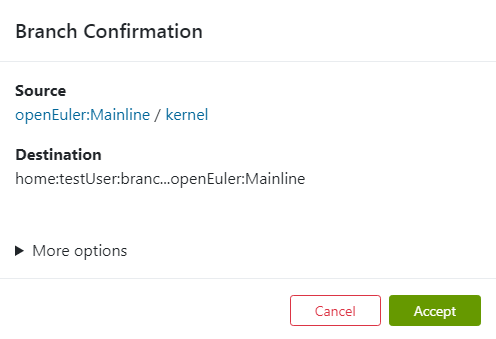
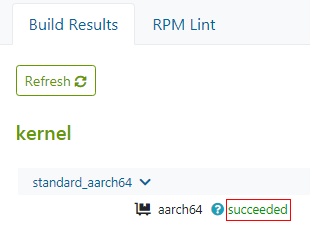
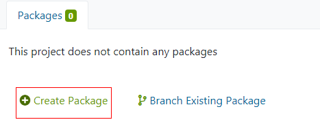
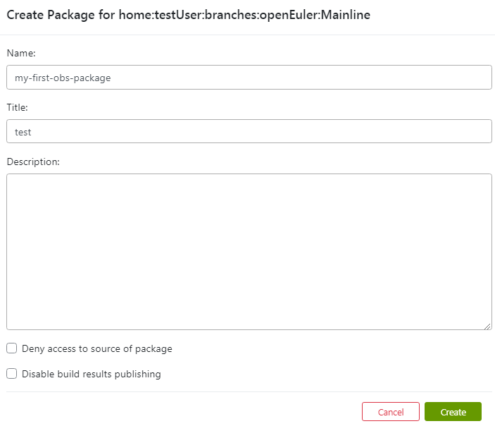
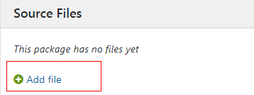
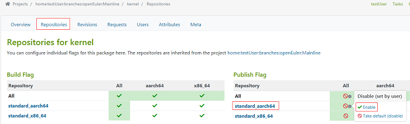
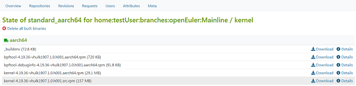

# Building an RPM Package

This section describes how to build an RPM software package on a local PC or using OBS. For details, see  [https://gitee.com/openeuler/community/blob/master/zh/contributors/packaging.md](https://gitee.com/openeuler/community/blob/master/zh/contributors/packaging.md).
<!-- TOC -->

- [Building an RPM Package](#building-an-rpm-package)
    - [Packaging Description](#packaging-description)
        - [Principles](#principles)
        - [Packaging Process](#packaging-process)
        - [Packaging Options](#packaging-options)
    - [Building an RPM Package Locally](#building-an-rpm-package-locally)
        - [Setting Up the Development Environment](#setting-up-the-development-environment)
        - [Creating a Hello World RPM Package](#creating-a-hello-world-rpm-package)
    - [Building an RPM Package Using the OBS](#building-an-rpm-package-using-the-obs)
        - [OBS Overview](#obs-overview)
        - [Building an RPM Software Package Online](#building-an-rpm-software-package-online)
        - [Building a Software Package Using OSC](#building-a-software-package-using-osc)

<!-- /TOC -->


## Packaging Description

### Principles
During RPM packaging, the source code needs to be compiled. The compiled configuration files and binary command files need to be placed in proper positions. The RPM packages need to be tested as required. A workspace is required for these operations. The  **rpmbuild**  command uses a set of standard workspaces.

```
$ rpmdev-setuptree
```

The  **rpmdev-setuptree**  command is used to install rpmdevtools. After the command is executed, the  **rpmbuild**  folder is generated in the  **/root**  directory \(or the  **/home/**_username_  directory for non-root users\). The directory structure is as follows:

```
$ tree rpmbuild
rpmbuild
├── BUILD
├── RPMS
├── SOURCES
├── SPECS
└── SRPMS
```

The content is described as follows:

<a name="en-us_topic_0184337290_table1268115913017"></a>
<table><thead align="left"><tr id="en-us_topic_0184337290_row673319549321"><th class="cellrowborder" valign="top" width="27.1%" id="mcps1.1.5.1.1"><p id="en-us_topic_0184337290_p1673485453210"><a name="en-us_topic_0184337290_p1673485453210"></a><a name="en-us_topic_0184337290_p1673485453210"></a><strong id="b146219361024"><a name="b146219361024"></a><a name="b146219361024"></a>Content</strong></p>
</th>
<th class="cellrowborder" valign="top" width="18.38%" id="mcps1.1.5.1.2"><p id="en-us_topic_0184337290_p167341354193219"><a name="en-us_topic_0184337290_p167341354193219"></a><a name="en-us_topic_0184337290_p167341354193219"></a><strong id="b1665543815218"><a name="b1665543815218"></a><a name="b1665543815218"></a>Macro Code</strong></p>
</th>
<th class="cellrowborder" valign="top" width="17.76%" id="mcps1.1.5.1.3"><p id="en-us_topic_0184337290_p157341854103211"><a name="en-us_topic_0184337290_p157341854103211"></a><a name="en-us_topic_0184337290_p157341854103211"></a><strong id="b189353391325"><a name="b189353391325"></a><a name="b189353391325"></a>Name</strong></p>
</th>
<th class="cellrowborder" valign="top" width="36.76%" id="mcps1.1.5.1.4"><p id="en-us_topic_0184337290_p1273465410328"><a name="en-us_topic_0184337290_p1273465410328"></a><a name="en-us_topic_0184337290_p1273465410328"></a><strong id="b531374110211"><a name="b531374110211"></a><a name="b531374110211"></a>Function</strong></p>
</th>
</tr>
</thead>
<tbody><tr id="en-us_topic_0184337290_row107541059163020"><td class="cellrowborder" valign="top" width="27.1%" headers="mcps1.1.5.1.1 "><p id="en-us_topic_0184337290_p675425913015"><a name="en-us_topic_0184337290_p675425913015"></a><a name="en-us_topic_0184337290_p675425913015"></a>~/rpmbuild/BUILD</p>
</td>
<td class="cellrowborder" valign="top" width="18.38%" headers="mcps1.1.5.1.2 "><p id="en-us_topic_0184337290_p175405917305"><a name="en-us_topic_0184337290_p175405917305"></a><a name="en-us_topic_0184337290_p175405917305"></a>%_builddir</p>
</td>
<td class="cellrowborder" valign="top" width="17.76%" headers="mcps1.1.5.1.3 "><p id="en-us_topic_0184337290_p1754175903010"><a name="en-us_topic_0184337290_p1754175903010"></a><a name="en-us_topic_0184337290_p1754175903010"></a>Build directory.</p>
</td>
<td class="cellrowborder" valign="top" width="36.76%" headers="mcps1.1.5.1.4 "><p id="en-us_topic_0184337290_p875415916306"><a name="en-us_topic_0184337290_p875415916306"></a><a name="en-us_topic_0184337290_p875415916306"></a>The source code package is decompressed and compiled in a subdirectory of the directory.</p>
</td>
</tr>
<tr id="en-us_topic_0184337290_row117541859183017"><td class="cellrowborder" valign="top" width="27.1%" headers="mcps1.1.5.1.1 "><p id="en-us_topic_0184337290_p87541259163017"><a name="en-us_topic_0184337290_p87541259163017"></a><a name="en-us_topic_0184337290_p87541259163017"></a>~/rpmbuild/RPMS</p>
</td>
<td class="cellrowborder" valign="top" width="18.38%" headers="mcps1.1.5.1.2 "><p id="en-us_topic_0184337290_p9754125913018"><a name="en-us_topic_0184337290_p9754125913018"></a><a name="en-us_topic_0184337290_p9754125913018"></a>%_rpmdir</p>
</td>
<td class="cellrowborder" valign="top" width="17.76%" headers="mcps1.1.5.1.3 "><p id="en-us_topic_0184337290_p12754205963018"><a name="en-us_topic_0184337290_p12754205963018"></a><a name="en-us_topic_0184337290_p12754205963018"></a>Standard RPM package directory.</p>
</td>
<td class="cellrowborder" valign="top" width="36.76%" headers="mcps1.1.5.1.4 "><p id="en-us_topic_0184337290_p177548599306"><a name="en-us_topic_0184337290_p177548599306"></a><a name="en-us_topic_0184337290_p177548599306"></a>The binary RPM package is generated and stored in this directory.</p>
</td>
</tr>
<tr id="en-us_topic_0184337290_row88505117359"><td class="cellrowborder" valign="top" width="27.1%" headers="mcps1.1.5.1.1 "><p id="en-us_topic_0184337290_p3753759173019"><a name="en-us_topic_0184337290_p3753759173019"></a><a name="en-us_topic_0184337290_p3753759173019"></a>~/rpmbuild/SOURCES</p>
</td>
<td class="cellrowborder" valign="top" width="18.38%" headers="mcps1.1.5.1.2 "><p id="en-us_topic_0184337290_p9753185903013"><a name="en-us_topic_0184337290_p9753185903013"></a><a name="en-us_topic_0184337290_p9753185903013"></a>%_sourcedir</p>
</td>
<td class="cellrowborder" valign="top" width="17.76%" headers="mcps1.1.5.1.3 "><p id="en-us_topic_0184337290_p10753135913308"><a name="en-us_topic_0184337290_p10753135913308"></a><a name="en-us_topic_0184337290_p10753135913308"></a>Source code directory.</p>
</td>
<td class="cellrowborder" valign="top" width="36.76%" headers="mcps1.1.5.1.4 "><p id="en-us_topic_0184337290_p675495933018"><a name="en-us_topic_0184337290_p675495933018"></a><a name="en-us_topic_0184337290_p675495933018"></a>The source code package (for example, .tar package) and all patches are stored in this directory.</p>
</td>
</tr>
<tr id="en-us_topic_0184337290_row1868513113357"><td class="cellrowborder" valign="top" width="27.1%" headers="mcps1.1.5.1.1 "><p id="en-us_topic_0184337290_p3753135912308"><a name="en-us_topic_0184337290_p3753135912308"></a><a name="en-us_topic_0184337290_p3753135912308"></a>~/rpmbuild/SPECS</p>
</td>
<td class="cellrowborder" valign="top" width="18.38%" headers="mcps1.1.5.1.2 "><p id="en-us_topic_0184337290_p147534598305"><a name="en-us_topic_0184337290_p147534598305"></a><a name="en-us_topic_0184337290_p147534598305"></a>%_specdir</p>
</td>
<td class="cellrowborder" valign="top" width="17.76%" headers="mcps1.1.5.1.3 "><p id="en-us_topic_0184337290_p17753105910308"><a name="en-us_topic_0184337290_p17753105910308"></a><a name="en-us_topic_0184337290_p17753105910308"></a>Spec file directory.</p>
</td>
<td class="cellrowborder" valign="top" width="36.76%" headers="mcps1.1.5.1.4 "><p id="en-us_topic_0184337290_p4753125918302"><a name="en-us_topic_0184337290_p4753125918302"></a><a name="en-us_topic_0184337290_p4753125918302"></a>The RPM package configuration file (.spec) is stored in this directory.</p>
</td>
</tr>
<tr id="en-us_topic_0184337290_row275418594301"><td class="cellrowborder" valign="top" width="27.1%" headers="mcps1.1.5.1.1 "><p id="en-us_topic_0184337290_p9754115973018"><a name="en-us_topic_0184337290_p9754115973018"></a><a name="en-us_topic_0184337290_p9754115973018"></a>~/rpmbuild/SRPMS</p>
</td>
<td class="cellrowborder" valign="top" width="18.38%" headers="mcps1.1.5.1.2 "><p id="en-us_topic_0184337290_p14754559163011"><a name="en-us_topic_0184337290_p14754559163011"></a><a name="en-us_topic_0184337290_p14754559163011"></a>%_srcrpmdir</p>
</td>
<td class="cellrowborder" valign="top" width="17.76%" headers="mcps1.1.5.1.3 "><p id="en-us_topic_0184337290_p7754115923010"><a name="en-us_topic_0184337290_p7754115923010"></a><a name="en-us_topic_0184337290_p7754115923010"></a>Source code RPM package directory.</p>
</td>
<td class="cellrowborder" valign="top" width="36.76%" headers="mcps1.1.5.1.4 "><p id="en-us_topic_0184337290_p10754165933017"><a name="en-us_topic_0184337290_p10754165933017"></a><a name="en-us_topic_0184337290_p10754165933017"></a>The source code RPM package (SRPM) is stored in this directory.</p>
</td>
</tr>
</tbody>
</table>

The  **\~/rpmbuild/SPECS**  directory contains the configuration file of the RPM package, which is the drawing of the RPM package. This file tells the  **rpmbuild**  command how to build the RPM package. The  **Macro Code**  column contains the corresponding directories in the .spec file, which is similar to the macro or global variable in the programming language.

### Packaging Process
The packaging process is as follows:

1.  Place the source code in  **%\_sourcedir**.
2.  Compile the source code in  **%\_builddir**. Generally, the source code is compressed and needs to be decompressed first.
3.  Install the RPM package. The installation is similar to pre-assembling the software package. Copy the contents \(such as binary files, configuration files, and man files\) that should be contained in the software package to  **%\_buildrootdir**  and assemble the contents based on the actual directory structure after installation. For example, if binary commands are stored in  **/usr/bin**, copy the directory structure to  **%\_buildrootdir**.
4.  Perform necessary configurations, such as preparations before installation and cleanup after installation. These are configured in the SPEC file to tell the  **rpmbuild**  command how to build.
5.  Check whether the software is running properly.
6.  The generated RPM package is stored in  **%\_rpmdir**, and the source code package is stored in  **%\_srpmdir**.

In the SPEC file, each phase is described as follows:

<a name="en-us_topic_0184337290_table14621920105410"></a>
<table><thead align="left"><tr id="en-us_topic_0184337290_row1416062025411"><th class="cellrowborder" valign="top" width="7.75077507750775%" id="mcps1.1.5.1.1"><p id="en-us_topic_0184337290_p141601200544"><a name="en-us_topic_0184337290_p141601200544"></a><a name="en-us_topic_0184337290_p141601200544"></a><strong id="en-us_topic_0184337290_b18160102005415"><a name="en-us_topic_0184337290_b18160102005415"></a><a name="en-us_topic_0184337290_b18160102005415"></a>Phase</strong></p>
</th>
<th class="cellrowborder" valign="top" width="13.931393139313933%" id="mcps1.1.5.1.2"><p id="en-us_topic_0184337290_p8160122017546"><a name="en-us_topic_0184337290_p8160122017546"></a><a name="en-us_topic_0184337290_p8160122017546"></a><strong id="b27201333171313"><a name="b27201333171313"></a><a name="b27201333171313"></a>Directory to Be Read</strong></p>
</th>
<th class="cellrowborder" valign="top" width="10.391039103910392%" id="mcps1.1.5.1.3"><p id="en-us_topic_0184337290_p816015207540"><a name="en-us_topic_0184337290_p816015207540"></a><a name="en-us_topic_0184337290_p816015207540"></a><strong id="b19261143101411"><a name="b19261143101411"></a><a name="b19261143101411"></a>Directory to Which Data Is Written</strong></p>
</th>
<th class="cellrowborder" valign="top" width="67.92679267926793%" id="mcps1.1.5.1.4"><p id="en-us_topic_0184337290_p1016072017548"><a name="en-us_topic_0184337290_p1016072017548"></a><a name="en-us_topic_0184337290_p1016072017548"></a><strong id="b966217545147"><a name="b966217545147"></a><a name="b966217545147"></a>Action</strong></p>
</th>
</tr>
</thead>
<tbody><tr id="en-us_topic_0184337290_row13160102085419"><td class="cellrowborder" valign="top" width="7.75077507750775%" headers="mcps1.1.5.1.1 "><p id="en-us_topic_0184337290_p2160152017546"><a name="en-us_topic_0184337290_p2160152017546"></a><a name="en-us_topic_0184337290_p2160152017546"></a>%prep</p>
</td>
<td class="cellrowborder" valign="top" width="13.931393139313933%" headers="mcps1.1.5.1.2 "><p id="en-us_topic_0184337290_p16160122010543"><a name="en-us_topic_0184337290_p16160122010543"></a><a name="en-us_topic_0184337290_p16160122010543"></a>%_sourcedir</p>
</td>
<td class="cellrowborder" valign="top" width="10.391039103910392%" headers="mcps1.1.5.1.3 "><p id="en-us_topic_0184337290_p71609207547"><a name="en-us_topic_0184337290_p71609207547"></a><a name="en-us_topic_0184337290_p71609207547"></a>%_builddir</p>
</td>
<td class="cellrowborder" valign="top" width="67.92679267926793%" headers="mcps1.1.5.1.4 "><p id="en-us_topic_0184337290_p1716017206546"><a name="en-us_topic_0184337290_p1716017206546"></a><a name="en-us_topic_0184337290_p1716017206546"></a>Read the source code and patch in the <strong id="b14368918157"><a name="b14368918157"></a><a name="b14368918157"></a>%_sourcedir</strong> directory. Then, decompress the source code to the <strong id="b189165137154"><a name="b189165137154"></a><a name="b189165137154"></a>%_builddir</strong> subdirectory and apply all patches.</p>
</td>
</tr>
<tr id="en-us_topic_0184337290_row14161122015418"><td class="cellrowborder" valign="top" width="7.75077507750775%" headers="mcps1.1.5.1.1 "><p id="en-us_topic_0184337290_p13161172012545"><a name="en-us_topic_0184337290_p13161172012545"></a><a name="en-us_topic_0184337290_p13161172012545"></a>%build</p>
</td>
<td class="cellrowborder" valign="top" width="13.931393139313933%" headers="mcps1.1.5.1.2 "><p id="en-us_topic_0184337290_p1416132055420"><a name="en-us_topic_0184337290_p1416132055420"></a><a name="en-us_topic_0184337290_p1416132055420"></a>%_builddir</p>
</td>
<td class="cellrowborder" valign="top" width="10.391039103910392%" headers="mcps1.1.5.1.3 "><p id="en-us_topic_0184337290_p1116182015544"><a name="en-us_topic_0184337290_p1116182015544"></a><a name="en-us_topic_0184337290_p1116182015544"></a>%_builddir</p>
</td>
<td class="cellrowborder" valign="top" width="67.92679267926793%" headers="mcps1.1.5.1.4 "><p id="en-us_topic_0184337290_p1216122017542"><a name="en-us_topic_0184337290_p1216122017542"></a><a name="en-us_topic_0184337290_p1216122017542"></a>Compile files in the <strong id="b155992131512"><a name="b155992131512"></a><a name="b155992131512"></a>%_builddir</strong> build directory. Run a command similar to <strong id="b3541328121518"><a name="b3541328121518"></a><a name="b3541328121518"></a>./configure &amp;&amp; make</strong>.</p>
</td>
</tr>
<tr id="en-us_topic_0184337290_row9161320155419"><td class="cellrowborder" valign="top" width="7.75077507750775%" headers="mcps1.1.5.1.1 "><p id="en-us_topic_0184337290_p916162025419"><a name="en-us_topic_0184337290_p916162025419"></a><a name="en-us_topic_0184337290_p916162025419"></a>%install</p>
</td>
<td class="cellrowborder" valign="top" width="13.931393139313933%" headers="mcps1.1.5.1.2 "><p id="en-us_topic_0184337290_p13161720135415"><a name="en-us_topic_0184337290_p13161720135415"></a><a name="en-us_topic_0184337290_p13161720135415"></a>%_builddir</p>
</td>
<td class="cellrowborder" valign="top" width="10.391039103910392%" headers="mcps1.1.5.1.3 "><p id="en-us_topic_0184337290_p13161192085414"><a name="en-us_topic_0184337290_p13161192085414"></a><a name="en-us_topic_0184337290_p13161192085414"></a>%_buildrootdir</p>
</td>
<td class="cellrowborder" valign="top" width="67.92679267926793%" headers="mcps1.1.5.1.4 "><p id="en-us_topic_0184337290_p1216162011546"><a name="en-us_topic_0184337290_p1216162011546"></a><a name="en-us_topic_0184337290_p1216162011546"></a>Read files in the <strong id="b133561433161517"><a name="b133561433161517"></a><a name="b133561433161517"></a>%_builddir</strong> build directory and install them to the <strong id="b1458004131520"><a name="b1458004131520"></a><a name="b1458004131520"></a>%_buildrootdir</strong> directory. These files are generated after the RPM is installed.</p>
</td>
</tr>
<tr id="en-us_topic_0184337290_row5161172035417"><td class="cellrowborder" valign="top" width="7.75077507750775%" headers="mcps1.1.5.1.1 "><p id="en-us_topic_0184337290_p2161132065410"><a name="en-us_topic_0184337290_p2161132065410"></a><a name="en-us_topic_0184337290_p2161132065410"></a>%check</p>
</td>
<td class="cellrowborder" valign="top" width="13.931393139313933%" headers="mcps1.1.5.1.2 "><p id="en-us_topic_0184337290_p4161162010548"><a name="en-us_topic_0184337290_p4161162010548"></a><a name="en-us_topic_0184337290_p4161162010548"></a>%_builddir</p>
</td>
<td class="cellrowborder" valign="top" width="10.391039103910392%" headers="mcps1.1.5.1.3 "><p id="en-us_topic_0184337290_p18161202019544"><a name="en-us_topic_0184337290_p18161202019544"></a><a name="en-us_topic_0184337290_p18161202019544"></a>%_builddir</p>
</td>
<td class="cellrowborder" valign="top" width="67.92679267926793%" headers="mcps1.1.5.1.4 "><p id="en-us_topic_0184337290_p15161152013541"><a name="en-us_topic_0184337290_p15161152013541"></a><a name="en-us_topic_0184337290_p15161152013541"></a>Check whether the software is running properly. Run a command similar to <strong id="b13199125581517"><a name="b13199125581517"></a><a name="b13199125581517"></a>make test</strong>.</p>
</td>
</tr>
<tr id="en-us_topic_0184337290_row19161202035419"><td class="cellrowborder" valign="top" width="7.75077507750775%" headers="mcps1.1.5.1.1 "><p id="en-us_topic_0184337290_p111617208547"><a name="en-us_topic_0184337290_p111617208547"></a><a name="en-us_topic_0184337290_p111617208547"></a>bin</p>
</td>
<td class="cellrowborder" valign="top" width="13.931393139313933%" headers="mcps1.1.5.1.2 "><p id="en-us_topic_0184337290_p161613204544"><a name="en-us_topic_0184337290_p161613204544"></a><a name="en-us_topic_0184337290_p161613204544"></a>%_buildrootdir</p>
</td>
<td class="cellrowborder" valign="top" width="10.391039103910392%" headers="mcps1.1.5.1.3 "><p id="en-us_topic_0184337290_p141611120175410"><a name="en-us_topic_0184337290_p141611120175410"></a><a name="en-us_topic_0184337290_p141611120175410"></a>%_rpmdir</p>
</td>
<td class="cellrowborder" valign="top" width="67.92679267926793%" headers="mcps1.1.5.1.4 "><p id="en-us_topic_0184337290_p12161162018541"><a name="en-us_topic_0184337290_p12161162018541"></a><a name="en-us_topic_0184337290_p12161162018541"></a>Read files in the <strong id="b1432417011164"><a name="b1432417011164"></a><a name="b1432417011164"></a>%_buildrootdir</strong> final installation directory to create RPM packages in the <strong id="b18528511163"><a name="b18528511163"></a><a name="b18528511163"></a>%_rpmdir</strong> directory. In this directory, RPM packages of different architectures are stored in different subdirectories. The <strong id="b61315164164"><a name="b61315164164"></a><a name="b61315164164"></a>noarch</strong> directory stores RPM packages applicable to all architectures. These RPM files are the RPM packages that are finally installed by users.</p>
</td>
</tr>
<tr id="en-us_topic_0184337290_row416213208540"><td class="cellrowborder" valign="top" width="7.75077507750775%" headers="mcps1.1.5.1.1 "><p id="en-us_topic_0184337290_p1416262085419"><a name="en-us_topic_0184337290_p1416262085419"></a><a name="en-us_topic_0184337290_p1416262085419"></a>src</p>
</td>
<td class="cellrowborder" valign="top" width="13.931393139313933%" headers="mcps1.1.5.1.2 "><p id="en-us_topic_0184337290_p716282015541"><a name="en-us_topic_0184337290_p716282015541"></a><a name="en-us_topic_0184337290_p716282015541"></a>%_sourcedir</p>
</td>
<td class="cellrowborder" valign="top" width="10.391039103910392%" headers="mcps1.1.5.1.3 "><p id="en-us_topic_0184337290_p17162142010547"><a name="en-us_topic_0184337290_p17162142010547"></a><a name="en-us_topic_0184337290_p17162142010547"></a>%_srcrpmdir</p>
</td>
<td class="cellrowborder" valign="top" width="67.92679267926793%" headers="mcps1.1.5.1.4 "><p id="en-us_topic_0184337290_p2162182011543"><a name="en-us_topic_0184337290_p2162182011543"></a><a name="en-us_topic_0184337290_p2162182011543"></a>Create the source code RPM package (SRPM for short, with the file name extension .src.rpm) and save it to the <strong id="b1626117369163"><a name="b1626117369163"></a><a name="b1626117369163"></a>%_srcrpmdir</strong> directory. The SRPM package is usually used to review and upgrade software packages.</p>
</td>
</tr>
</tbody>
</table>

### Packaging Options

Run the  **rpmbuild**  command to build the software package. The  **rpmbuild**  command can be used to build software packages by building .spec, .tar, and source files.

The format of the  **rpmbuild**  command is rpmbuild \[_option_...\]

[Table 1](#table1342946175212)  describes the common rpmbuild packaging options.

**Table  1**  rpmbuild Packaging Options

<a name="table1342946175212"></a>
<table><thead align="left"><tr id="row1242184611523"><th class="cellrowborder" valign="top" width="50%" id="mcps1.2.3.1.1"><p id="p1142134616527"><a name="p1142134616527"></a><a name="p1142134616527"></a><em id="i196115187577"><a name="i196115187577"></a><a name="i196115187577"></a>option</em> Value</p>
</th>
<th class="cellrowborder" valign="top" width="50%" id="mcps1.2.3.1.2"><p id="p174244605210"><a name="p174244605210"></a><a name="p174244605210"></a>Description</p>
</th>
</tr>
</thead>
<tbody><tr id="row1642124685214"><td class="cellrowborder" valign="top" width="50%" headers="mcps1.2.3.1.1 "><p id="p44294645211"><a name="p44294645211"></a><a name="p44294645211"></a>-bp <em id="i142674211316"><a name="i142674211316"></a><a name="i142674211316"></a>specfile</em></p>
</td>
<td class="cellrowborder" valign="top" width="50%" headers="mcps1.2.3.1.2 "><p id="p5504192417282"><a name="p5504192417282"></a><a name="p5504192417282"></a>Starts build from the <strong id="b15909724197"><a name="b15909724197"></a><a name="b15909724197"></a>%prep</strong> phase of the <em id="i276214508223"><a name="i276214508223"></a><a name="i276214508223"></a>specfile</em> (decompress the source code package and install the patch).</p>
</td>
</tr>
<tr id="row375616513198"><td class="cellrowborder" valign="top" width="50%" headers="mcps1.2.3.1.1 "><p id="p663152652313"><a name="p663152652313"></a><a name="p663152652313"></a>-bc <em id="i17281843152313"><a name="i17281843152313"></a><a name="i17281843152313"></a>specfile</em></p>
</td>
<td class="cellrowborder" valign="top" width="50%" headers="mcps1.2.3.1.2 "><p id="p1475675181912"><a name="p1475675181912"></a><a name="p1475675181912"></a>Starts build from the <strong id="b52483117197"><a name="b52483117197"></a><a name="b52483117197"></a>%build</strong> phase of the <em id="i11191112514"><a name="i11191112514"></a><a name="i11191112514"></a>specfile</em>.</p>
</td>
</tr>
<tr id="row3421646125214"><td class="cellrowborder" valign="top" width="50%" headers="mcps1.2.3.1.1 "><p id="p143521654132516"><a name="p143521654132516"></a><a name="p143521654132516"></a>-bi <em id="i1312330192911"><a name="i1312330192911"></a><a name="i1312330192911"></a>specfile</em></p>
</td>
<td class="cellrowborder" valign="top" width="50%" headers="mcps1.2.3.1.2 "><p id="p134949360269"><a name="p134949360269"></a><a name="p134949360269"></a>Starts build from the <strong id="b879710551192"><a name="b879710551192"></a><a name="b879710551192"></a>%install</strong> phase of the <em id="i37971555111910"><a name="i37971555111910"></a><a name="i37971555111910"></a>specfile</em>.</p>
</td>
</tr>
<tr id="row642846145211"><td class="cellrowborder" valign="top" width="50%" headers="mcps1.2.3.1.1 "><p id="p1342746115211"><a name="p1342746115211"></a><a name="p1342746115211"></a>-bl <em id="i1654526296"><a name="i1654526296"></a><a name="i1654526296"></a>specfile</em></p>
</td>
<td class="cellrowborder" valign="top" width="50%" headers="mcps1.2.3.1.2 "><p id="p14710104517231"><a name="p14710104517231"></a><a name="p14710104517231"></a>Starts check from the <strong id="b15640104316205"><a name="b15640104316205"></a><a name="b15640104316205"></a>%file</strong> phase of the <em id="i5641104316208"><a name="i5641104316208"></a><a name="i5641104316208"></a>specfile</em>.</p>
</td>
</tr>
<tr id="row2428463528"><td class="cellrowborder" valign="top" width="50%" headers="mcps1.2.3.1.1 "><p id="p56839482271"><a name="p56839482271"></a><a name="p56839482271"></a>-ba <em id="i182405318294"><a name="i182405318294"></a><a name="i182405318294"></a>specfile</em></p>
</td>
<td class="cellrowborder" valign="top" width="50%" headers="mcps1.2.3.1.2 "><p id="p1983024422919"><a name="p1983024422919"></a><a name="p1983024422919"></a>Uses the <em id="i622172017295"><a name="i622172017295"></a><a name="i622172017295"></a>specfile</em> to build the source code package and binary package.</p>
</td>
</tr>
<tr id="row176441743349"><td class="cellrowborder" valign="top" width="50%" headers="mcps1.2.3.1.1 "><p id="p176441749342"><a name="p176441749342"></a><a name="p176441749342"></a>-bb <em id="i1815358294"><a name="i1815358294"></a><a name="i1815358294"></a>specfile</em></p>
</td>
<td class="cellrowborder" valign="top" width="50%" headers="mcps1.2.3.1.2 "><p id="p26440463410"><a name="p26440463410"></a><a name="p26440463410"></a>Uses the <em id="i1950512552910"><a name="i1950512552910"></a><a name="i1950512552910"></a>specfile</em> to build the binary package.</p>
</td>
</tr>
<tr id="row143691297164"><td class="cellrowborder" valign="top" width="50%" headers="mcps1.2.3.1.1 "><p id="p913185619293"><a name="p913185619293"></a><a name="p913185619293"></a>-bs <em id="i18577144710301"><a name="i18577144710301"></a><a name="i18577144710301"></a>specfile</em></p>
</td>
<td class="cellrowborder" valign="top" width="50%" headers="mcps1.2.3.1.2 "><p id="p8707203214307"><a name="p8707203214307"></a><a name="p8707203214307"></a>Uses the <em id="i99441330193010"><a name="i99441330193010"></a><a name="i99441330193010"></a>specfile</em> to build the source code package.</p>
</td>
</tr>
<tr id="row1399650113119"><td class="cellrowborder" valign="top" width="50%" headers="mcps1.2.3.1.1 "><p id="p6756203383111"><a name="p6756203383111"></a><a name="p6756203383111"></a>-rp <em id="i18757173312312"><a name="i18757173312312"></a><a name="i18757173312312"></a>sourcefile</em></p>
</td>
<td class="cellrowborder" valign="top" width="50%" headers="mcps1.2.3.1.2 "><p id="p11757183311317"><a name="p11757183311317"></a><a name="p11757183311317"></a>Starts build from the <strong id="b4301319235"><a name="b4301319235"></a><a name="b4301319235"></a>%prep</strong> phase of the <em id="i197751147153619"><a name="i197751147153619"></a><a name="i197751147153619"></a>sourcefile</em> (decompress the source code package and install the patch).</p>
</td>
</tr>
<tr id="row114161423119"><td class="cellrowborder" valign="top" width="50%" headers="mcps1.2.3.1.1 "><p id="p2757183312313"><a name="p2757183312313"></a><a name="p2757183312313"></a>-rc <em id="i7716153183620"><a name="i7716153183620"></a><a name="i7716153183620"></a>sourcefile</em></p>
</td>
<td class="cellrowborder" valign="top" width="50%" headers="mcps1.2.3.1.2 "><p id="p67571733133114"><a name="p67571733133114"></a><a name="p67571733133114"></a>Starts build from the <strong id="b1542443012232"><a name="b1542443012232"></a><a name="b1542443012232"></a>%build</strong> phase of the <em id="i9194650163619"><a name="i9194650163619"></a><a name="i9194650163619"></a>sourcefile</em>.</p>
</td>
</tr>
<tr id="row1787181019319"><td class="cellrowborder" valign="top" width="50%" headers="mcps1.2.3.1.1 "><p id="p1275773373119"><a name="p1275773373119"></a><a name="p1275773373119"></a>-ri <em id="i1963616335362"><a name="i1963616335362"></a><a name="i1963616335362"></a>sourcefile</em></p>
</td>
<td class="cellrowborder" valign="top" width="50%" headers="mcps1.2.3.1.2 "><p id="p0757143320319"><a name="p0757143320319"></a><a name="p0757143320319"></a>Starts build from the <strong id="b15281247192316"><a name="b15281247192316"></a><a name="b15281247192316"></a>%install</strong> phase of the <em id="i952894732316"><a name="i952894732316"></a><a name="i952894732316"></a>sourcefile</em>.</p>
</td>
</tr>
<tr id="row0937171213317"><td class="cellrowborder" valign="top" width="50%" headers="mcps1.2.3.1.1 "><p id="p167579334315"><a name="p167579334315"></a><a name="p167579334315"></a>-rl <em id="i1483914353366"><a name="i1483914353366"></a><a name="i1483914353366"></a>sourcefile</em></p>
</td>
<td class="cellrowborder" valign="top" width="50%" headers="mcps1.2.3.1.2 "><p id="p12757933103117"><a name="p12757933103117"></a><a name="p12757933103117"></a>Starts build from the <strong id="b19752559112316"><a name="b19752559112316"></a><a name="b19752559112316"></a>%file</strong> phase of the <em id="i375265952316"><a name="i375265952316"></a><a name="i375265952316"></a>sourcefile</em>.</p>
</td>
</tr>
<tr id="row15609181543116"><td class="cellrowborder" valign="top" width="50%" headers="mcps1.2.3.1.1 "><p id="p167572332315"><a name="p167572332315"></a><a name="p167572332315"></a>-ra <em id="i195041839133617"><a name="i195041839133617"></a><a name="i195041839133617"></a>sourcefile</em></p>
</td>
<td class="cellrowborder" valign="top" width="50%" headers="mcps1.2.3.1.2 "><p id="p1475713334313"><a name="p1475713334313"></a><a name="p1475713334313"></a>Uses the <em id="i11175457133613"><a name="i11175457133613"></a><a name="i11175457133613"></a>sourcefile</em> to build the source code package and binary package.</p>
</td>
</tr>
<tr id="row346418223315"><td class="cellrowborder" valign="top" width="50%" headers="mcps1.2.3.1.1 "><p id="p1875753320313"><a name="p1875753320313"></a><a name="p1875753320313"></a>-rb <em id="i9950941153618"><a name="i9950941153618"></a><a name="i9950941153618"></a>sourcefile</em></p>
</td>
<td class="cellrowborder" valign="top" width="50%" headers="mcps1.2.3.1.2 "><p id="p675783333115"><a name="p675783333115"></a><a name="p675783333115"></a>Uses the <em id="i13566059153619"><a name="i13566059153619"></a><a name="i13566059153619"></a>sourcefile</em> to build the binary package.</p>
</td>
</tr>
<tr id="row4848131918311"><td class="cellrowborder" valign="top" width="50%" headers="mcps1.2.3.1.1 "><p id="p187575336317"><a name="p187575336317"></a><a name="p187575336317"></a>-rs <em id="i5943643133613"><a name="i5943643133613"></a><a name="i5943643133613"></a>sourcefile</em></p>
</td>
<td class="cellrowborder" valign="top" width="50%" headers="mcps1.2.3.1.2 "><p id="p12757123383112"><a name="p12757123383112"></a><a name="p12757123383112"></a>Uses the <em id="i6891141113712"><a name="i6891141113712"></a><a name="i6891141113712"></a>sourcefile</em> to build the source code package.</p>
</td>
</tr>
<tr id="row24008816315"><td class="cellrowborder" valign="top" width="50%" headers="mcps1.2.3.1.1 "><p id="p1864848133917"><a name="p1864848133917"></a><a name="p1864848133917"></a>-tp <em id="i1164815843917"><a name="i1164815843917"></a><a name="i1164815843917"></a>tarfile</em></p>
</td>
<td class="cellrowborder" valign="top" width="50%" headers="mcps1.2.3.1.2 "><p id="p1664812814397"><a name="p1664812814397"></a><a name="p1664812814397"></a>Starts build from the <strong id="b882495422416"><a name="b882495422416"></a><a name="b882495422416"></a>%prep</strong> phase of the <em id="i10204153654013"><a name="i10204153654013"></a><a name="i10204153654013"></a>tarfile</em> (decompress the source code package and install the patch).</p>
</td>
</tr>
<tr id="row73977115386"><td class="cellrowborder" valign="top" width="50%" headers="mcps1.2.3.1.1 "><p id="p7648168153911"><a name="p7648168153911"></a><a name="p7648168153911"></a>-tc <em id="i352342324018"><a name="i352342324018"></a><a name="i352342324018"></a>tarfile</em></p>
</td>
<td class="cellrowborder" valign="top" width="50%" headers="mcps1.2.3.1.2 "><p id="p664808173911"><a name="p664808173911"></a><a name="p664808173911"></a>Starts build from the <strong id="b10722181472516"><a name="b10722181472516"></a><a name="b10722181472516"></a>%build</strong> phase of the <em id="i1299733764014"><a name="i1299733764014"></a><a name="i1299733764014"></a>tarfile</em>.</p>
</td>
</tr>
<tr id="row1867693203810"><td class="cellrowborder" valign="top" width="50%" headers="mcps1.2.3.1.1 "><p id="p1464911811392"><a name="p1464911811392"></a><a name="p1464911811392"></a>-ti <em id="i50102611402"><a name="i50102611402"></a><a name="i50102611402"></a>tarfile</em></p>
</td>
<td class="cellrowborder" valign="top" width="50%" headers="mcps1.2.3.1.2 "><p id="p764910818397"><a name="p764910818397"></a><a name="p764910818397"></a>Starts build from the <strong id="b19946153211254"><a name="b19946153211254"></a><a name="b19946153211254"></a>%install</strong> phase of the <em id="i8946153211257"><a name="i8946153211257"></a><a name="i8946153211257"></a>tarfile</em>.</p>
</td>
</tr>
<tr id="row1831910143813"><td class="cellrowborder" valign="top" width="50%" headers="mcps1.2.3.1.1 "><p id="p176494814391"><a name="p176494814391"></a><a name="p176494814391"></a>-ta <em id="i1598822734013"><a name="i1598822734013"></a><a name="i1598822734013"></a>tarfile</em></p>
</td>
<td class="cellrowborder" valign="top" width="50%" headers="mcps1.2.3.1.2 "><p id="p1164938153915"><a name="p1164938153915"></a><a name="p1164938153915"></a>Uses the <em id="i5555114184019"><a name="i5555114184019"></a><a name="i5555114184019"></a>tarfile</em> to build the source code package and binary package.</p>
</td>
</tr>
<tr id="row16858111273820"><td class="cellrowborder" valign="top" width="50%" headers="mcps1.2.3.1.1 "><p id="p964912883913"><a name="p964912883913"></a><a name="p964912883913"></a>-tb <em id="i1985417296405"><a name="i1985417296405"></a><a name="i1985417296405"></a>tarfile</em></p>
</td>
<td class="cellrowborder" valign="top" width="50%" headers="mcps1.2.3.1.2 "><p id="p1564916811399"><a name="p1564916811399"></a><a name="p1564916811399"></a>Uses the <em id="i1033434614408"><a name="i1033434614408"></a><a name="i1033434614408"></a>tarfile</em> to build the binary package.</p>
</td>
</tr>
<tr id="row163391515123813"><td class="cellrowborder" valign="top" width="50%" headers="mcps1.2.3.1.1 "><p id="p176495811391"><a name="p176495811391"></a><a name="p176495811391"></a>-ts <em id="i990815311403"><a name="i990815311403"></a><a name="i990815311403"></a>tarfile</em></p>
</td>
<td class="cellrowborder" valign="top" width="50%" headers="mcps1.2.3.1.2 "><p id="p56490810392"><a name="p56490810392"></a><a name="p56490810392"></a>Uses the <em id="i17708658122817"><a name="i17708658122817"></a><a name="i17708658122817"></a>tarfile</em> to build the source code package.</p>
</td>
</tr>
<tr id="row2443719144118"><td class="cellrowborder" valign="top" width="50%" headers="mcps1.2.3.1.1 "><p id="p7444191984111"><a name="p7444191984111"></a><a name="p7444191984111"></a>\-\-buildroot=<em id="i39711271427"><a name="i39711271427"></a><a name="i39711271427"></a>DIRECTORY</em></p>
</td>
<td class="cellrowborder" valign="top" width="50%" headers="mcps1.2.3.1.2 "><p id="p553719220506"><a name="p553719220506"></a><a name="p553719220506"></a>During the build, uses <em id="i95820263299"><a name="i95820263299"></a><a name="i95820263299"></a>DIRECTORY</em> to overwrite the default <strong id="b183143742910"><a name="b183143742910"></a><a name="b183143742910"></a>/root</strong> directory.</p>
</td>
</tr>
<tr id="row1794104355716"><td class="cellrowborder" valign="top" width="50%" headers="mcps1.2.3.1.1 "><p id="p5941184375717"><a name="p5941184375717"></a><a name="p5941184375717"></a>\-\-clean</p>
</td>
<td class="cellrowborder" valign="top" width="50%" headers="mcps1.2.3.1.2 "><p id="p1094144315577"><a name="p1094144315577"></a><a name="p1094144315577"></a>Deletes the files in the <strong id="b442979133416"><a name="b442979133416"></a><a name="b442979133416"></a>BUILD</strong> directory.</p>
</td>
</tr>
<tr id="row12405112795814"><td class="cellrowborder" valign="top" width="50%" headers="mcps1.2.3.1.1 "><p id="p440562735814"><a name="p440562735814"></a><a name="p440562735814"></a>\-\-nobuild</p>
</td>
<td class="cellrowborder" valign="top" width="50%" headers="mcps1.2.3.1.2 "><p id="p0405182714588"><a name="p0405182714588"></a><a name="p0405182714588"></a>No actual build steps are performed. It can be used to test the .spec file.</p>
</td>
</tr>
<tr id="row10784164615815"><td class="cellrowborder" valign="top" width="50%" headers="mcps1.2.3.1.1 "><p id="p1784154655815"><a name="p1784154655815"></a><a name="p1784154655815"></a>\-\-noclean</p>
</td>
<td class="cellrowborder" valign="top" width="50%" headers="mcps1.2.3.1.2 "><p id="p57851946185814"><a name="p57851946185814"></a><a name="p57851946185814"></a>Skips the <strong id="b5564141903518"><a name="b5564141903518"></a><a name="b5564141903518"></a>%clean</strong> phase of the .spec file (even if it does exist).</p>
</td>
</tr>
<tr id="row5585102605911"><td class="cellrowborder" valign="top" width="50%" headers="mcps1.2.3.1.1 "><p id="p10585132665911"><a name="p10585132665911"></a><a name="p10585132665911"></a>\-\-nocheck</p>
</td>
<td class="cellrowborder" valign="top" width="50%" headers="mcps1.2.3.1.2 "><p id="p85851226135913"><a name="p85851226135913"></a><a name="p85851226135913"></a>Skips the <strong id="b9680113853510"><a name="b9680113853510"></a><a name="b9680113853510"></a>%check</strong> phase of the .spec file (even if it does exist).</p>
</td>
</tr>
<tr id="row6577145616591"><td class="cellrowborder" valign="top" width="50%" headers="mcps1.2.3.1.1 "><p id="p7577165625910"><a name="p7577165625910"></a><a name="p7577165625910"></a>\-\-dbpath <em id="i20573371107"><a name="i20573371107"></a><a name="i20573371107"></a>DIRECTORY</em></p>
</td>
<td class="cellrowborder" valign="top" width="50%" headers="mcps1.2.3.1.2 "><p id="p16578456185911"><a name="p16578456185911"></a><a name="p16578456185911"></a>Uses the database in <strong id="b1870295115357"><a name="b1870295115357"></a><a name="b1870295115357"></a>DIRECTORY</strong> instead of the default directory <strong id="b7245811362"><a name="b7245811362"></a><a name="b7245811362"></a>/var/lib/rpm</strong>.</p>
</td>
</tr>
<tr id="row1424515812017"><td class="cellrowborder" valign="top" width="50%" headers="mcps1.2.3.1.1 "><p id="p132451184010"><a name="p132451184010"></a><a name="p132451184010"></a>\-\-root <em id="i1163110211911"><a name="i1163110211911"></a><a name="i1163110211911"></a>DIRECTORY</em></p>
</td>
<td class="cellrowborder" valign="top" width="50%" headers="mcps1.2.3.1.2 "><p id="p1424548908"><a name="p1424548908"></a><a name="p1424548908"></a>Sets <em id="i193371924103614"><a name="i193371924103614"></a><a name="i193371924103614"></a>DIRECTORY</em> to the highest level. The default value is <strong id="b2093817253715"><a name="b2093817253715"></a><a name="b2093817253715"></a>/</strong>, indicating the highest level.</p>
</td>
</tr>
<tr id="row2477041403"><td class="cellrowborder" valign="top" width="50%" headers="mcps1.2.3.1.1 "><p id="p1247744907"><a name="p1247744907"></a><a name="p1247744907"></a>\-\-rebuild <em id="i45014485219"><a name="i45014485219"></a><a name="i45014485219"></a>sourcefile</em></p>
</td>
<td class="cellrowborder" valign="top" width="50%" headers="mcps1.2.3.1.2 "><p id="p2477747013"><a name="p2477747013"></a><a name="p2477747013"></a>Installs the specified source code package <em id="i5781916123714"><a name="i5781916123714"></a><a name="i5781916123714"></a>sourcefile</em>, that is, start preparation, compilation, and installation of the source code package.</p>
</td>
</tr>
<tr id="row15893211013"><td class="cellrowborder" valign="top" width="50%" headers="mcps1.2.3.1.1 "><p id="p168931212018"><a name="p168931212018"></a><a name="p168931212018"></a>\-\-recompile <em id="i182834913220"><a name="i182834913220"></a><a name="i182834913220"></a>sourcefile</em></p>
</td>
<td class="cellrowborder" valign="top" width="50%" headers="mcps1.2.3.1.2 "><p id="p113161298620"><a name="p113161298620"></a><a name="p113161298620"></a>Builds a new binary package based on <strong id="b2299155103715"><a name="b2299155103715"></a><a name="b2299155103715"></a>\-\-recompile</strong>. When the build is complete, the build directory, source code, and .spec file are deleted.</p>
<p id="p39465919516"><a name="p39465919516"></a><a name="p39465919516"></a>The deletion effect is the same as that of <strong id="b6487112214399"><a name="b6487112214399"></a><a name="b6487112214399"></a>\-\-clean</strong>.</p>
</td>
</tr>
<tr id="row1783829436"><td class="cellrowborder" valign="top" width="50%" headers="mcps1.2.3.1.1 "><p id="p198332910318"><a name="p198332910318"></a><a name="p198332910318"></a>-?, \-\-help</p>
</td>
<td class="cellrowborder" valign="top" width="50%" headers="mcps1.2.3.1.2 "><p id="p108312912320"><a name="p108312912320"></a><a name="p108312912320"></a>Displays detailed help information.</p>
</td>
</tr>
<tr id="row1123916251135"><td class="cellrowborder" valign="top" width="50%" headers="mcps1.2.3.1.1 "><p id="p1023913255315"><a name="p1023913255315"></a><a name="p1023913255315"></a>\-\-version</p>
</td>
<td class="cellrowborder" valign="top" width="50%" headers="mcps1.2.3.1.2 "><p id="p1923952518312"><a name="p1923952518312"></a><a name="p1923952518312"></a>Displays detailed version information.</p>
</td>
</tr>
</tbody>
</table>

## Building an RPM Package Locally

This section uses an example to describe how to build an RPM software package locally.


### Setting Up the Development Environment

#### Prerequisites
You have obtained the  **root**  permission, and have configured a repo source for openEuler.

#### Procedure
You can use the DNF tool to install rpmdevtools, including the  **rpm-build**  command and related dependencies \(such as make and gdb\). Run the following command:

```
# dnf install rpmdevtools*
```

### Creating a Hello World RPM Package

The following uses the packaging process of the GNU Hello World project as an example. The package contains the most common peripheral components related to the typical Free and Open Source Software \(FOSS\) project, including the configuration, compilation, and installation environments, documents, and internationalization \(i18n\) information.


#### Obtaining the Source Code

Run the following command to download the source code of the official example:

```
$ cd ~/rpmbuild/SOURCES
$ wget http://ftp.gnu.org/gnu/hello/hello-2.10.tar.gz
```

#### Editing the SPEC File

Run the following command to create the .spec file in the **~/rpmbuild/SPECS** directory:

```
$ cd ~/rpmbuild/SPECS
$ vi hello.spec 
```

Write the corresponding content to the file and save the file. The following is an example of the file content. Modify the corresponding fields based on the actual requirements.

```
Name:     hello
Version:  2.10
Release:  1%{?dist}
Summary:  The "Hello World" program from GNU
Summary(zh_CN): GNU Hello World program
License:  GPLv3+
URL:      http://ftp.gnu.org/gnu/hello
Source0:  http://ftp.gnu.org/gnu/hello/%{name}-%{version}.tar.gz

BuildRequires:  gettext
Requires(post): info
Requires(preun): info

%description
The "Hello World" program, done with all bells and whistles of a proper FOSS
project, including configuration, build, internationalization, help files, etc.

%description -l zh_CN
The Hello World program contains all parts required by the FOSS project, including configuration, build, i18n, and help files.

%prep
%setup -q

%build
%configure
make %{?_smp_mflags}

%install
make install DESTDIR=%{buildroot}
%find_lang %{name}
rm -f %{buildroot}/%{_infodir}/dir

%post
/sbin/install-info %{_infodir}/%{name}.info %{_infodir}/dir || :

%preun
if [ $1 = 0 ] ; then
/sbin/install-info --delete %{_infodir}/%{name}.info %{_infodir}/dir || :
fi

%files -f %{name}.lang
%doc AUTHORS ChangeLog NEWS README THANKS TODO
%license COPYING
%{_mandir}/man1/hello.1.*
%{_infodir}/hello.info.*
%{_bindir}/hello

%changelog
* Thu Dec 26 2019 Your Name <youremail@xxx.xxx> - 2.10-1
- Update to 2.10
* Sat Dec 3 2016 Your Name <youremail@xxx.xxx> - 2.9-1
- Update to 2.9
```

-   The  **Name**  tag indicates the software name, the  **Version**  tag indicates the version number, and the  **Release**  tag indicates the release number.
-   The  **Summary**  tag is a brief description. The first letter of the tag must be capitalized to prevent the rpmlint tool \(packaging check tool\) from generating alarms.
-   The  **License**  tag describes the protocol version of the software package. The packager is responsible for checking the license status of the software, which can be implemented by checking the source code or license file or communicating with the author.
-   The  **Group**  tag is used to classify software packages by  **/usr/share/doc/rpm-/GROUPS**. Currently, this tag has been discarded. However, the VIM template still has this tag. You can delete it. However, adding this tag does not affect the system. The  **%changelog**  tag should contain the log of changes made for each release, especially the description of the upstream security/vulnerability patches. The  **%changelog**  tag should contain the version string to avoid the rpmlint tool from generating alarms.
-   If multiple lines are involved, such as %changelog or %description, start from the next line of the instruction and end with a blank line.
-   Some unnecessary lines \(such as BuildRequires and Requires\) can be commented out with a number sign \(\#\) at the beginning of the lines.
-   The default values of  **%prep**,  **%build**,  **%install**, and  **%file**  are retained.

#### Building an RPM Package

Run the following command in the directory where the .spec file is located to build the source code, binary files, and software packages that contain debugging information:

```
$ rpmbuild -ba hello.spec 
```

Run the following command to view the execution result:

```
$ tree ~/rpmbuild/*RPMS

/home/testUser/rpmbuild/RPMS
└── aarch64
    ├── hello-2.10-1.aarch64.rpm
    ├── hello-debuginfo-2.10-1.aarch64.rpm
    └── hello-debugsource-2.10-1.aarch64.rpm
/home/testUser/rpmbuild/SRPMS
└── hello-2.10-1.src.rpm
```

## Building an RPM Package Using the OBS

This section describes how to build RPM software packages using the OBS on the web page or with OSC. There are two methods:

-   Modifying an existing software package: Modify the source code of an existing software package and build the modified source code into an RPM software package.
-   Adding a software package: A new software source file is developed from scratch, and the newly developed source file is used to build an RPM software package.


### OBS Overview

OBS is a general compilation framework based on the openSUSE distribution. It is used to build source code packages into RPM software packages or Linux images. OBS uses the automatic distributed compilation mode and supports the compilation of images and installation packages of multiple Linux OS distributions \(such as openEuler, SUSE, and Debian\) on multiple architecture platforms \(such as x86 and ARM64\).

OBS consists of the backend and frontend. The backend implements all core functions. The frontend provides web applications and APIs for interaction with the backend. In addition, OBS provides an API command line client OSC, which is developed in an independent repository.

OBS uses the project organization software package. Basic permission control, related repository, and build targets \(OS and architecture\) can be defined in the project. A project can contain multiple subprojects. Each subproject can be configured independently to complete a task.

### Building an RPM Software Package Online

This section describes how to build an RPM software package online on OBS.


#### Building an Existing Software Package

> **NOTE:**   
>-   If you use OBS for the first time, register an individual account on the OBS web page.  
>-   With this method, you must copy the modified code and commit it to the code directory before performing the following operations. The code directory is specified in the  **\_service**  file.  

To modify the source code of the existing software and build the modified source file into an RPM software package on the OBS web client, perform the following steps:

1.  Log in to OBS at  [https://build.openeuler.org/](https://build.openeuler.org/).
2.  Click  **All Projects**. The  **All Projects**  page is displayed.
3.  Click the project to be modified. The project details page is displayed. For example, click  **openEuler:Mainline**.
4.  On the project details page, search for the software package to be modified and click the software package name. The software package details page is displayed.
5.  Click  **Branch package**. In the displayed dialog box, click  **Accept**, as shown in  [Figure 1](#fig77646143214).

    **Figure  1** **Branch Confirmation**  page<a name="fig77646143214"></a>  
    

6.  Click the  **\_service**  file to go to the editing page, modify the file content, and click  **Save**. An example of the  **\_service**  file content is as follows.  _userCodeURL_  and  _userCommitID_  indicate the user code path and commission version number or branch, respectively.

    ```
    <services>
        <service name="tar_scm_kernel">
            <param name="scm">git</param>
            <param name="url">userCodeURL</param>
    	<param name="revision">userCommitID</param>
        </service>
        <service name="recompress">
    	<param name="compression">bz2</param>
    	<param name="file">*.tar</param>
         </service>
    </services>
    ```

    > **NOTE:**   
    >Click  **Save**  to save the  **\_service**  file. OBS downloads the source code from the specified URL to the software directory of the corresponding OBS project based on the  **\_service**  file description and replaces the original file. For example, the  **kernel**  directory of the  **openEuler:Mainline**  project in the preceding example.  

7.  After the files are copied and replaced, OBS automatically starts to build the RPM software package. Wait until the build is complete and view the build status in the status bar on the right.
    -   **succeeded**: The build is successful. You can click  **succeeded**  to view the build logs, as shown in  [Figure 2](#fig10319114217337).

        **Figure  2** **Succeeded**  page<a name="fig10319114217337"></a>  
        

    -   **failed**: The build failed. Click  **failed**  to view error logs, locate the fault, and rebuild again.
    -   **unresolvable**: The build is not performed. The possible cause is that the dependency is missing.
    -   **disabled**: The build is manually closed or is queuing for build.
    -   **excluded**: The build is prohibited. The possible cause is that the .spec file is missing or the compilation of the target architecture is prohibited in the .spec file.


#### Adding a Software Package

To add a new software package on the OBS web page, perform the following steps:

1.  Log in to the OBS console.
2.  Select a project based on the dependency of the new software package. That is, click  **All Projects**  and select the corresponding project, for example,  **openEuler:Mainline**.
3.  Click a software package in the project. The software package details page is displayed.
4.  Click  **Branch package**. On the confirmation page that is displayed, click  **Accept**.
5.  Click  **Delete package**  to delete the software package in the new subproject, as shown in  [Figure 3](#fig18306181103615).

    **Figure  3**  Deleting a software package from a subproject<a name="fig18306181103615"></a>  
    

    > **NOTE:**   
    >The purpose of creating a project by using existing software is to inherit the dependency such as the environment. Therefore, you need to delete these files.  

6.  Click  **Create Package**. On the page that is displayed, enter the software package name, title, and description, and click  **Create**  to create a software package, as shown in  [Figure 4](#fig6762111693811)  and  [Figure 5](#fig18351153518389).

    **Figure  4** **Create Package**  page<a name="fig6762111693811"></a>  
    

    **Figure  5**  Creating a software package<a name="fig18351153518389"></a>  
    

7.  Click  **Add file**  to upload the .spec file and the file to be compiled \(specified in the .spec file\), as shown in  [Figure 6](#fig1475845284011).

    **Figure  6** **Add file**  page<a name="fig1475845284011"></a>  
    

8.  After the file is uploaded, OBS automatically starts to build the RPM software package. Wait until the build is complete and view the build status in the status bar on the right.
    -   **succeeded**: The build is successful. You can click  **succeeded**  to view the build logs.
    -   **failed**: The build failed. Click  **failed**  to view error logs, locate the fault, and rebuild again.
    -   **unresolvable**: The build is not performed. The possible cause is that the dependency is missing.
    -   **disabled**: The build is manually closed or is queuing for build.
    -   **excluded**: The build is prohibited. The possible cause is that the .spec file is missing or the compilation of the target architecture is prohibited in the .spec file.


#### Obtaining the Software Package

After the RPM software package is built, perform the following operations to obtain the RPM software package on the web page:

1.  Log in to the OBS console.
2.  Click  **All Projects**  and find the project corresponding to the required software package, for example,  **openEuler:Mainline**.
3.  Click the name of the required software package in the project. The software package details page is displayed, for example, the  **kernel**  page in the preceding example.

1.  Click the  **Repositories**  tab. On the software repository management page that is displayed, click  **Enable**  in  **Publish Flag**  to enable the RPM software package download function \(the status changes from    to  \), as shown in  [Figure 7](#fig17480830144217).

    **Figure  7** **Repositories**  page<a name="fig17480830144217"></a>  
    

2.  Click the project name in the  **Repository**  column. On the RPM software package download page that is displayed, click  **Download**  on the right of the RPM software package to download the RPM software package, as shown in  [Figure 8](#fig12152145615438).

    **Figure  8**  RPM software package download page<a name="fig12152145615438"></a>  
    


### Building a Software Package Using OSC

This section describes how to use the OBS command line tool OSC to create a project and build an RPM software package.


#### Installing and Configuring the OSC

##### Prerequisites
You have obtained the  **root**  permission, and have configured a repo source for openEuler.

##### Procedure
1.  Install the OSC command line tool and its dependency as the  **root**  user.

    ```
    # dnf install osc build
    ```

    > **NOTE:**   
    >The compilation of RPM software packages depends on build.  

2.  Configure the OSC.
    1.  Run the following command to open the  **\~/.oscrc**  file:

        ```
        $ vi ~/.oscrc
        ```

    2.  Add the  **user**  and  **pass**  fields to  **\~/.oscrc**. The values of  _userName_  and  _passWord_  are the account and password registered on the OBS website \([https://build.openeuler.org/](https://build.openeuler.org/)\).

        ```
        [general]
        apiurl = https://build.openeuler.org/
        [https://build.openeuler.org/]
        user=userName
        pass=passWord
        ```


#### Building an Existing Software Package

**Creating a Project**

1.  You can copy an existing project to create a subproject of your own. For example, to copy the  **zlib**  software package in the  **openEuler:Mainline**  project to the new branch, run the following command:

    ```
    $ osc branch openEuler:Mainline zlib
    ```

    If the following information is displayed, a new branch project  **home:testUser:branches:openEuler:Mainline**  is created for user  **testUser**.

    ```
    A working copy of the branched package can be checked out with:
    osc co home:testUser:branches:openEuler:Mainline/zlib
    ```

2.  Download the configuration file \(for example,  **\_service**\) of the software package to be modified to the local directory. In the preceding command,  _testUser_  indicates the account name configured in the  **\~/.oscrc**  configuration file. Change it based on the actual requirements.

    ```
    $ osc co home:testUser:branches:openEuler:Mainline/zlib
    ```

    Information similar to the following is displayed:

    ```
    A    home:testUser:branches:openEuler:Mainline
    A    home:testUser:branches:openEuler:Mainline/zlib
    A    home:testUser:branches:openEuler:Mainline/zlib/_service
    ```

3.  Go to the local subproject directory and synchronize the remote code of the software package to the local host.

    ```
    $ cd home:testUser:branches:openEuler:Mainline/zlib
    $ osc up -S
    ```

    Information similar to the following is displayed:

    ```
    A    _service:tar_scm_kernel_repo:0001-Neon-Optimized-hash-chain-rebase.patch
    A    _service:tar_scm_kernel_repo:0002-Porting-optimized-longest_match.patch
    A    _service:tar_scm_kernel_repo:0003-arm64-specific-build-patch.patch
    A    _service:tar_scm_kernel_repo:zlib-1.2.11-optimized-s390.patch
    A    _service:tar_scm_kernel_repo:zlib-1.2.11.tar.xz
    A    _service:tar_scm_kernel_repo:zlib-1.2.5-minizip-fixuncrypt.patch
    A    _service:tar_scm_kernel_repo:zlib.spec
    ```


**Building an RPM Package**

1.  Rename the source file and add the renamed source file to the temporary storage of OBS.

    ```
    $ rm -f _service;for file in `ls | grep -v .osc`;do new_file=${file##*:};mv $file $new_file;done
    $ osc addremove *
    ```

2.  Modify the source code and .spec file, and synchronize all modifications of the corresponding software package to the OBS server. The following is a command example. The information after the  **-m**  parameter is the commission record.

    ```
    $ osc ci -m "commit log"
    ```

3.  Run the following command to obtain the repository name and architecture of the current project:

    ```
    $ osc repos home:testUser:branches:openEuler:Mainline
    ```

4.  After the modification is committed, OBS automatically compiles the software package. You can run the following command to view the compilation logs of the corresponding repository. In the command, *standard\_aarch64*  and  _aarch64_  indicate the repository name and architecture obtained in the command output.

    ```
    $ osc buildlog standard_aarch64  aarch64
    ```

    > **NOTE:**   
    >You can also open the created project on the web client to view the build logs.  


#### Adding a Software Package

To use the OSC tool of OBS to add a new software package, perform the following steps:

**Creating a Project**

1.  Create a project based on the dependency of the new software package and a proper project. For example, to create a project based on  **zlib**  of the  **openEuler:Mainline**  project, run the following command \(**zlib**  is any software package in the project\):

    ```
    $ osc branch openEuler:Mainline zlib
    ```

2.  Delete unnecessary software packages added during project creation. For example, to delete the  **zlib**  software package, run the following command:

    ```
    $ cd home:testUser:branches:openEuler:Mainline
    $ osc rm zlib
    $ osc commit -m "commit log"
    ```

3.  Create a software package in your own project. For example, to add the  **my-first-obs-package**  software package, run the following command:

    ```
    $ mkdir my-first-obs-package 
    $ cd my-first-obs-package
    ```


**Building an RPM Package**

1.  Add the prepared source file and .spec file to the software package directory.
2.  Modify the source code and .spec file, and upload all files of the corresponding software package to the OBS server. The following is a command example. The information after the  **-m**  parameter is the commission record.

    ```
    $ cd home:testUser:branches:openEuler:Mainline
    $ osc add my-first-obs-package
    $ osc ci -m "commit log"
    ```

3.  Run the following command to obtain the repository name and architecture of the current project:

    ```
    $ osc repos home:testUser:branches:openEuler:Mainline
    ```

4.  After the modification is committed, OBS automatically compiles the software package. You can run the following command to view the compilation logs of the corresponding repository. In the command,  _standard\_aarch64_  and  _aarch64_  indicate the repository name and architecture obtained in the command output.

    ```
    $ cd home:testUser:branches:openEuler:Mainline/my-first-obs-package
    $ osc buildlog standard_aarch64  aarch64
    ```

    > **NOTE:**   
    >You can also open the created project on the web client to view the build logs.  


#### Obtaining the Software Package

After the RPM software package is built, run the following command to obtain the RPM software package using the OSC:

```
$ osc getbinaries home:testUser:branches:openEuler:Mainline my-first-obs-package standard_aarch64 aarch64
```

The parameters in the command are described as follows. You can modify the parameters according to the actual situation.

-   _home:testUser:branches:openEuler:Mainline_: name of the project to which the software package belongs.
-   _my-first-obs-package_: name of the software package.
-   _standard\_aarch64_: repository name.
-   _aarch64_: repository architecture name.

> **NOTE:**   
>You can also obtain the software package built using OSC from the web page. For details, see  [Obtaining the Software Package](#obtaining-the-software-package).  

