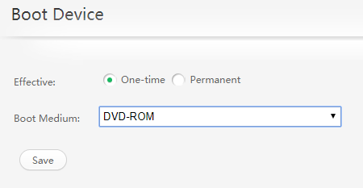
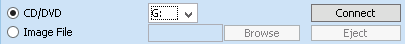
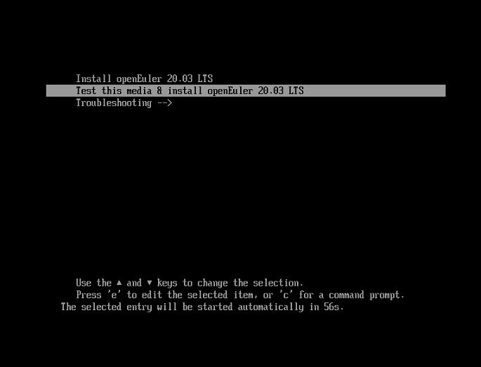
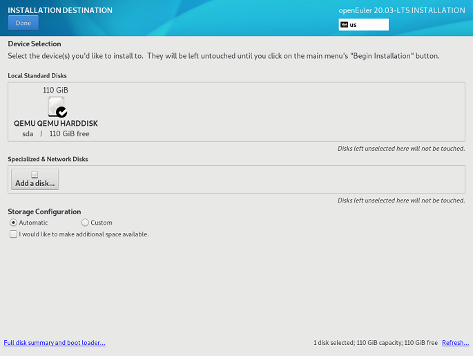
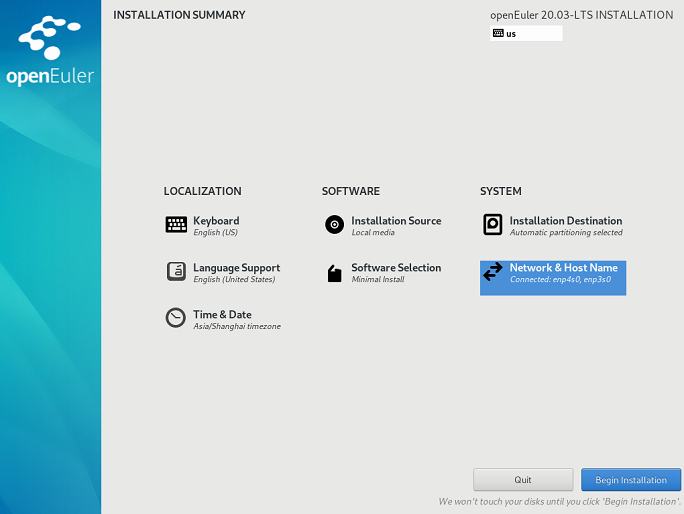
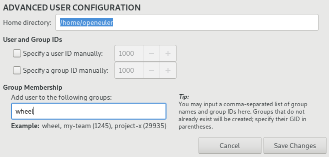

# Quick Start

This document uses openEuler 20.03 LTS installed on the TaiShan 200 server as an example to describe how to quickly install and use openEuler OS. For details about the installation requirements and methods, see  [openEuler 20.03 LTS Installation Guide](https://openeuler.org/en/docs/20.03_LTS/docs/Installation/Installation.html).
<!-- TOC -->

- [Quick Start](#quick-start)
    - [Installation Preparations](#installation-preparations)
    - [Obtaining the Installation Source](#obtaining-the-installation-source)
    - [Release Package Integrity Check](#release-package-integrity-check)
    - [Starting the Installation](#starting-the-installation)
    - [Installation](#installation)
    - [Viewing System Information](#viewing-system-information)

<!-- /TOC -->

## Installation Preparations

-   Hardware Compatibility

    [Table 1](#table14948632047)  describes the types of supported servers.

    **Table  1**  Supported servers

    <a name="table14948632047"></a>
    <table><thead align="left"><tr id="en-us_topic_0229291190_row5949431547"><th class="cellrowborder" valign="top" width="26.369999999999997%" id="mcps1.2.4.1.1"><p id="en-us_topic_0229291190_p694923843"><a name="en-us_topic_0229291190_p694923843"></a><a name="en-us_topic_0229291190_p694923843"></a>Server Type</p>
    </th>
    <th class="cellrowborder" valign="top" width="24%" id="mcps1.2.4.1.2"><p id="en-us_topic_0229291190_p132705020556"><a name="en-us_topic_0229291190_p132705020556"></a><a name="en-us_topic_0229291190_p132705020556"></a>Server Name</p>
    </th>
    <th class="cellrowborder" valign="top" width="49.63%" id="mcps1.2.4.1.3"><p id="en-us_topic_0229291190_p119491131848"><a name="en-us_topic_0229291190_p119491131848"></a><a name="en-us_topic_0229291190_p119491131848"></a>Server Model</p>
    </th>
    </tr>
    </thead>
    <tbody><tr id="en-us_topic_0229291190_row8949153348"><td class="cellrowborder" valign="top" width="26.369999999999997%" headers="mcps1.2.4.1.1 "><p id="en-us_topic_0229291190_p4893192424117"><a name="en-us_topic_0229291190_p4893192424117"></a><a name="en-us_topic_0229291190_p4893192424117"></a>Rack server</p>
    </td>
    <td class="cellrowborder" valign="top" width="24%" headers="mcps1.2.4.1.2 "><p id="en-us_topic_0229291190_p02706012553"><a name="en-us_topic_0229291190_p02706012553"></a><a name="en-us_topic_0229291190_p02706012553"></a>TaiShan 200</p>
    </td>
    <td class="cellrowborder" valign="top" width="49.63%" headers="mcps1.2.4.1.3 "><p id="en-us_topic_0229291190_p126551941225"><a name="en-us_topic_0229291190_p126551941225"></a><a name="en-us_topic_0229291190_p126551941225"></a>2280 balanced model</p>
    </td>
    </tr>
    <tr id="en-us_topic_0229291190_row104064391909"><td class="cellrowborder" valign="top" width="26.369999999999997%" headers="mcps1.2.4.1.1 "><p id="en-us_topic_0229291190_p54061539609"><a name="en-us_topic_0229291190_p54061539609"></a><a name="en-us_topic_0229291190_p54061539609"></a>Rack server</p>
    </td>
    <td class="cellrowborder" valign="top" width="24%" headers="mcps1.2.4.1.2 "><p id="en-us_topic_0229291190_p9937105713311"><a name="en-us_topic_0229291190_p9937105713311"></a><a name="en-us_topic_0229291190_p9937105713311"></a>FusionServer Pro </p>
    </td>
    <td class="cellrowborder" valign="top" width="49.63%" headers="mcps1.2.4.1.3 "><p id="en-us_topic_0229291190_p154063394011"><a name="en-us_topic_0229291190_p154063394011"></a><a name="en-us_topic_0229291190_p154063394011"></a>FusionServer Pro 2288H V5</p>
    <div class="note" id="en-us_topic_0229291190_note2046771016316"><a name="en-us_topic_0229291190_note2046771016316"></a><a name="en-us_topic_0229291190_note2046771016316"></a><span class="notetitle"> NOTE: </span><div class="notebody"><p id="en-us_topic_0229291190_p1646710101130"><a name="en-us_topic_0229291190_p1646710101130"></a><a name="en-us_topic_0229291190_p1646710101130"></a>The server must be configured with the Avago SAS3508 RAID controller card and the LOM-X722 NIC.</p>
    </div></div>
    </td>
    </tr>
    </tbody>
    </table>

-   Minimum Hardware Specifications

    [Table 2](#tff48b99c9bf24b84bb602c53229e2541)  lists the minimum hardware specifications supported by openEuler.

    **Table  2**  Minimum hardware specifications

    <a name="tff48b99c9bf24b84bb602c53229e2541"></a>
    <table><thead align="left"><tr id="en-us_topic_0229291228_r36f08b63edea4973a8228200caa2a50b"><th class="cellrowborder" valign="top" width="11.19111911191119%" id="mcps1.2.4.1.1"><p id="en-us_topic_0229291228_aef3575d97cdf4dcfb65f8d0c8d2d4a76"><a name="en-us_topic_0229291228_aef3575d97cdf4dcfb65f8d0c8d2d4a76"></a><a name="en-us_topic_0229291228_aef3575d97cdf4dcfb65f8d0c8d2d4a76"></a>Component</p>
    </th>
    <th class="cellrowborder" valign="top" width="40.06400640064006%" id="mcps1.2.4.1.2"><p id="en-us_topic_0229291228_a919d3bb266c8432fb33c51fa8f3a4fc3"><a name="en-us_topic_0229291228_a919d3bb266c8432fb33c51fa8f3a4fc3"></a><a name="en-us_topic_0229291228_a919d3bb266c8432fb33c51fa8f3a4fc3"></a>Minimum Hardware Specifications</p>
    </th>
    <th class="cellrowborder" valign="top" width="48.74487448744874%" id="mcps1.2.4.1.3"><p id="en-us_topic_0229291228_a3ac7cf4867974c4990ee6deab716db5f"><a name="en-us_topic_0229291228_a3ac7cf4867974c4990ee6deab716db5f"></a><a name="en-us_topic_0229291228_a3ac7cf4867974c4990ee6deab716db5f"></a>Description</p>
    </th>
    </tr>
    </thead>
    <tbody><tr id="en-us_topic_0229291228_r1a3ceb0cc79241c6ba8c5fb800c274e2"><td class="cellrowborder" valign="top" width="11.19111911191119%" headers="mcps1.2.4.1.1 "><p id="en-us_topic_0229291228_af37d7ef138ee45eca00898e0d34a03f4"><a name="en-us_topic_0229291228_af37d7ef138ee45eca00898e0d34a03f4"></a><a name="en-us_topic_0229291228_af37d7ef138ee45eca00898e0d34a03f4"></a>Architecture</p>
    </td>
    <td class="cellrowborder" valign="top" width="40.06400640064006%" headers="mcps1.2.4.1.2 "><a name="en-us_topic_0229291228_ul262164044016"></a><a name="en-us_topic_0229291228_ul262164044016"></a><ul id="en-us_topic_0229291228_ul262164044016"><li>AArch64</li><li>x86_64</li></ul>
    </td>
    <td class="cellrowborder" valign="top" width="48.74487448744874%" headers="mcps1.2.4.1.3 "><a name="en-us_topic_0229291228_ul1830173916388"></a><a name="en-us_topic_0229291228_ul1830173916388"></a><ul id="en-us_topic_0229291228_ul1830173916388"><li>64-bit Arm architecture</li><li>64-bit Intel x86 architecture</li></ul>
    </td>
    </tr>
    <tr id="en-us_topic_0229291228_ra68eff5c33a84bb2be6672a48a643d26"><td class="cellrowborder" valign="top" width="11.19111911191119%" headers="mcps1.2.4.1.1 "><p id="en-us_topic_0229291228_ac0a50d2069ab444cafff180647772df4"><a name="en-us_topic_0229291228_ac0a50d2069ab444cafff180647772df4"></a><a name="en-us_topic_0229291228_ac0a50d2069ab444cafff180647772df4"></a>CPU</p>
    </td>
    <td class="cellrowborder" valign="top" width="40.06400640064006%" headers="mcps1.2.4.1.2 "><a name="en-us_topic_0229291228_ul97131912175915"></a><a name="en-us_topic_0229291228_ul97131912175915"></a><ul id="en-us_topic_0229291228_ul97131912175915"><li>Huawei Kunpeng 920 series</li><li>Intel <sup>&reg;</sup> Xeon<sup>&reg;</sup> processor</li></ul>
    </td>
    <td class="cellrowborder" valign="top" width="48.74487448744874%" headers="mcps1.2.4.1.3 "><p id="en-us_topic_0229291228_a2601e9eece5f4c7bb02881c9ac647a61"><a name="en-us_topic_0229291228_a2601e9eece5f4c7bb02881c9ac647a61"></a><a name="en-us_topic_0229291228_a2601e9eece5f4c7bb02881c9ac647a61"></a>-</p>
    </td>
    </tr>
    <tr id="en-us_topic_0229291228_rf2a5d43b74894a0882b7c17bdfeb697f"><td class="cellrowborder" valign="top" width="11.19111911191119%" headers="mcps1.2.4.1.1 "><p id="en-us_topic_0229291228_ad00611ec129a41a9841fb579eece7804"><a name="en-us_topic_0229291228_ad00611ec129a41a9841fb579eece7804"></a><a name="en-us_topic_0229291228_ad00611ec129a41a9841fb579eece7804"></a>Memory</p>
    </td>
    <td class="cellrowborder" valign="top" width="40.06400640064006%" headers="mcps1.2.4.1.2 "><p id="en-us_topic_0229291228_a94efe642b8694e5a85747e123b951efc"><a name="en-us_topic_0229291228_a94efe642b8694e5a85747e123b951efc"></a><a name="en-us_topic_0229291228_a94efe642b8694e5a85747e123b951efc"></a>≥ 4 GB (8 GB or higher recommended for better user experience)</p>
    </td>
    <td class="cellrowborder" valign="top" width="48.74487448744874%" headers="mcps1.2.4.1.3 "><p id="en-us_topic_0229291228_abfb44d28dca741f68df94e4e276d2410"><a name="en-us_topic_0229291228_abfb44d28dca741f68df94e4e276d2410"></a><a name="en-us_topic_0229291228_abfb44d28dca741f68df94e4e276d2410"></a>-</p>
    </td>
    </tr>
    <tr id="en-us_topic_0229291228_rd2c1ebd93ea64e85a5f3fc88dc5ba456"><td class="cellrowborder" valign="top" width="11.19111911191119%" headers="mcps1.2.4.1.1 "><p id="en-us_topic_0229291228_afd36954546334c1681b5a391bbc386ae"><a name="en-us_topic_0229291228_afd36954546334c1681b5a391bbc386ae"></a><a name="en-us_topic_0229291228_afd36954546334c1681b5a391bbc386ae"></a>Hard disk</p>
    </td>
    <td class="cellrowborder" valign="top" width="40.06400640064006%" headers="mcps1.2.4.1.2 "><p id="en-us_topic_0229291228_p1224172312719"><a name="en-us_topic_0229291228_p1224172312719"></a><a name="en-us_topic_0229291228_p1224172312719"></a>≥ 120 GB (for better user experience)</p>
    </td>
    <td class="cellrowborder" valign="top" width="48.74487448744874%" headers="mcps1.2.4.1.3 "><p id="en-us_topic_0229291228_acc0affdd82e34f32966171e21855ef40"><a name="en-us_topic_0229291228_acc0affdd82e34f32966171e21855ef40"></a><a name="en-us_topic_0229291228_acc0affdd82e34f32966171e21855ef40"></a>The hard disk supports IDE, SATA, SAS interfaces.</p>
    </td>
    </tr>
    </tbody>
    </table>


## Obtaining the Installation Source

Perform the following operations to obtain the openEuler release package:

1.  Log in to the  [openEuler Community](https://openeuler.org)  website.
2.  Click  **Download**. 
3.  Click the link provided after  **Download ISO**. The download list is displayed.
4.  Click  **openEuler-20.03-LTS**. The openEuler 20.03 LTS version download list is displayed.
5.  Click  **ISO**. The ISO download list is displayed.
    -   **aarch64**: ISO image file of the AArch64 architecture
    -   **x86\_64**: ISO image file of the x86\_64 architecture
    -   **source**: ISO image file of the openEuler source code

6.  Select the openEuler release package and verification file to be downloaded based on the architecture of the environment to be installed.
    -   If the AArch64 architecture is used:
        1.  Click  **aarch64**.
        2.  Click  **openEuler-20.03-LTS-aarch64-dvd.iso**  to download the openEuler release package to the local host.
        3.  Click  **openEuler-20.03-LTS-aarch64-dvd.iso.sha256sum**  to download the openEuler verification file to the local host.

    -   If the x86\_64 architecture is used:
        1.  Click  **x86\_64**.
        2.  Click  **openEuler-20.03-LTS-x86\_64-dvd.iso**  to download the openEuler release package to the local host.
        3.  Click  **openEuler-20.03-LTS-x86\_64-dvd.iso.sha256sum**  to download the openEuler verification file to the local host.


## Release Package Integrity Check

To prevent incomplete download of the software package due to network or storage device problems during the transmission, you can perform the following steps to check the integrity of the obtained openEuler software package:

1.  Obtain the verification value in the verification file. Run the following command:

    ```
    #cat openEuler-20.03-LTS-aarch64-dvd.iso.sha256sum 
    ```

2.  Calculate the SHA256 verification value of the file. Run the following command:

    ```
    #sha256sum openEuler-20.03-LTS-aarch64-dvd.iso
    ```

    After the command is run, the verification value is displayed.

3.  Check whether the values calculated in step 1 and step 2 are consistent.

    If the verification values are consistent, the .iso file is not damaged. If they are inconsistent, you can confirm that the file is damaged and you need to obtain the file again.


## Starting the Installation

1.  Log in to the iBMC WebUI.

    For details, see  [TaiShan 200 Server User Guide \(Model 2280\)](https://support.huawei.com/enterprise/en/doc/EDOC1100093459).

2.  Choose  **Configuration**  from the main menu, and select  **Boot Device**  from the navigation tree. The  **Boot Device**  page is displayed.

    Set  **Effective**  and  **Boot Medium**  to  **One-time**  and  **DVD-ROM**, respectively, and click  **Save**, as shown in  [Figure 1](#fig1011938131018).

    **Figure  1**  Setting the boot device<a name="fig1011938131018"></a>  
    

3.  Choose  **Remote Console**  from the main menu. The  **Remote Console**  page is displayed.

    Select an integrated remote console as required to access the remote virtual console, for example,  **Java Integrated Remote Console \(Shared\)**.

4.  On the toolbar, click the icon shown in the following figure.

    **Figure  2**  Drive icon<a name="en-us_topic_0229291223_en-us_topic_0151920806_f6ff7658b349942ea87f4521c0256c32e"></a>  
    

    An image dialog box is displayed, as shown in the following figure.

    **Figure  3**  Image dialog box<a name="en-us_topic_0229291223_en-us_topic_0151920806_fb74fb37f86cd423aacf34bddedd6841a"></a>  
    

5.  Select  **Image File**  and then click  **Browse**. The  **Open**  dialog box is displayed.
6.  Select the image file and click  **Open**. In the image dialog box, click  **Connect**. If  **Connect**  changes to  **Disconnect**, the virtual CD/DVD-ROM drive is connected to the server.
7.  On the toolbar, click the restart icon shown in the following figure to restart the device.

    **Figure  4**  Restart icon<a name="en-us_topic_0229291223_en-us_topic_0151920806_f0d1f4f5f96de47b48c64b3535b2b60d1"></a>  
    

8.  A boot menu is displayed after the system restarts, as shown in  [Figure 5](#fig1648754873314).

    > **NOTE:**   
    >-   If you do not perform any operations within 1 minute, the system automatically selects the default option  **Test this media & install openEuler 20.03 LTS**  and enters the installation page.  
    >-   During PM installation, if you cannot use the arrow keys to select boot options and the system does not respond after you press  **Enter**, click    on the BMC page and configure  **Key & Mouse Reset**.  

    **Figure  5**  Installation Wizard<a name="fig1648754873314"></a>  
    

9.  On the installation wizard page, press  **Enter**  to select the default option  **Test this media & install openEuler 20.03 LTS**  to enter the GUI installation page.

## Installation

After entering the GUI installation page, perform the following operations to install the system:

1.  Set an installation language. The default language is English. You can change the language based on the site requirements, as shown in  [Figure 6](#fig874344811484).

    **Figure  6**  Selecting a language<a name="fig874344811484"></a>  
    

2.  On the  **INSTALLATION SUMMARY**  page, set configuration items based on the site requirements.

    -   A configuration item with an alarm symbol must be configured. When the alarm symbol disappears, you can perform the next operation.
    -   A configuration item without an alarm symbol is configured by default.
    -   You can click  **Begin Installation**  to install the system only when all alarms are cleared.

    **Figure  7**  Installation summary<a name="fig24261457656"></a>  
    

    1.  Select  **Software Selection**  to set configuration items.

        Based on the site requirements, select  **Minimal Install**  on the left box and select an add-on in the  **Add-Ons for Selected Environment**  area on the right, as shown in  [Figure 8](#fig1133717611109).

        **Figure  8**  Selecting installation software<a name="fig1133717611109"></a>  
        

        > **NOTE:**   
        >-   In  **Minimal Install**  mode, not all packages in the installation source will be installed. If the required package is not installed, you can mount the installation source to the local PC and configure a repo source, and use DNF to install the package.  
        >-   If you select  **Virtual Host**, the virtualization components QEMU, libvirt, and edk2 are installed by default. You can select whether to install the OVS component in the add-on area.  

        After the setting is complete, click  **Done**  in the upper left corner to go back to the  **INSTALLATION SUMMARY**  page.

    2.  Select  **Installation Destination**  to set configuration items.

        On the  **INSTALLATION DESTINATION**  page, select a local storage device or click  **Add a disk**  to add a specified additional device or network device. You also need to configure the storage to partition the system. You can either manually configure partitions or select  **Automatic**  to automatically configure partitioning. Select  **Automatic**  if the software is installed in a new storage device or the data in the storage device is not required, as shown in  [Figure 9](#fig153381468101).

        > **NOTICE:**   
        >When selecting the device to be installed, you are advised not to use the NVMe SSD storage medium as the OS installation disk.  

        **Figure  9**  Setting the installation destination<a name="fig153381468101"></a>  
        

        > **NOTE:**   
        >-   During partitioning, to ensure system security and performance, you are advised to divide the device into the following partitions:  **/boot**,  **/var**,  **/var/log**,  **/var/log/audit**,  **/home**, and  **/tmp**.  
        >-   If the system is configured with the swap partition, the swap partition is used when the physical memory of the system is insufficient. Although the swap partition can be used to expand the physical memory, if the swap partition is used due to insufficient memory, the system response slows and the system performance deteriorates. Therefore, you are not advised to configure the swap partition in the system with sufficient physical memory or the performance sensitive system.  
        >-   If you need to split a logical volume group, select  **Custom**  to manually partition the logical volume group. On the  **MANUAL PARTITIONING**  page, click  **Modify**  in the  **Volume Group**  area to reconfigure the logical volume group.  

        After the setting is complete, click  **Done**  in the upper left corner to go back to the  **INSTALLATION SUMMARY**  page.

    3.  Set other configuration items. You can use the default values for other configuration items.

3.  Click  **Begin Installation**  to install the system, as shown in  [Figure 10](#fig1717019357392).

    **Figure  10**  Starting installation<a name="fig1717019357392"></a>  
    

4.  Set the root user password.

    Click  **Root Password**. In the displayed dialog box, as shown in  [Figure 11](#en-us_topic_0186390266_en-us_topic_0122145909_fig1323165793018), enter a password and re-enter to confirm.

    > **NOTE:**   
    >The  **root**  password must be configured when you install software packages. Otherwise, the installation will fail. A  **root**  account is used for performing critical system administration tasks. It is not recommended to use this account for daily work or system access.  

    The password of the  **root**  user must meet the password complexity requirements. Otherwise, the password configuration or user creation will fail. The password complexity requirements are as follows:

    -   A password must contain at least eight characters.
    -   A password must contain at least three of the following types: uppercase letters, lowercase letters, digits, and special characters.
    -   A password must be different from the account name.
    -   A password cannot contain words in the dictionary.
        -   Querying a dictionary

            In the installed openEuler environment, you can run the following command to export the dictionary library file  **dictionary.txt**, and then check whether the password is in the dictionary.

            ```
            cracklib-unpacker /usr/share/cracklib/pw_dict > dictionary.txt
            ```

        -   Modifying a dictionary
            -   Modify the exported dictionary library file, and then run the following command to update the dictionary library:

                ```
                create-cracklib-dict dictionary.txt
                ```

            -   Run the following command to add another dictionary file  **custom.txt**  to the original dictionary library.

                ```
                create-cracklib-dict dictionary.txt custom.txt
                ```
    
    **Figure  11**  Password of the  **root**  account<a name="en-us_topic_0186390266_en-us_topic_0122145909_fig1323165793018"></a>  
    
    
5.  Create a user.

    Click  **User Creation**.  [Figure 12](#en-us_topic_0186390266_en-us_topic_0122145909_fig1237715313319)  shows the page for creating a user. Enter a username and set a password. The password complexity requirements are the same as those of the user  **root**. By clicking  **Advanced**, you can also configure a home directory and a user group, as shown in  [Figure 13](#en-us_topic_0186390266_en-us_topic_0122145909_fig128716531312).

    **Figure  12**  Creating a user<a name="en-us_topic_0186390266_en-us_topic_0122145909_fig1237715313319"></a>  
    

    **Figure  13**  Advanced user configuration<a name="en-us_topic_0186390266_en-us_topic_0122145909_fig128716531312"></a>  
    

    After configuration, click  **Done**  in the left-upper corner to switch back to the installation process page.

6.  After the installation is complete, restart the system.

    openEuler has been installed, as shown in  [Figure 14](#en-us_topic_0186390267_en-us_topic_0122145917_fig1429512116338). Click  **Reboot**  to restart the system.

    **Figure  14**  Completing the installation<a name="en-us_topic_0186390267_en-us_topic_0122145917_fig1429512116338"></a>  
    


## Viewing System Information

After the system is installed and restarted, the system CLI login page is displayed. Enter the username and password set during the installation to log in to openEuler OS and view the following system information. For details about system management and configuration, see the  [openEuler 20.03 LTS Administrator Guide](https://openeuler.org/en/docs/20.03_LTS/docs/Administration/administration.html).

-   Run the following command to view the system information:

    ```
    cat /etc/os-release
    ```

    For example, the command and output are as follows:

    ```
    # cat /etc/os-release
    NAME="openEuler"
    VERSION="20.03 (LTS)"
    ID="openEuler"
    VERSION_ID="20.03"
    PRETTY_NAME="openEuler 20.03 (LTS)"
    ANSI_COLOR="0;31"
    ```

-   View system resource information.

    Run the following command to view the CPU information:

    ```
    lscpu
    ```

    Run the following command to view the memory information:

    ```
    free
    ```

    Run the following command to view the disk information:

    ```
    fdisk -l
    ```

-   Run the following command to view the IP address:

    ```
    ip addr
    ```


