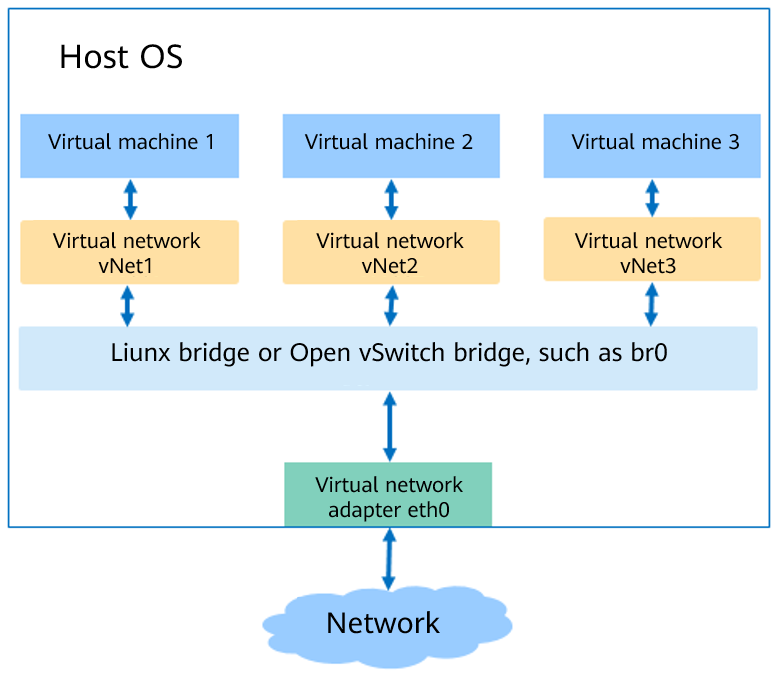

# Environment Preparation

- [Environment Preparation](#environment-preparation)
    - [Preparing a VM Image](#preparing-a-vm-image)
    - [Preparing the VM Network](#preparing-the-vm-network)
    - [Preparing Boot Firmware](#preparing-boot-firmware)

## Preparing a VM Image

### Overview

A VM image is a file that contains a virtual disk that has been installed and can be used to start the OS. VM images are in different formats, such as raw and qcow2. Compared with the raw format, the qcow2 format occupies less space and supports features such as snapshot, copy-on-write, AES encryption, and zlib compression. However, the performance of the qcow2 format is slightly lower than that of the raw format. The qemu-img tool is used to create image files. This section uses the qcow2 image file as an example to describe how to create a VM image.

### Creating an Image

To create a qcow2 image file, perform the following steps:

1.  Install the  **qemu-img**  software package.

    ```
    # yum install -y qemu-img
    ```

2.  Run the  **create**  command of the qemu-img tool to create an image file. The command format is as follows:

    ```
    $ qemu-img create -f <imgFormat> -o <fileOption> <fileName> <diskSize>
    ```

    The parameters are described as follows:

    -   _imgFormat_: Image format. The value can be  **raw**  or  **qcow2**.
    -   _fileOption_: File option, which is used to set features of an image file, such as specifying a backend image file, compression, and encryption.
    -   _fileName_: File name.
    -   _diskSize_: Disk size, which specifies the size of a block disk. The unit can be K, M, G, or T, indicating KiB, MiB, GiB, or TiB.

    For example, to create an image file openEuler-imge.qcow2 whose disk size is 4 GB and format is qcow2, the command and output are as follows:

    ```
    $ qemu-img create -f qcow2 openEuler-image.qcow2 4G
    Formatting 'openEuler-image.qcow2', fmt=qcow2 size=4294967296 cluster_size=65536 lazy_refcounts=off refcount_bits=16
    ```


### Changing the Image Disk Space

If a VM requires larger disk space, you can use the qemu-img tool to change the disk space of the VM image. The method is as follows:

1.  Run the following command to query the disk space of the VM image:

    ```
    # qemu-img info <imgFiLeName>
    ```

    For example, if the command and output for querying the disk space of the openEuler-image.qcow2 image are as follows, the disk space of the image is 4 GiB.

    ```
    # qemu-img info openEuler-image.qcow2 
    image: openEuler-image.qcow2
    file format: qcow2
    virtual size: 4.0G (4294967296 bytes)
    disk size: 196K
    cluster_size: 65536
    Format specific information:
        compat: 1.1
        lazy refcounts: false
        refcount bits: 16
        corrupt: false
    ```

2.  Run the following command to change the image disk space. In the command,  _imgFiLeName_  indicates the image name, and  **+**  and  **-**  indicate the image disk space to be increased and decreased, respectively. The unit is KB, MB, GB, and T, indicating KiB, MiB, GiB, and TiB, respectively.

    ```
    # qemu-img resize <imgFiLeName> [+|-]<size>
    ```

    For example, to expand the disk space of the openEuler-image.qcow2 image to 24 GiB, that is, to add 20 GiB to the original 4 GiB, the command and output are as follows:

    ```
    # qemu-img resize openEuler-image.qcow2 +20G
    Image resized.
    ```

3.  Run the following command to check whether the image disk space is changed successfully:

    ```
    # qemu-img info <imgFiLeName>
    ```

    For example, if the openEuler-image.qcow2 image disk space has been expanded to 24 GiB, the command and output are as follows:

    ```
    # qemu-img info openEuler-image.qcow2 
    image: openEuler-image.qcow2
    file format: qcow2
    virtual size: 24G (25769803776 bytes)
    disk size: 200K
    cluster_size: 65536
    Format specific information:
        compat: 1.1
        lazy refcounts: false
        refcount bits: 16
        corrupt: false
    ```


## Preparing the VM Network

### Overview

To enable the VM to communicate with external networks, you need to configure the network environment for the VM. KVM virtualization supports multiple types of bridges, such as Linux bridge and Open vSwitch bridge. As shown in  [Figure 1](#fig1785384714917), the data transmission path is  **VM \> virtual NIC device \> Linux bridge or Open vSwitch bridge \> physical NIC**. In addition to configuring virtual NICs \(vNICs\) for VMs, creating a bridge for a host is the key to connecting to a virtualized network.

This section describes how to set up a Linux bridge and an Open vSwitch bridge to connect a VM to the network. You can select a bridge type based on the site requirements.

**Figure  1**  Virtual network structure<a name="fig1785384714917"></a>  


### Setting Up a Linux Bridge

The following describes how to bind the physical NIC eth0 to the Linux bridge br0.

1.  Install the  **bridge-utils**  software package.

    The Linux bridge is managed by the brctl tool. The corresponding installation package is bridge-utils. The installation command is as follows:

    ```
    # yum install -y bridge-utils
    ```

2.  Create bridge br0.

    ```
    # brctl addbr br0
    ```

3.  Bind the physical NIC eth0 to the Linux bridge.

    ```
    # brctl addif br0 eth0
    ```

4.  After eth0 is connected to the bridge, the IP address of eth0 is set to 0.0.0.0.

    ```
    # ifconfig eth0 0.0.0.0
    ```

5.  Set the IP address of br0.
    -   If a DHCP server is available, set a dynamic IP address through the dhclient.

        ```
        # dhclient br0
        ```

    -   If no DHCP server is available, configure a static IP address for br0. For example, set the static IP address to 192.168.1.2 and subnet mask to 255.255.255.0.

        ```
        # ifconfig br0 192.168.1.2 netmask 255.255.255.0
        ```


### Setting Up an Open vSwitch Bridge

The Open vSwitch bridge provides more convenient automatic orchestration capabilities. This section describes how to install network virtualization components to set up an Open vSwitch bridge.

**1. Install the Open vSwitch component.**

If the Open vSwitch is used to provide virtual network, you need to install the Open vSwitch network virtualization component.

1.  Install the Open vSwitch component.

    ```
    # yum install -y openvswitch-kmod
    # yum install -y openvswitch
    ```

2.  Start the Open vSwitch service.

    ```
    # systemctl start openvswitch
    ```


**2. Check whether the installation is successful.**

Check whether the Open vSwitch components, openvswitch-kmod and openvswitch, are successfully installed.

1.  Check whether the openvswitch-kmod component is successfully installed. If the installation is successful, the software package information is displayed. The command and output are as follows:

    ```
    # rpm -qi openvswitch-kmod
    Name        : openvswitch-kmod
    Version     : 2.11.1
    Release     : 1.oe3
    Architecture: aarch64
    Install Date: Thu 15 Aug 2019 05:07:49 PM CST
    Group       : System Environment/Daemons
    Size        : 15766774
    License     : GPLv2
    Signature   : (none)
    Source RPM  : openvswitch-kmod-2.11.1-1.oe3.src.rpm
    Build Date  : Thu 08 Aug 2019 04:33:08 PM CST
    Build Host  : armbuild10b175b113b44
    Relocations : (not relocatable)
    Vendor      : OpenSource Security Ralf Spenneberg <ralf@os-s.net>
    URL         : http://www.openvswitch.org/
    Summary     : Open vSwitch Kernel Modules
    Description :
    Open vSwitch provides standard network bridging functions augmented with
    support for the OpenFlow protocol for remote per-flow control of
    traffic. This package contains the kernel modules.
    ```

2.  Check whether the openvswitch component is successfully installed. If the installation is successful, the software package information is displayed. The command and output are as follows:

    ```
    # rpm -qi openvswitch
    Name        : openvswitch
    Version     : 2.11.1
    Release     : 1
    Architecture: aarch64
    Install Date: Thu 15 Aug 2019 05:08:35 PM CST
    Group       : System Environment/Daemons
    Size        : 6051185
    License     : ASL 2.0
    Signature   : (none)
    Source RPM  : openvswitch-2.11.1-1.src.rpm
    Build Date  : Thu 08 Aug 2019 05:24:46 PM CST
    Build Host  : armbuild10b247b121b105
    Relocations : (not relocatable)
    Vendor      : Nicira, Inc.
    URL         : http://www.openvswitch.org/
    Summary     : Open vSwitch daemon/database/utilities
    Description :
    Open vSwitch provides standard network bridging functions and
    support for the OpenFlow protocol for remote per-flow control of
    traffic.
    ```

3.  Check whether the Open vSwitch service is started successfully. If the service is in the  **Active**  state, the service is started successfully. You can use the command line tool provided by the Open vSwitch. The command and output are as follows:

    ```
    # systemctl status openvswitch
    ● openvswitch.service - LSB: Open vSwitch switch
       Loaded: loaded (/etc/rc.d/init.d/openvswitch; generated)
       Active: active (running) since Sat 2019-08-17 09:47:14 CST; 4min 39s ago
         Docs: man:systemd-sysv-generator(8)
      Process: 54554 ExecStart=/etc/rc.d/init.d/openvswitch start (code=exited, status=0/SUCCESS)
        Tasks: 4 (limit: 9830)
       Memory: 22.0M
       CGroup: /system.slice/openvswitch.service
               ├─54580 ovsdb-server: monitoring pid 54581 (healthy)
               ├─54581 ovsdb-server /etc/openvswitch/conf.db -vconsole:emer -vsyslog:err -vfile:info --remote=punix:/var/run/openvswitch/db.sock --private-key=db:Open_vSwitch,SSL,private_key --certificate>
               ├─54602 ovs-vswitchd: monitoring pid 54603 (healthy)
               └─54603 ovs-vswitchd unix:/var/run/openvswitch/db.sock -vconsole:emer -vsyslog:err -vfile:info --mlockall --no-chdir --log-file=/var/log/openvswitch/ovs-vswitchd.log --pidfile=/var/run/open>
    ```


**3. Set up an Open vSwitch bridge**

The following describes how to set up an Open vSwitch layer-1 bridge br0.

1.  Create the Open vSwitch bridge br0.

    ```
    # ovs-vsctl add-br br0
    ```

2.  Add the physical NIC eth0 to br0.

    ```
    # ovs-vsctl add-port br0 eth0
    ```

3.  After eth0 is connected to the bridge, the IP address of eth0 is set to 0.0.0.0.

    ```
    # ifconfig eth0 0.0.0.0
    ```

4.  Assign an IP address to OVS bridge br0.
    -   If a DHCP server is available, set a dynamic IP address through the dhclient.

        ```
        # dhclient br0
        ```

    -   If no DHCP server is available, configure a static IP address for br0, for example, 192.168.1.2.

        ```
        # ifconfig br0 192.168.1.2
        ```


## Preparing Boot Firmware

### Overview

The boot mode varies depending on the architecture. x86 servers support the Unified Extensible Firmware Interface \(UFEI\) and BIOS boot modes, and AArch64 servers support only the UFEI boot mode. By default, boot files corresponding to the BIOS mode have been installed on openEuler. No additional operations are required. This section describes how to install boot files corresponding to the UEFI mode.

The Unified Extensible Firmware Interface \(UEFI\) is a new interface standard used for power-on auto check and OS boot. It is an alternative to the traditional BIOS. EDK II is a set of open source code that implements the UEFI standard. In virtualization scenarios, the EDK II tool set is used to start a VM in UEFI mode. Before using the EDK II tool, you need to install the corresponding software package before starting a VM. This section describes how to install the EDK II tool.

### Installation Methods

If the UEFI mode is used, the tool set EDK II needs to be installed. The installation package for the AArch64 architecture is  **edk2-aarch64**, and that for the x86 architecture is  **edk2-ovmf**. This section uses the AArch64 architecture as an example to describe the installation method. For the x86 architecture, you only need to replace  **edk2-aarch64**  with  **edk2-ovmf**.

1.  Run the following command to install the  **edk**  software package:

    In the AArch64 architecture, the  **edk2**  package name is  **edk2-aarch64**.

    ```
    # yum install -y edk2-aarch64
    ```

    In the x86\_64 architecture, the  **edk2**  package name is  **edk2-ovmf**.

    ```
    # yum install -y edk2-ovmf
    ```

2.  Run the following command to check whether the  **edk**  software package is successfully installed:

    In the AArch64 architecture, the command is as follows:

    ```
    # rpm -qi edk2-aarch64
    ```

    If information similar to the following is displayed, the  **edk**  software package is successfully installed:

    ```
    Name        : edk2-aarch64
    Version     : 20180815gitcb5f4f45ce
    Release     : 1.oe3
    Architecture: noarch
    Install Date: Mon 22 Jul 2019 04:52:33 PM CST
    Group       : Applications/Emulators
    ```

    In the x86\_64 architecture, the command is as follows:

    ```
    # rpm -qi edk2-ovmf
    ```

    If information similar to the following is displayed, the  **edk**  software package is successfully installed:

    ```
    Name        : edk2-ovmf
    Version     : 201908
    Release     : 6.oe1
    Architecture: noarch
    Install Date: Thu 19 Mar 2020 09:09:06 AM CST
    ```
