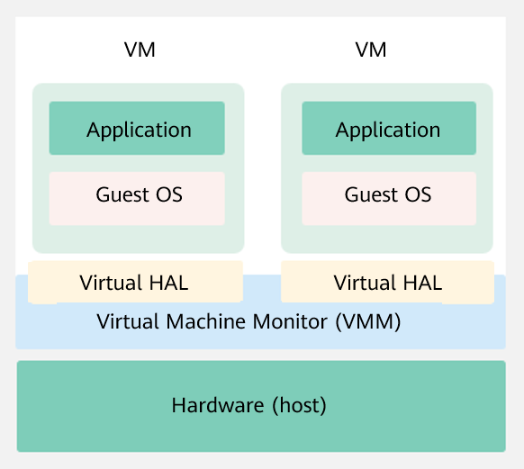
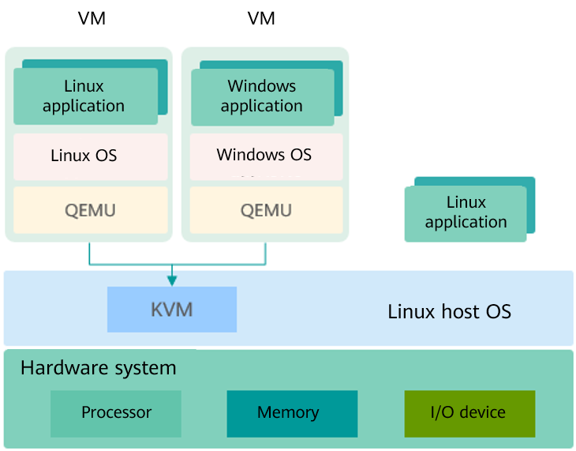

# Introduction to Virtualization

## Overview

In computer technologies, virtualization is a resource management technology. It abstracts various physical resources \(such as processors, memory, disks, and network adapters\) of a computer, converts the resources, and presents the resources for segmentation and combination into one or more computer configuration environments. This resource management technology breaks the inseparable barrier of the physical structure, and makes these resources not restricted by the architecture, geographical or physical configuration of the existing resources after virtualization. In this way, users can better leverage the computer hardware resources and maximize the resource utilization.

Virtualization enables multiple virtual machines \(VMs\) to run on a physical server. The VMs share the processor, memory, and I/O resources of the physical server, but are logically isolated from each other. In the virtualization technology, the physical server is called a host machine, the VM running on the host machine is called a guest, and the operating system \(OS\) running on the VM is called a guest OS. A layer of software, called the virtualization layer, exists between a host machine and a VM to simulate virtual hardware. This virtualization layer is called a VM monitor, as shown in the following figure.

**Figure  1**  Virtualized architecture 

## Virtualized Architecture

Currently, mainstream virtualization technologies are classified into two types based on the implementation structure of the Virtual Machine Monitor \(VMM\):

-   Hypervisor model

    In this model, VMM is considered as a complete operating system \(OS\) and has the virtualization function. VMM directly manages all physical resources, including processors, memory, and I/O devices.

-   Host model

    In this model, physical resources are managed by a host OS, which is a traditional OS, such as Linux and Windows. The host OS does not provide the virtualization capability. The VMM that provides the virtualization capability runs on the host OS as a driver or software of the system. The VMM invokes the host OS service to obtain resources and simulate the processor, memory, and I/O devices. The virtualization implementation of this model includes KVM and Virtual Box.

Kernel-based Virtual Machine \(KVM\) is a kernel module of Linux. It makes Linux a hypervisor.  [Figure 2](#fig310953013541)  shows the KVM architecture. KVM does not simulate any hardware device. It is used to enable virtualization capabilities provided by the hardware, such as Intel VT-x, AMD-V, Arm virtualization extensions. The user-mode QEMU simulates the mainboard, memory, and I/O devices. The user-mode QEMU works with the kernel KVM module to simulate VM hardware. The guest OS runs on the hardware simulated by the QEMU and KVM.

**Figure  2**  KVM architecture

## Virtualization Components

Virtualization components provided in the openEuler software package:

-   KVM: provides the core virtualization infrastructure to make the Linux system a hypervisor. Multiple VMs can run on the same host at the same time.
-   QEMU: simulates a processor and provides a set of device models to work with KVM to implement hardware-based virtualization simulation acceleration.
-   Libvirt: provides a tool set for managing VMs, including unified, stable, and open application programming interfaces \(APIs\), daemon process \(libvirtd\), and default command line management tool \(virsh\).
-   Open vSwitch: provides a virtual network tool set for VMs, supports programming extension and standard management interfaces and protocols \(such as NetFlow, sFlow, IPFIX, RSPAN, CLI, LACP, and 802.1ag\).

## Virtualization Characteristics

Virtualization has the following characteristics:

-   Partition

    Virtualization can logically divide software on a physical server to run multiple VMs \(virtual servers\) with different specifications.

-   Isolation

    Virtualization can simulate virtual hardware and provide hardware conditions for VMs to run complete OSs. The OSs of each VM are independent and isolated from each other. For example, if the OS of a VM breaks down due to a fault or malicious damage, the OSs and applications of other VMs are not affected.

-   Encapsulation

    Encapsulation is performed on a per VM basis. The excellent encapsulation capability makes VMs more flexible than physical machines. Functions such as live migration, snapshot, and cloning of VMs can be realized, implementing quick deployment and automatic O&M of data centers.

-   Hardware-irrelevant

    After being abstracted by the virtualization layer, VMs are not directly bound to underlying hardware and can run on other servers without being modified.

## Virtualization Advantages

Virtualization brings the following benefits to infrastructure of the data center:

-   Flexibility and scalability

    Users can dynamically allocate and reclaim resources based to meet dynamic service requirements. In addition, users can plan different VM specifications based on product requirements and adjust the scale without changing the physical resource configuration.

-   Higher availability and better O&M methods

    Virtualization provides O&M methods such as live migration, snapshot, live upgrade, and automatic DR. Physical resources can be deleted, upgraded, or changed without affecting users, improving service continuity and implementing automatic O&M.

-   Security hardening

    Virtualization provides OS-level isolation and hardware-based processor operation privilege-level control. Compared with simple sharing mechanisms, virtualization provides higher security and implements controllable and secure access to data and services.

-   High resource utilization

    Virtualization supports dynamic sharing of physical resources and resource pools, improving resource utilization.

## openEuler Virtualization

openEuler provides KVM virtualization components that support the AArch64 and x86\_64 processor architectures.

