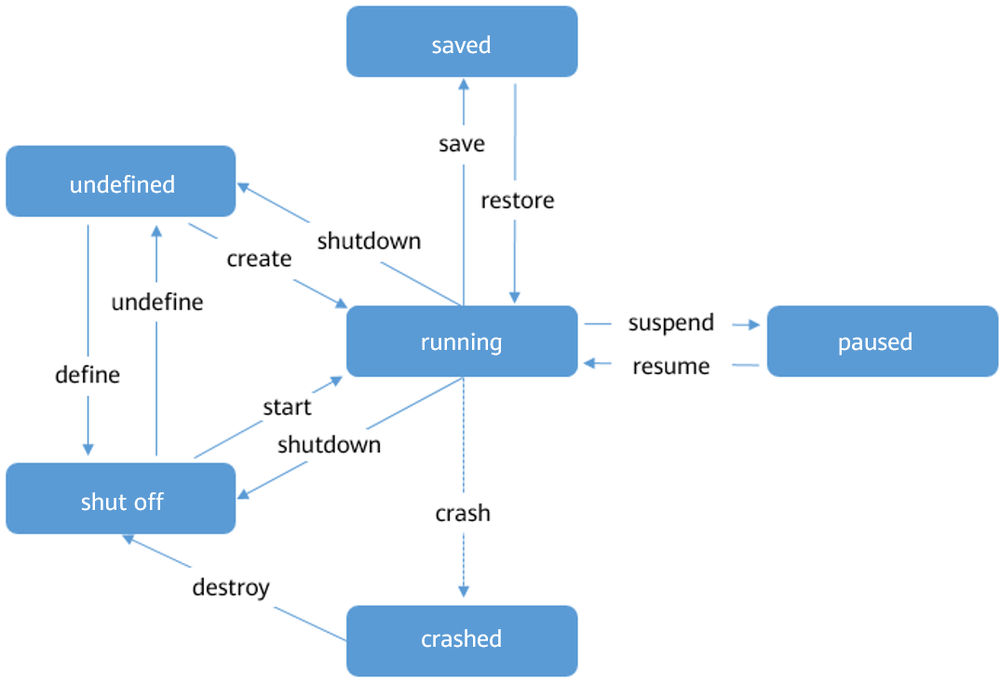

## Managing VMs

- [Managing VMs](#managing-vms)
    - [VM Life Cycle](#vm-life-cycle)
        - [Introduction](#introduction-0)
        - [Management Commands](#management-commands)
        - [Example](#example)
    - [Modify VM Configurations Online](#modify-vm-configurations-online)
    - [Querying VM Information](#querying-vm-information)
    - [Logging In to a VM](#logging-in-to-a-vm)
        - [Logging In Using VNC Passwords](#logging-in-using-vnc-passwords)
        - [Configuring VNC TLS Login](#configuring-vnc-tls-login)


### VM Life Cycle

#### Introduction

##### Overview

To leverage hardware resources and reduce costs, users need to properly manage VMs. This section describes basic operations during the VM lifecycle, such as creating, using, and deleting VMs.

##### VM Status

A VM can be in one of the following status:

-   **undefined**: The VM is not defined or created. That is, libvirt considers that the VM does not exist.
-   **shut off**: The VM has been defined but is not running, or the VM is terminated.
-   **running**: The VM is running.
-   **paused**: The VM is suspended and its running status is temporarily stored in the memory. The VM can be restored to the running status.
-   **saved**: Similar to the  **paused**  status, the running state is stored in a persistent storage medium and can be restored to the running status.
-   **crashed**: The VM crashes due to an internal error and cannot be restored to the running status.

##### Status Transition

VMs in different status can be converted, but certain rules must be met.  [Figure 1](#fig671014583483)  describes the common rules for transiting the VM status.

**Figure  1**  Status transition diagram<a name="fig671014583483"></a>  


##### VM ID

In libvirt, a created VM instance is called a  **domain**, which describes the configuration information of resources such as the CPU, memory, network device, and storage device of the VM. On a host, each domain has a unique ID, which is represented by the VM  **Name**,  **UUID**, and  **Id**. For details, see  [Table 1](#table84397266483). During the VM lifecycle, an operation can be performed on a specific VM by using a VM ID.

**Table  1**  Domain ID description


<table><thead align="left"><tr id="row194391726114819"><th class="cellrowborder" valign="top" width="24.57%" id="mcps1.2.3.1.1"><p id="p1417373404815"><a name="p1417373404815"></a><a name="p1417373404815"></a>ID</p>
</th>
<th class="cellrowborder" valign="top" width="75.42999999999999%" id="mcps1.2.3.1.2"><p id="p12173123414810"><a name="p12173123414810"></a><a name="p12173123414810"></a>Description</p>
</th>
</tr>
</thead>
<tbody><tr id="row143972684815"><td class="cellrowborder" valign="top" width="24.57%" headers="mcps1.2.3.1.1 "><p id="p1173534124817"><a name="p1173534124817"></a><a name="p1173534124817"></a>Name</p>
</td>
<td class="cellrowborder" valign="top" width="75.42999999999999%" headers="mcps1.2.3.1.2 "><p id="p16173193464815"><a name="p16173193464815"></a><a name="p16173193464815"></a>VM name</p>
</td>
</tr>
<tr id="row1644092654815"><td class="cellrowborder" valign="top" width="24.57%" headers="mcps1.2.3.1.1 "><p id="p917353411487"><a name="p917353411487"></a><a name="p917353411487"></a>UUID</p>
</td>
<td class="cellrowborder" valign="top" width="75.42999999999999%" headers="mcps1.2.3.1.2 "><p id="p19173734104819"><a name="p19173734104819"></a><a name="p19173734104819"></a>Universally unique identifier</p>
</td>
</tr>
<tr id="row12440626154811"><td class="cellrowborder" valign="top" width="24.57%" headers="mcps1.2.3.1.1 "><p id="p16174193404818"><a name="p16174193404818"></a><a name="p16174193404818"></a>Id</p>
</td>
<td class="cellrowborder" valign="top" width="75.42999999999999%" headers="mcps1.2.3.1.2 "><p id="p14174193464817"><a name="p14174193464817"></a><a name="p14174193464817"></a>VM running ID</p>
<div class="note" id="note117420341481"><a name="note117420341481"></a><a name="note117420341481"></a><span class="notetitle"> NOTE: </span><div class="notebody"><p id="p817413414484"><a name="p817413414484"></a><a name="p817413414484"></a>The ID is not displayed for a powered off VM.</p>
</div></div>
</td>
</tr>
</tbody>
</table>

> **NOTE:**   
>Run the  **virsh**  command to query the VM ID and UUID. For details, see  [Querying VM Information](#querying-vm-information).  

#### Management Commands

##### Overview

You can use the  **virsh**  command tool to manage the VM lifecycle. This section describes the commands related to the lifecycle.

##### Prerequisites

-   Before performing operations on a VM, you need to query the VM status to ensure that the operations can be performed. For details about the conversion between status, see  [Status Transition](#introduction-0).
-   You have administrator rights.
-   The VM XML configuration files are prepared.

##### Command Usage

You can run the  **virsh**  command to manage the VM lifecycle. The command format is as follows:

```
virsh <operate> <obj> <options>
```

The parameters are described as follows:

-   _operate_: manages VM lifecycle operations, such as creating, deleting, and starting VMs.
-   _obj_: specifies the operation object, for example, the VM to be operated.
-   _options_: command option. This parameter is optional.

[Table 1](#table389518422611)  describes the commands used for VM lifecycle management.  _VMInstanse_  indicates the VM name, VM ID, or VM UUID,  _XMLFile_  indicates the XML configuration file of the VM, and  _DumpFile_  indicates the dump file. Change them based on the site requirements.

**Table  1**  VM Lifecycle Management Commands


<table><thead align="left"><tr id="row11896124210613"><th class="cellrowborder" valign="top" width="31.669999999999998%" id="mcps1.2.3.1.1"><p id="p148961421461"><a name="p148961421461"></a><a name="p148961421461"></a>Command</p>
</th>
<th class="cellrowborder" valign="top" width="68.33%" id="mcps1.2.3.1.2"><p id="p789618424610"><a name="p789618424610"></a><a name="p789618424610"></a>Description</p>
</th>
</tr>
</thead>
<tbody><tr id="row16896134211610"><td class="cellrowborder" valign="top" width="31.669999999999998%" headers="mcps1.2.3.1.1 "><p id="p37307741012"><a name="p37307741012"></a><a name="p37307741012"></a><strong id="b973047201019"><a name="b973047201019"></a><a name="b973047201019"></a>virsh define </strong>&lt;<em id="i98831715135"><a name="i98831715135"></a><a name="i98831715135"></a>XMLFile</em>&gt;</p>
</td>
<td class="cellrowborder" valign="top" width="68.33%" headers="mcps1.2.3.1.2 "><p id="p7730770101"><a name="p7730770101"></a><a name="p7730770101"></a>Define a persistent VM. After the definition is complete, the VM is shut down and is considered as a <strong id="b186431046135716"><a name="b186431046135716"></a><a name="b186431046135716"></a>domain</strong> instance.</p>
</td>
</tr>
<tr id="row118965423615"><td class="cellrowborder" valign="top" width="31.669999999999998%" headers="mcps1.2.3.1.1 "><p id="p1873010791017"><a name="p1873010791017"></a><a name="p1873010791017"></a><strong id="b207308718102"><a name="b207308718102"></a><a name="b207308718102"></a>virsh create </strong>&lt;<em id="i132641341137"><a name="i132641341137"></a><a name="i132641341137"></a>XMLFile</em>&gt;</p>
</td>
<td class="cellrowborder" valign="top" width="68.33%" headers="mcps1.2.3.1.2 "><p id="p97301879104"><a name="p97301879104"></a><a name="p97301879104"></a>Create a temporary VM. After the VM is created, it is in the running status.</p>
</td>
</tr>
<tr id="row1689619421617"><td class="cellrowborder" valign="top" width="31.669999999999998%" headers="mcps1.2.3.1.1 "><p id="p37301474109"><a name="p37301474109"></a><a name="p37301474109"></a><strong id="b20730770108"><a name="b20730770108"></a><a name="b20730770108"></a>virsh start </strong>&lt;<em id="i204711236181813"><a name="i204711236181813"></a><a name="i204711236181813"></a>VMInstanse</em>&gt;</p>
</td>
<td class="cellrowborder" valign="top" width="68.33%" headers="mcps1.2.3.1.2 "><p id="p2073018721010"><a name="p2073018721010"></a><a name="p2073018721010"></a>Start the VM. </p>
</td>
</tr>
<tr id="row14896442366"><td class="cellrowborder" valign="top" width="31.669999999999998%" headers="mcps1.2.3.1.1 "><p id="p20291141611019"><a name="p20291141611019"></a><a name="p20291141611019"></a><strong id="b729181641014"><a name="b729181641014"></a><a name="b729181641014"></a>virsh shutdown </strong>&lt;<em id="i4966101010166"><a name="i4966101010166"></a><a name="i4966101010166"></a>VMInstanse</em>&gt;</p>
</td>
<td class="cellrowborder" valign="top" width="68.33%" headers="mcps1.2.3.1.2 "><p id="p17319175773610"><a name="p17319175773610"></a><a name="p17319175773610"></a>Shut down the VM. Start the VM shutdown process. If the VM fails to be shut down, forcibly stop it.</p>
</td>
</tr>
<tr id="row9896134210612"><td class="cellrowborder" valign="top" width="31.669999999999998%" headers="mcps1.2.3.1.1 "><p id="p929111641011"><a name="p929111641011"></a><a name="p929111641011"></a><strong id="b529191691010"><a name="b529191691010"></a><a name="b529191691010"></a>virsh destroy </strong>&lt;<em id="i694273815180"><a name="i694273815180"></a><a name="i694273815180"></a>VMInstanse</em>&gt;</p>
</td>
<td class="cellrowborder" valign="top" width="68.33%" headers="mcps1.2.3.1.2 "><p id="p1029271671016"><a name="p1029271671016"></a><a name="p1029271671016"></a>Forcibly stop the VM.</p>
</td>
</tr>
<tr id="row108969421161"><td class="cellrowborder" valign="top" width="31.669999999999998%" headers="mcps1.2.3.1.1 "><p id="p5292191611016"><a name="p5292191611016"></a><a name="p5292191611016"></a><strong id="b112925167108"><a name="b112925167108"></a><a name="b112925167108"></a>virsh reboot </strong>&lt;<em id="i3983440111815"><a name="i3983440111815"></a><a name="i3983440111815"></a>VMInstanse</em>&gt;</p>
</td>
<td class="cellrowborder" valign="top" width="68.33%" headers="mcps1.2.3.1.2 "><p id="p32921616111019"><a name="p32921616111019"></a><a name="p32921616111019"></a>Reboot the VM.</p>
</td>
</tr>
<tr id="row48973421767"><td class="cellrowborder" valign="top" width="31.669999999999998%" headers="mcps1.2.3.1.1 "><p id="p1424561235"><a name="p1424561235"></a><a name="p1424561235"></a><strong id="b8424261833"><a name="b8424261833"></a><a name="b8424261833"></a>virsh save </strong> &lt;<em id="i163855131814"><a name="i163855131814"></a><a name="i163855131814"></a>VMInstanse</em>&gt; &lt;<em id="i43271518136"><a name="i43271518136"></a><a name="i43271518136"></a>DumpFile</em>&gt;</p>
</td>
<td class="cellrowborder" valign="top" width="68.33%" headers="mcps1.2.3.1.2 "><p id="p3292916151012"><a name="p3292916151012"></a><a name="p3292916151012"></a>Dump the VM running status to a file.</p>
</td>
</tr>
<tr id="row7171162171019"><td class="cellrowborder" valign="top" width="31.669999999999998%" headers="mcps1.2.3.1.1 "><p id="p136882812108"><a name="p136882812108"></a><a name="p136882812108"></a><strong id="b86802814106"><a name="b86802814106"></a><a name="b86802814106"></a>virsh restore </strong>&lt;<em id="i119924133319"><a name="i119924133319"></a><a name="i119924133319"></a>DumpFile</em>&gt;</p>
</td>
<td class="cellrowborder" valign="top" width="68.33%" headers="mcps1.2.3.1.2 "><p id="p868182841017"><a name="p868182841017"></a><a name="p868182841017"></a>Restore the VM from the VM status dump file.</p>
</td>
</tr>
<tr id="row1117211217102"><td class="cellrowborder" valign="top" width="31.669999999999998%" headers="mcps1.2.3.1.1 "><p id="p669328161014"><a name="p669328161014"></a><a name="p669328161014"></a><strong id="b106918286103"><a name="b106918286103"></a><a name="b106918286103"></a>virsh suspend </strong>&lt;<em id="i215106151910"><a name="i215106151910"></a><a name="i215106151910"></a>VMInstanse</em>&gt;</p>
</td>
<td class="cellrowborder" valign="top" width="68.33%" headers="mcps1.2.3.1.2 "><p id="p1069182871017"><a name="p1069182871017"></a><a name="p1069182871017"></a>Suspend the VM to make the VM in the paused status.</p>
</td>
</tr>
<tr id="row1917215213101"><td class="cellrowborder" valign="top" width="31.669999999999998%" headers="mcps1.2.3.1.1 "><p id="p16691428161011"><a name="p16691428161011"></a><a name="p16691428161011"></a><strong id="b1869132812100"><a name="b1869132812100"></a><a name="b1869132812100"></a>virsh resume </strong>&lt;<em id="i14154151015192"><a name="i14154151015192"></a><a name="i14154151015192"></a>VMInstanse</em>&gt;</p>
</td>
<td class="cellrowborder" valign="top" width="68.33%" headers="mcps1.2.3.1.2 "><p id="p469328141011"><a name="p469328141011"></a><a name="p469328141011"></a>Resume the VM and restore the VM in the paused status to the running status.</p>
</td>
</tr>
<tr id="row11173921141013"><td class="cellrowborder" valign="top" width="31.669999999999998%" headers="mcps1.2.3.1.1 "><p id="p1569162812109"><a name="p1569162812109"></a><a name="p1569162812109"></a><strong id="b136913287105"><a name="b136913287105"></a><a name="b136913287105"></a>virsh undefine </strong>&lt;<em id="i2597181811911"><a name="i2597181811911"></a><a name="i2597181811911"></a>VMInstanse</em>&gt;</p>
</td>
<td class="cellrowborder" valign="top" width="68.33%" headers="mcps1.2.3.1.2 "><p id="p369122819106"><a name="p369122819106"></a><a name="p369122819106"></a>After a persistent VM is destroyed, the VM lifecycle ends and no more operations can be performed on the VM.</p>
</td>
</tr>
</tbody>
</table>

#### Example

This section provides examples of commands related to VM life cycle management.

-   Create a VM.

    The VM XML configuration file is  **openEulerVM.xml**. The command and output are as follows:

    ```
    # virsh define openEulerVM.xml
    Domain openEulerVM defined from openEulerVM.xml
    ```


-   Start a VM. 

    Run the following command to start the  _openEulerVM_:

    ```
    # virsh start openEulerVM
    Domain openEulerVM started
    ```

-   Reboot a VM.

    Run the following command to reboot the  _openEulerVM_:

    ```
    # virsh reboot openEulerVM
    Domain openEulerVM is being rebooted
    ```

-   Shut down a VM.

    Run the following command to shut down the  _openEulerVM_:

    ```
    # virsh shutdown openEulerVM
    Domain openEulerVM is being shutdown
    ```

-   Destroy a VM.
    -   If the  **nvram**  file is not used during the VM startup, run the following command to destroy the VM:

        ```
        # virsh undefine <VMInstanse>
        ```

    -   If the  **nvram**  file is used during the VM startup, run the following command to specify the  **nvram**  processing policy when destroying the VM:

        ```
        # virsh undefine <VMInstanse> <strategy>
        ```

        _strategy_  indicates the policy for destroying a VM. The values can be:

        --**nvram**: delete the corresponding  **nvram**  file when destroying a VM.

        --**keep-nvram**: destroy a VM but retain the corresponding  **nvram**  file.

        For example, to delete the  _openEulerVM_  and its  **nvram**  file, run the following command:

        ```
        # virsh undefine openEulerVM --nvram
        Domain openEulerVM has been undefined
        ```


### Modify VM Configurations Online

#### Overview

After a VM is created, users can modify VM configurations. This process is called online modification of VM configuration. After the configuration is modified online, the new VM configuration file is persistent and takes effect after the VM is shut down and restarted.

The format of the command for modifying VM configuration is as follows:

```
virsh edit <VMInstance>
```

The  **virsh edit**  command is used to edit the XML configuration file corresponding to  **domain**  to update VM configuration.  **virsh edit**  uses the  **vi**  program as the default editor. You can specify the editor type by modifying the environment variable  _EDITOR_  or  _VISUAL_. By default,  **virsh edit**  preferentially uses the text editor specified by the environment variable  _VISUAL_.

#### Procedure

1.  \(Optional\) Set the editor of the  **virsh edit**  command to  **vim**.

    ```
    # export VISUAL=vim
    ```

2.  Run the  **virsh edit**  command to open the XML configuration file of the  _openEulerVM_.

    ```
    # virsh edit openEulerVM
    ```

3.  Modify the VM configuration file.
4.  Save the VM configuration file and exit.
5.  Reboot the VM for the configuration to take effect.

    ```
    # virsh reboot openEulerVM
    ```


### Querying VM Information

#### Overview

The libvirt provides a set of command line tools to query VM information. This section describes how to use commands to obtain VM information.

#### Prerequisites

To query VM information, the following requirements must be met:

-   The libvirtd service is running.

-   Only the administrator has the permission to execute command line.

#### Querying VM Information on a Host.

-   Query the list of running and paused VMs on a host.

    ```
    # virsh list
    ```

    For example, the following command output indicates that three VMs exist on the host.  **openEulerVM01**  and  **openEulerVM02**  are running, and  **openEulerVM03**  is paused.

    ```
     Id    Name                           State
    ----------------------------------------------------
     39    openEulerVM01                   running
     40    openEulerVM02                   running
     69    openEulerVM03                   paused
    ```


-   Query the list of VM information defined on a host.

    ```
    # virsh list --all
    ```

    For example, the following command output indicates that four VMs are defined on the current host.  **openEulerVM01**  is running,  **openEulerVM02**  is paused, and  **openEulerVM03**  and  **openEulerVM04**  are shut down.

    ```
     Id    Name                           State
    ----------------------------------------------------
     39    openEulerVM01                  running
     69    openEulerVM02                  paused
     -     openEulerVM03                  shut off
     -     openEulerVM04                  shut off
    ```


#### Querying Basic VM Information

Libvirt component provides a group of commands for querying the VM status, including the VM running status, device information, and scheduling attributes. For details, see  [Table 1](#table10582103963816).

**Table  1**  Querying basic VM information


<table><thead align="left"><tr id="row1858320394388"><th class="cellrowborder" valign="top" width="16.41164116411641%" id="mcps1.2.4.1.1"><p id="p11583173983813"><a name="p11583173983813"></a><a name="p11583173983813"></a>Information to be queried</p>
</th>
<th class="cellrowborder" valign="top" width="37.72377237723772%" id="mcps1.2.4.1.2"><p id="p7583539103816"><a name="p7583539103816"></a><a name="p7583539103816"></a>Command line</p>
</th>
<th class="cellrowborder" valign="top" width="45.86458645864587%" id="mcps1.2.4.1.3"><p id="p85831039103818"><a name="p85831039103818"></a><a name="p85831039103818"></a>Description</p>
</th>
</tr>
</thead>
<tbody><tr id="row1958314393386"><td class="cellrowborder" valign="top" width="16.41164116411641%" headers="mcps1.2.4.1.1 "><p id="p13583133923819"><a name="p13583133923819"></a><a name="p13583133923819"></a>Basic information</p>
</td>
<td class="cellrowborder" valign="top" width="37.72377237723772%" headers="mcps1.2.4.1.2 "><p id="p65831839193819"><a name="p65831839193819"></a><a name="p65831839193819"></a><strong id="b6163104455314"><a name="b6163104455314"></a><a name="b6163104455314"></a>virsh dominfo</strong><em id="i68095290111"><a name="i68095290111"></a><a name="i68095290111"></a> &lt;VMInstance&gt;</em></p>
</td>
<td class="cellrowborder" valign="top" width="45.86458645864587%" headers="mcps1.2.4.1.3 "><p id="p9583183915380"><a name="p9583183915380"></a><a name="p9583183915380"></a>The information includes the VM ID, UUID, and VM specifications.</p>
</td>
</tr>
<tr id="row1958320393383"><td class="cellrowborder" valign="top" width="16.41164116411641%" headers="mcps1.2.4.1.1 "><p id="p19583839183817"><a name="p19583839183817"></a><a name="p19583839183817"></a>Current status</p>
</td>
<td class="cellrowborder" valign="top" width="37.72377237723772%" headers="mcps1.2.4.1.2 "><p id="p658312398384"><a name="p658312398384"></a><a name="p658312398384"></a><strong id="b1051304710532"><a name="b1051304710532"></a><a name="b1051304710532"></a>virsh domstate</strong><em id="i452815388117"><a name="i452815388117"></a><a name="i452815388117"></a> &lt;VMInstance&gt;</em></p>
</td>
<td class="cellrowborder" valign="top" width="45.86458645864587%" headers="mcps1.2.4.1.3 "><p id="p2058343913381"><a name="p2058343913381"></a><a name="p2058343913381"></a>You can use the <strong id="b562262954113"><a name="b562262954113"></a><a name="b562262954113"></a>--reason</strong> option to query the reason why the VM changes to the current status.</p>
</td>
</tr>
<tr id="row175838395384"><td class="cellrowborder" valign="top" width="16.41164116411641%" headers="mcps1.2.4.1.1 "><p id="p105831939153812"><a name="p105831939153812"></a><a name="p105831939153812"></a>Scheduling information</p>
</td>
<td class="cellrowborder" valign="top" width="37.72377237723772%" headers="mcps1.2.4.1.2 "><p id="p45831439123820"><a name="p45831439123820"></a><a name="p45831439123820"></a><strong id="b48561249175312"><a name="b48561249175312"></a><a name="b48561249175312"></a>virsh schedinfo</strong><em id="i5581174112116"><a name="i5581174112116"></a><a name="i5581174112116"></a> &lt;VMInstance&gt;</em></p>
</td>
<td class="cellrowborder" valign="top" width="45.86458645864587%" headers="mcps1.2.4.1.3 "><p id="p95841339143816"><a name="p95841339143816"></a><a name="p95841339143816"></a>The information includes the vCPU share.</p>
</td>
</tr>
<tr id="row7584439183820"><td class="cellrowborder" valign="top" width="16.41164116411641%" headers="mcps1.2.4.1.1 "><p id="p155841039173810"><a name="p155841039173810"></a><a name="p155841039173810"></a>Number of vCPUs</p>
</td>
<td class="cellrowborder" valign="top" width="37.72377237723772%" headers="mcps1.2.4.1.2 "><p id="p1858420390389"><a name="p1858420390389"></a><a name="p1858420390389"></a><strong id="b1427395345319"><a name="b1427395345319"></a><a name="b1427395345319"></a>virsh vcpucount<em id="i13236144015290"><a name="i13236144015290"></a><a name="i13236144015290"></a> </em></strong><em id="i3406175013110"><a name="i3406175013110"></a><a name="i3406175013110"></a>&lt;VMInstance&gt;</em></p>
</td>
<td class="cellrowborder" valign="top" width="45.86458645864587%" headers="mcps1.2.4.1.3 "><p id="p155843392381"><a name="p155843392381"></a><a name="p155843392381"></a>Number of vCPUs of the VM.</p>
</td>
</tr>
<tr id="row15584193973820"><td class="cellrowborder" valign="top" width="16.41164116411641%" headers="mcps1.2.4.1.1 "><p id="p1258417396387"><a name="p1258417396387"></a><a name="p1258417396387"></a>Virtual block device status</p>
</td>
<td class="cellrowborder" valign="top" width="37.72377237723772%" headers="mcps1.2.4.1.2 "><p id="p9584639123820"><a name="p9584639123820"></a><a name="p9584639123820"></a><strong id="b8432175618532"><a name="b8432175618532"></a><a name="b8432175618532"></a>virsh domblkstat </strong><em id="i77100571118"><a name="i77100571118"></a><a name="i77100571118"></a>&lt;VMInstance&gt;</em></p>
</td>
<td class="cellrowborder" valign="top" width="45.86458645864587%" headers="mcps1.2.4.1.3 "><p id="p155841393384"><a name="p155841393384"></a><a name="p155841393384"></a>To query the name of a block device, run the <strong id="b122131347181618"><a name="b122131347181618"></a><a name="b122131347181618"></a>virsh domblklist</strong> command.</p>
</td>
</tr>
<tr id="row05841639153813"><td class="cellrowborder" valign="top" width="16.41164116411641%" headers="mcps1.2.4.1.1 "><p id="p15584163983814"><a name="p15584163983814"></a><a name="p15584163983814"></a>vNIC status</p>
</td>
<td class="cellrowborder" valign="top" width="37.72377237723772%" headers="mcps1.2.4.1.2 "><p id="p1158411390389"><a name="p1158411390389"></a><a name="p1158411390389"></a><strong id="b14243916105419"><a name="b14243916105419"></a><a name="b14243916105419"></a>virsh domifstat</strong><em id="i11486439121"><a name="i11486439121"></a><a name="i11486439121"></a> &lt;VMInstance&gt;</em></p>
</td>
<td class="cellrowborder" valign="top" width="45.86458645864587%" headers="mcps1.2.4.1.3 "><p id="p10584163919383"><a name="p10584163919383"></a><a name="p10584163919383"></a>To query the NIC name, run the <strong id="b85773231180"><a name="b85773231180"></a><a name="b85773231180"></a>virsh domiflist</strong> command.</p>
</td>
</tr>
<tr id="row258413397385"><td class="cellrowborder" valign="top" width="16.41164116411641%" headers="mcps1.2.4.1.1 "><p id="p1258483914386"><a name="p1258483914386"></a><a name="p1258483914386"></a>I/O thread</p>
</td>
<td class="cellrowborder" valign="top" width="37.72377237723772%" headers="mcps1.2.4.1.2 "><p id="p55845397381"><a name="p55845397381"></a><a name="p55845397381"></a><strong id="b04151220175413"><a name="b04151220175413"></a><a name="b04151220175413"></a>virsh iothreadinfo </strong><em id="i37361563122"><a name="i37361563122"></a><a name="i37361563122"></a>&lt;VMInstance&gt;</em></p>
</td>
<td class="cellrowborder" valign="top" width="45.86458645864587%" headers="mcps1.2.4.1.3 "><p id="p2058433919382"><a name="p2058433919382"></a><a name="p2058433919382"></a>VM I/O thread and CPU affinity.</p>
</td>
</tr>
</tbody>
</table>

#### Example

-   Run the  **virsh dominfo**  command to query the basic information about a created VM. The query result shows that the VM ID is  **5**, UUID is  **ab472210-db8c-4018-9b3e-fc5319a769f7**, memory size is 8 GiB, and the number of vCPUs is 4.

    ```
    # virsh dominfo openEulerVM
    Id:             5
    Name:           openEulerVM
    UUID:           ab472210-db8c-4018-9b3e-fc5319a769f7
    OS Type:        hvm
    State:          running
    CPU(s):         4
    CPU time:       6.8s
    Max memory:     8388608 KiB
    Used memory:    8388608 KiB
    Persistent:     no
    Autostart:      disable
    Managed save:   no
    Security model: none
    Security DOI:   0
    ```


-   Run the  **virsh domstate**  command to query the VM status. The query result shows that VM  **openEulerVM**  is running.

    ```
    # virsh domstate openEulerVM
    running
    ```

-   Run  **virsh schedinfo**  to query the VM scheduling information. The query result shows that the CPU reservation share of the VM is 1024.

    ```
    # virsh schedinfo openEulerVM
    Scheduler      : posix
    cpu_shares     : 1024
    vcpu_period    : 100000
    vcpu_quota     : -1
    emulator_period: 100000
    emulator_quota : -1
    global_period  : 100000
    global_quota   : -1
    iothread_period: 100000
    iothread_quota : -1
    ```

-   Run the  **virsh vcpucount**  command to query the number of vCPUs. The query result shows that the VM has four CPUs.

    ```
    # virsh vcpucount openEulerVM
    maximum      live           4
    current      live           4
    ```

-   Run the  **virsh domblklist**  command to query the VM disk information. The query result shows that the VM has two disks. sda is a virtual disk in qcow2 format, and sdb is a cdrom device.

    ```
     # virsh domblklist openEulerVM
     Target   Source
    ---------------------------------------------------------------------
     sda      /home/openeuler/vm/openEuler_aarch64.qcow2
     sdb      /home/openeuler/vm/openEuler-20.03-LTS-aarch64-dvd.iso
    ```

-   Run the  **virsh domiflist**  command to query the VM NIC information. The query result shows that the VM has one NIC, the backend is vnet0, which is on the br0 bridge of the host. The MAC address is 00:05:fe:d4:f1:cc.

    ```
    # virsh domiflist openEulerVM
    Interface  Type       Source     Model       MAC
    -------------------------------------------------------
    vnet0      bridge     br0        virtio      00:05:fe:d4:f1:cc
    ```

-   Run the  **virsh iothreadinfo**  command to query the VM I/O thread information. The query result shows that the VM has five I/O threads, which are scheduled on physical CPUs 7-10.

    ```
    # virsh iothreadinfo openEulerVM
     IOThread ID     CPU Affinity
    ---------------------------------------------------
     3               7-10
     4               7-10
     5               7-10
     1               7-10
     2               7-10
    ```


### Logging In to a VM

This section describes how to log in to a VM using VNC.

#### Logging In Using VNC Passwords

##### Overview

After the OS is installed on a VM, you can remotely log in to the VM using VNC to manage the VM.

##### Prerequisites

Before logging in to a VM using a client, such as RealVNC or TightVNC, ensure that:

-   You have obtained the IP address of the host where the VM resides.
-   The environment where the client resides can access the network of the host.
-   You have obtained the VNC listening port of the VM. This port is automatically allocated when the client is started. Generally, the port number is  **5900 + x**  \(_x_  is a positive integer and increases in ascending order based on the VM startup sequence.  **5900**  is invisible to users.\)
-   If a password has been set for the VNC, you also need to obtain the VNC password of the VM.

    > **NOTE:**   
    >To set a password for the VM VNC, edit the XML configuration file of the VM. That is, add the  **passwd**  attribute to the  **graphics**  element and set the attribute value to the password to be configured. For example, to set the VNC password of the VM to  **n8VfjbFK**, configure the XML file as follows:  
    >```  
    >    <graphics type='vnc' port='5900' autoport='yes' listen='0.0.0.0' keymap='en-us' passwd='n8VfjbFK'>  
    >      <listen type='address' address='0.0.0.0'/>  
    >    </graphics>  
    >```


##### Procedure
##### Procedure

1.  Query the VNC port number used by the VM. For example, if the VM name is  _openEulerVM_, run the following command:

    ```
    # virsh vncdisplay openEulerVM
    :3
    ```

    > **NOTE:**   
    >To log in to the VNC, you need to configure firewall rules to allow the connection of the VNC port. The reference command is as follows, where  _X_  is  **5900 + Port number**, for example,  **5903**.  
    >```  
    >firewall-cmd --zone=public --add-port=X/tcp  
    >```

2.  Start the VncViewer software and enter the IP address and port number of the host. The format is  **host IP address:port number**, for example,  **10.133.205.53:3**.
3.  Click  **OK**  and enter the VNC password \(optional\) to log in to the VM VNC.

#### Configuring VNC TLS Login

##### Overview

By default, the VNC server and client transmit data in plaintext. Therefore, the communication content may be intercepted by a third party. To improve security, openEuler allows the VNC server to configure the Transport Layer Security \(TLS\) mode for encryption and authentication. TLS implements encrypted communication between the VNC server and client to prevent communication content from being intercepted by third parties.

> **NOTE:**   
>-   To use the TLS encryption authentication mode, the VNC client must support the TLS mode \(for example, TigerVNC\). Otherwise, the VNC client cannot be connected.  
>-   The TLS encryption authentication mode is configured at the host level. After this feature is enabled, the TLS encryption authentication mode is enabled for the VNC clients of all VMs running on the host.  

##### Procedure

To enable the TLS encryption authentication mode for the VNC, perform the following steps:

1.  Log in to the host where the VNC server resides, and edit the corresponding configuration items in the  **/etc/libvirt/qemu.conf**  configuration file of the server. The configuration is as follows:

    ```
    vnc_listen = "x.x.x.x"                    # "x.x.x.x" indicates the listening IP address of the VNC. Set this parameter based on the site requirements. The VNC server allows only the connection requests from clients whose IP addresses are in this range.
    vnc_tls = 1                        # If this parameter is set to 1, VNC TLS is enabled.
    vnc_tls_x509_cert_dir = "/etc/pki/libvirt-vnc"                           # Specify /etc/pki/libvirt-vnc as the path for storing the certificate.
    vnc_tls_x509_verify = 1                              #If this parameter is set to 1, the X509 certificate is used for TLS authentication.
    ```

2.  Create a certificate and a private key file for the VNC. The following uses GNU TLS as an example.

    > **NOTE:**   
    >To use GNU TLS, install the gnu-utils software package in advance.  

    1.  Create a certificate file issued by the Certificate Authority \(CA\).

        ```
        # certtool --generate-privkey > ca-key.pem
        ```

    1.  Create a self-signed public and private key for the CA certificate.  _Your organization name_  indicates the organization name, which is specified by the user.

        ```
        # cat > ca.info<<EOF
        cn = Your organization name 
        ca
        cert_signing_key
        EOF
        ```

        ```
        # certtool --generate-self-signed \
                 --load-privkey ca-key.pem \
                 --template ca.info \
                 --outfile ca-cert.pem
        ```

        In the preceding generated file,  **ca-cert.pem**  is the generated CA public key, and** ca-key.pem**  is the generated CA private key. The CA must keep them properly to prevent disclosure.

    2.  Issue a certificate to the VNC server.  **Client Organization Name**  indicates the actual service name, for example,  **cleint.foo.com**. Set this parameter based on the site requirements.

        ```
        # cat > server.info<<EOF
        cn = Server Organization Name
        tls_www_server
        encryption_key
        signing_key
        EOF
        ```

        ```
        # certtool --generate-privkey > server-key.pem
        # certtool --generate-certificate \
                   --load-ca-certificate ca-cert.pem \
                   --load-ca-privkey ca-key.pem \
                   --load-privkey server-key.pem \
                   --template server.info \
                   --outfile server-cert.pem
        ```

        In the preceding generated file,  **server-key.pem**  is the private key of the VNC server, and  **server-cert.pem**  is the public key of the VNC server.

    3.  Issue a certificate to the VNC client.

        ```
        # cat > client.info<<EOF
        cn = Client Organization Name
        tls_www_client
        encryption_key
        signing_key
        EOF
        ```

        ```
        # certtool --generate-privkey > client-key.pem
        # certtool --generate-certificate \
                   --load-ca-certificate ca-cert.pem \
                   --load-ca-privkey ca-key.pem \
                   --load-privkey client-key.pem \
                   --template client.info \
                   --outfile client-cert.pem
        ```

        In the preceding generated file,  **client-key.pem**  is the private key of the VNC client, and  **client-cert.pem**  is the public key of the VNC client. The generated public and private key pairs need to be copied to the VNC client.

3.  Shut down the VM to be logged in to and restart the libvirtd service on the host where the VNC server resides.

    ```
    # systemctl restart libvirtd
    ```

4.  Save the generated server certificate to the specified directory on the VNC server and grant the read and write permissions on the certificate only to  the current user.

    ```
    # sudo mkdir -m 750 /etc/pki/libvirt-vnc
    # cp ca-cert.pem /etc/pki/libvirt-vnc/ca-cert.pem
    # cp server-cert.pem /etc/pki/libvirt-vnc/server-cert.pem
    # cp server-key.pem /etc/pki/libvirt-vnc/server-key.pem
    # chmod 0600 /etc/pki/libvirt-vnc/*
    ```

5.  Copy the generated client certificates  **ca-cert.pem**,  **client-cert.pem**, and  **client-key.pem**  to the VNC client. After the TLS certificate of the VNC client is configured, you can use VNC TLS to log in to the VM.

    > **NOTE:**   
    >-   For details about how to configure the VNC client certificate, see the usage description of each client.  
    >-   For details about how to log in to the VM, see Logging In Using VNC Passwords.  

