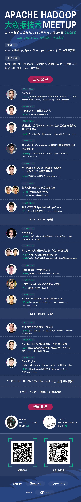

+++ 
author = "openLooKeng"
time = "2020.09.26" 
title = "Apache Hadoop大数据技术Meetup" 
location = " · 地点: 中国上海" 
tag = "Meetup"
img = "./events/2020-09-26/banner.png" 
img_mobile = './events/2020-09-26/banner.png'
link = "./events/2020-09-26/shanghai-meetup.html"
eventtype = "lookBack"
description = "由Apache Hadoop、Spark、Flink、openLooKeng等技术开源社区及上海白玉兰开源开放研究院共同发起的Apache Hadoop大数据技术Meetup。"
weight = 95
+++

### 关于Meetup

openLooKeng社区用开源的魅力吸引真正热爱技术并持续探索的用户和开发者，Meetup通过打造一个自由、活跃的前沿技术交流空间，定期邀请业内专家分享与深度探讨大数据领域的前瞻性技术思考与经验，共同构建一个能够融合多元文化的开源大数据社区。

### 活动介绍

由Apache Hadoop、Spark、Flink、openLooKeng等技术开源社区及上海白玉兰开源开放研究院共同发起的Apache Hadoop大数据技术Meetup，联合来自华为、阿里巴巴、Cloudera、Databricks、滴滴出行、京东、美团点评、清华大学、腾讯、小米、字节跳动等公司的多位技术大咖，于9月26日在上海，共同探讨大数据开源技术前沿动态的思考与经验，旨在促进工程师同行相互交流、学习、社交。

### 时间

2020-9-26 9:00 -18:00

### 地点

上海市黄浦区延安东路550号海洋大厦29层（氪空间）

### 回放地址

https://space.bilibili.com/627629884/channel/detail?cid=151660

### 资料下载
<a href="https://openlookeng-website.obs.ap-southeast-1.myhuaweicloud.com/讲师PPT.zip" download>点击下载议题资料</a>
### 活动议程

