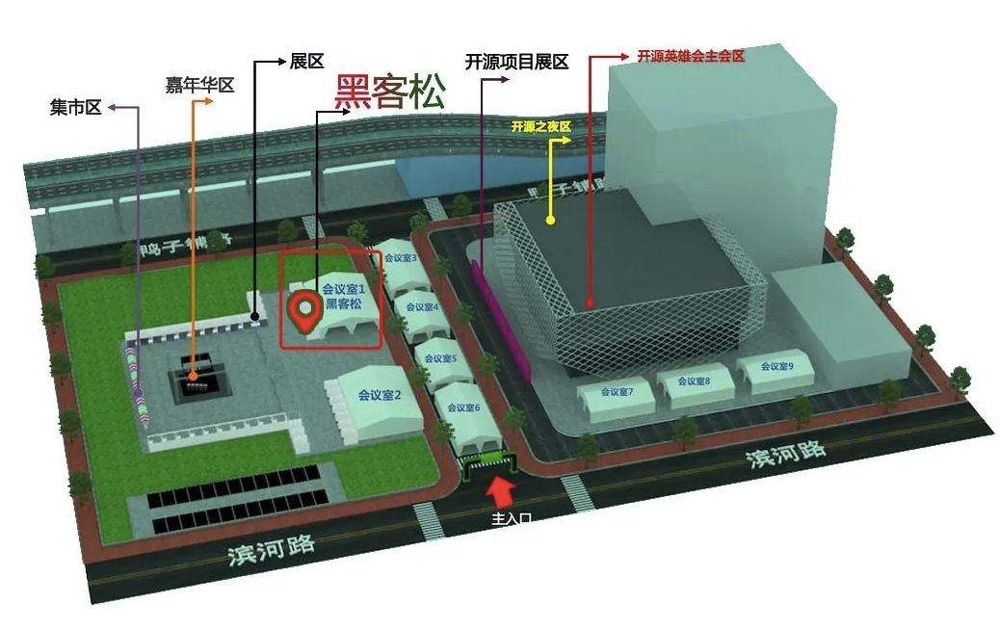
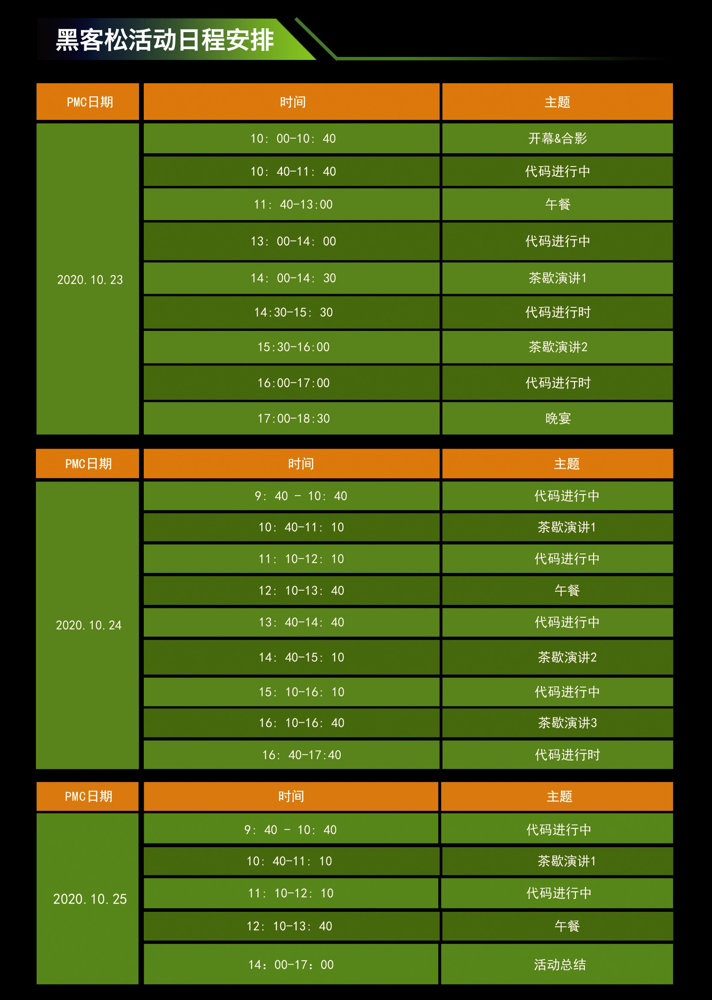

+++ 
author = "openLooKeng"
time = "2020.10.23-2020.10.26" 
title = "2020 第十一届中国开源黑客松" 
location = "长沙" 
tag = "黑客松"
img = "./events/2020-10-23/banner.png" 
img_mobile = './events/2020-10-23/banner.png'
link = "./events/2020-10-23/hackathon.html"
eventtype = "lookBack"
description = "由中国电子技术标准化研究院、华为、腾讯云、英特尔，鹏城实验室联合主办第十一届中国开源黑客松活动将与1024程序员节相结合，规模空前，相信一定可以碰撞出不一样的火花。"
weight = 94
+++

### 关于黑客松

黑客松作为开源开发者搭建交流沟通的互动平台，以实现bug修复和代码优化为目标，推动开源技术广泛使用，活动自2015年开办以来，始终坚持“开放代码、开放设计、开放开发、开放社区”的开源理念，用实际编程行动鼓励开发者技术创新、创意实践，利用多元的应用场景，呈现黑客松团队协作、自由共享、协同创新的理念。

### 活动介绍

由中国电子技术标准化研究院、华为、腾讯云、英特尔，鹏城实验室联合主办第十一届中国开源黑客松活动将与1024程序员节相结合，规模空前，相信一定可以碰撞出不一样的火花。

本届活动项目广泛覆盖OpenStack/Kubernetes/openEuler/Mindspore/openGauss/openLooKeng/SODA/Kata/Ceph/ChubaoFS等多个项目，涵盖了多个主流的支撑基础架构平台的开源项目，共建多个场景的全栈合作模式。

### 参与形式：

面对面聚集在一张张“圆桌”上，
参加者们在各自的团队中共同协作，完成目标。

### 参与纪念品：

### 我们的项目：openLooKeng

Leader：Yongle Li

Task：New Feature，Hands-on

目标：完成openLooKeng在多个操作系统（openEuler\openSUSE\CentOS）多个架构（arm、x86）上的安装和验证

### 参加开源项目详情：

### 活动信息：

日期：10月23日-10月26日（周五至周日）

会场：马栏山视频创意文化园室外帐篷会场一（论坛一）

地址：湖南省 长沙市 开福区 鸭子辅路1号

### 活动流程：

### 报名方式：

扫描二维码或点击链接

https://etherpad.opendev.org/p/PRC-OpenSource-Hackathon-11-ChangSha

欢迎报名

### 更多详情，请关注

openLooKeng 官方公众号     openLooKeng微信小助手

