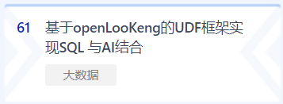

+++ 
author = "openLookeng"
time = "2020.11.05-2021.04.20" 
title = "openLooKeng参加openEuler高校开发者大赛，50万奖金等你来赢" 
location = "线上" 
tag = "开发者竞赛"
img = "./events/2020-11-12/banner.png" 
img_mobile = './events/2020-11-12/banner.png'
link = "./events/2020-11-12/developer-competition.html"
eventtype = "upComing"
description = "为了丰富openEuler的技术生态，作为大数据领域中的关键项目，咱们openLooKeng也贡献了赛题，关注openLooKeng的同学，抓住机会哦。与行业顶级大咖的交流，把技术构想从0变1，瓜分50W现金大奖，抱走含金量超高的大赛证书！openLooKeng欢迎朋友们报名参赛，一起拥抱开源，共建开源项目社区。"
weight = 91
+++

### 前言

为了丰富openEuler的技术生态，作为大数据领域中的关键项目，咱们openLooKeng也贡献了赛题，关注openLooKeng的同学，抓住机会哦。与行业顶级大咖的交流，把技术构想从0变1，瓜分50W现金大奖，抱走含金量超高的大赛证书！

openLooKeng欢迎朋友们报名参赛，一起拥抱开源，共建开源项目社区。

### openLooKeng赛题介绍

难度：低

<strong> # 60 题目</strong>

在openEuler上成功部署openLooKeng并实现跨域异构数据联合分析

<strong>要求</strong>

成功部署，并且可以现场演示跨域联合查询分析能力

难度：中

<strong> # 61 题目</strong>

基于openLooKeng的UDF框架实现SQL 与AI结合

<strong>要求</strong>

能够在openLooKeng上通过执行SQL语言实现调用AI UDF完成人脸识别，并正确查询出人脸对应的用户名字

难度：高

<strong> # 62 题目</strong>

为openLooKeng开发Python客户端

<strong>要求</strong>

产出标准：

1.openLooKeng pyton客户端作为openLooKeng的一个模块，需符合openLooKeng开源规范；

2.openLooKeng pyton客户端必须经过充分测试，包括UT覆盖率符合openLooKeng要求，无遗留致命问题；

3.通过openLooKeng pyton客户端能正常访问openLooKeng业务。

### Hi，可爱的朋友们 咱们openLooKeng迎来新一波的大活动

### 2020 openEuler 高校开发者大赛

每一位高校开发者，都是这个时代宝贵的财富

2020 openEuler 高校开发者大赛，旨在鼓励高校学生积极参与开源项目

通过参与开源协作、社区交流，提升动手实践、解决问题、技术创新等能力，与社区共同成长

### 关于openEuler 

openEuler 是一个开源的 Linux 发行版，通过开放的社区形式与全球开发者共同构建一个开放、多元和架构包容的软件生态体系。同时 openEuler 也是一个创新的平台，鼓励任何人在该平台上提出新想法、开拓新思路、实践新方案。

### 赛事安排

##### <strong>初赛 2020年11月5日--2020年12月8日</strong>

组建团队，报名大赛，选择团队赛题，提交作品文档

##### <strong>复赛 2020年12月16日--2021年3月31日</strong>

根据赛题要求开发可运行的Demo,提交作品至代码仓库

##### <strong>决赛 2021年4月10日--2021年4月20日</strong>

持续优化作品，线上演示，作品进行答辩

### 奖池

<strong>最佳人气奖：1 席</strong>
奖金：10000 元

<strong>优秀指导教师奖：4-5 席</strong>
奖金：15000 元

<strong>一等奖：5 席</strong>
奖金：30000 元

<strong>二等奖：8-9 席</strong>
奖金：15000 元

<strong>三等奖：11-13席</strong>
奖金：10000 元

### 你将收获

openEuler核心开发、行业顶级导师指导建议，与全国高校开发者切磋代码技术，学习交流组建开发小组，把你的技术构想<strong>从 0 变成 1</strong>

拥抱开源，参与顶级开源项目社区共建

还有机会瓜分 50W 现金大奖，赢走含金量超高的大赛证书

只要参赛，就有机会，是时候展现真正的技术了！

### 大赛报名通道

2020 openEuler 高校开发者大赛，面向全国大学生，不限专业 / 年级 / 学校，正在持续招募中

大赛时间：2020 年 11 月 5 日- 2021 年 4 月 20 日

初赛报名时间：2020 年 11 月 5 日- 2020 年 12 月 8 日

### 立即报名
长按识别下方二维码，即可报名

