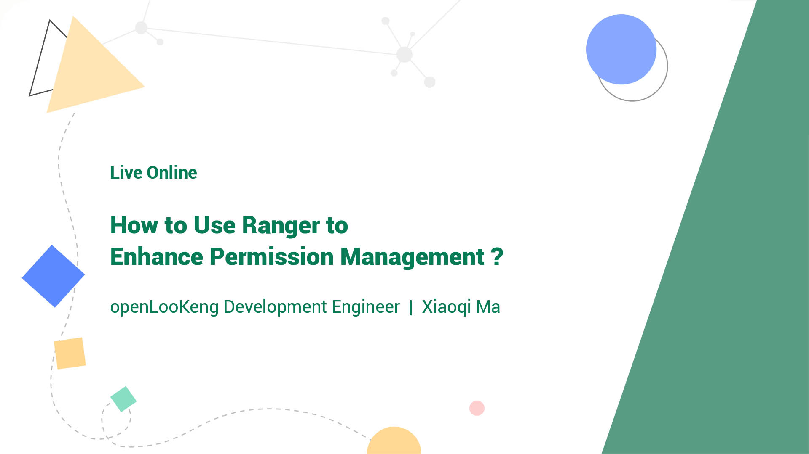

+++
author = "openLooKeng"
time = "2021.04.15"
title = "How to Use Ranger to Enhance Permission Management？"
location = "Online"
tag = "Live"
img = "./events/2021-04-15/poster.jpg"
img_mobile = "./events/2021-04-15/poster.jpg"
link = "./events/2021-04-15/range.html"
eventtype = "lookBack"
description = ""
+++

How do I configure the read-only permission on metadata for all users except the admin user？

What are the new permission management functions after Ranger is integrated?

### Please click the link to watch the video.

https://www.bilibili.com/video/BV1kb4y1D7GK

### Please click the link below to download the PDF if you need.

<a href="openLooKeng_Ranger权限管理.pdf" download="">Click here</a>

### Scan for More Details.

openLooKeng

openLooKeng Assistant

