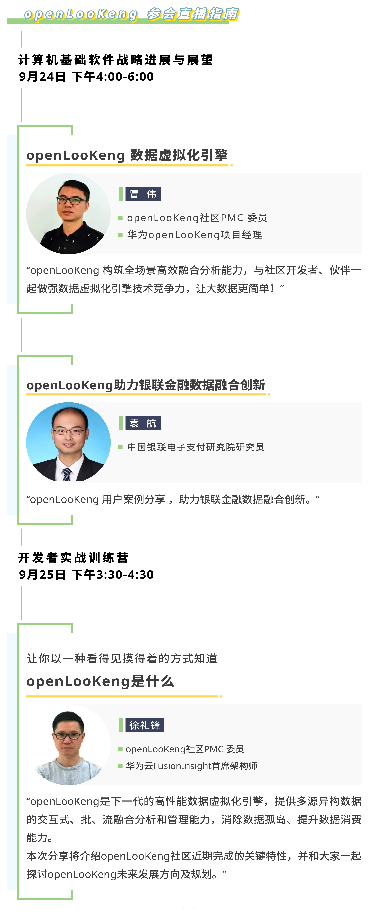

+++ 
time = "2020.09.23 - 2020.09.26"
author = "openLookeng"
title = "HUEWEI CONNECT 2020 openLookeng训练营" 
location = "上海" 
tag = "训练营"
img = "./events/huawei-connect/banner.jpg" 
img_mobile = './events/huawei-connect/banner.jpg'
link = "./events/huawei-connect/hc2020.html"
eventtype = "lookBack"
description = "HUEWEI CONNECT 2020 openLookeng训练营"
weight = 97
+++

### 关于HUAWEI CONNECT 2020

华为将于上海举办第五届HUAWEI CONNECT，携手来自全球的业界思想领袖、商业精英、技术大咖、先锋企业、生态合作伙伴、应用服务商以及开发者等，共同探讨行业数字化的发展方向，展示ICT领域的领先技术、产品和解决方案，分享成功实践，构筑开放、共赢的健康产业生态，共创行业新价值。

### 时间

2020年9月23日~9月26日

### 地点

上海世博中心

### 回放地址

https://www.bilibili.com/video/BV1Tp4y1Y7nN

### 资料下载
<a href="https://openlookeng-website.obs.ap-southeast-1.myhuaweicloud.com/%5B徐礼锋%5DopenLooKeng%20项目介绍和上手.pdf" download>点击下载议题资料</a>

### 活动介绍

### 更多详情，请关注

