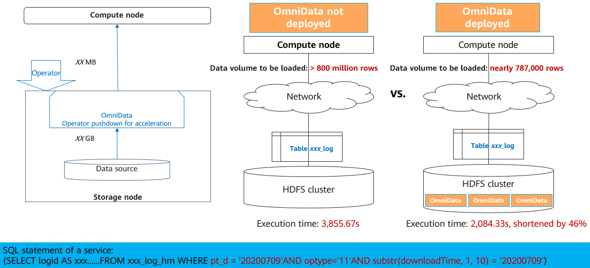
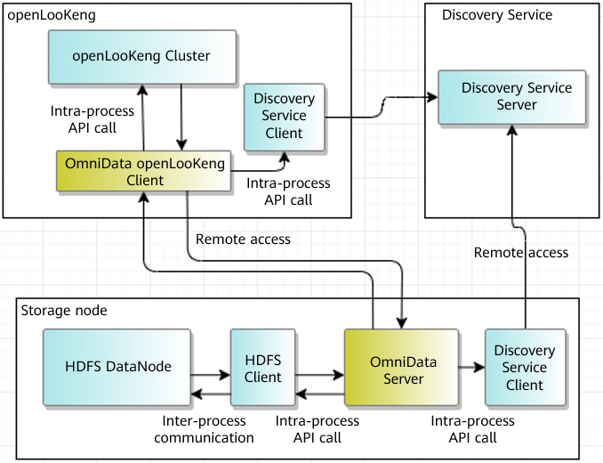

+++ 
title = "openLooKeng v1.4.1 Officially Released - OmniData Implements Near-data Computing for Operators"
date = "2021-11-12"
categories = ["Announcement"]
author = "openLooKeng"
description = "openLooKeng v1.4.1 will officially go live on November 12. In addition to enhancement for earlier versions, openLooKeng v1.4.1 introduces the OmniData connector."
+++
 
On Apache Hadoop Meetup 2021, OmniData shared by Ken Zhang, PMC Chair of the openLooKeng community, attracted public attention. openLooKeng v1.4.1 will officially go live on November 12. In addition to enhancement for earlier versions, openLooKeng v1.4.1 introduces the OmniData connector.

### What Is OmniData

OmniData provides the operator pushdown feature to fit into the big data scenarios where storage and compute are decoupled or converged at scale. When a large number of compute nodes read data from storage nodes, a large amount of raw data is transmitted from the storage nodes to the compute nodes over the network for processing. The proportion of valid data is low, greatly wasting network bandwidth. OmniData aims to reduce transmission of invalid data between the storage and compute layers.

OmniData pushes the Filter, Aggregation, and Limit operators from the compute nodes to the storage nodes to implement near-data computing, unleashing diverse computing power to alleviate the CPU pressure on the compute nodes. Then it transmits the operator processing result to the compute nodes over the network, reducing invalid data to be transmitted and effectively improving big data computing performance.

**Application scope of OmniData:**

1. Supports openLooKeng v1.4.0 and Spark 3.0.0 and provides the OmniData plug-in for the engine.
 
2. Pushes operators down to HDFS and supports access interfaces of Amazon S3.

3. Supports different data formats such as TXT, ORC, and Parquet.

4. Suitable for TaiShan servers and supports the Kunpeng processor architecture.

OmniData makes big data simpler in the scenarios where storage and compute are decoupled or converged at scale, which complies with the vision of openLooKeng.

The OmniData connector will further improve the performance of the openLooKeng engine.

For details about the OmniData connector, visit the following website:
<https://openlookeng.io/docs/docs/connector/omnidata.html>

For details about OmniData, visit the following website:
<https://www.hikunpeng.com/zh/developer/boostkit/big-data?accelerated=3>

### openLooKeng v1.4.1 Enhancement

**Support for JDK 8 in the ARM Architecture**

The restriction on the Java version for the ARM architecture due to JDK freezing is removed. JDK 1.8.262 and later are supported in the ARM architecture.

Welcome to download and use openLooKeng at: <https://openlookeng.io/download.html>

You are welcomed to commit issues to openLooKeng Gitee repositories and share your experience and suggestions. If you want to leave feedback on the openLooKeng v1.4.1, send an email to <users@openlookeng.io>. 

Your voice may become the key to improving the performance of the openLooKeng engine.

openLooKeng code repositories: <https://gitee.com/openlookeng>

openLooKeng, Make Big Data Simplified!
 