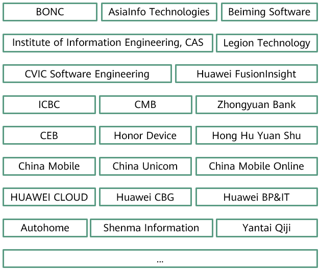

+++ 
title = "Move Forward Together, Thanks for Your Accompany"
date = "2021-11-25"
categories = ["Announcement"]
author = "openLooKeng"
description = "Since June 30, 2020, openLooKeng has been growing with everyone's attention. Those glittering moments are the sparks of community friends."
+++

Since June 30, 2020, openLooKeng has been growing with everyone's attention. Those glittering moments are the sparks of community friends.
 
In 2021, prior to its 1st anniversary, openLooKeng becomes one of the first open source communities to earn the Trusted Open Source Community certification. It is one of the best gifts the community has received. As the community grows quickly, the openLooKeng has presented itself as a powerful big data engine.

 

openLooKeng was granted the Trusted Open Source Community certification at Cloud Native Industry Conference 2021

The openLooKeng open source community has more than 30 partners, including China Merchants Bank (CMB), China Everbright Bank (CEB), AsiaInfo Technologies, Chinese Academy of Sciences (CAS), China Mobile, and China Unicom. They have brought contributions to key features of openLooKeng. The community also works closely with industry solution software partners to jointly launch scenario-specific solutions. For example, with openLooKeng, Beiming Software launched their Data Asset Management Platform v4.0 to offer data exchange and sharing services, and Legion Technology introduced the UIAUTO, a data asset management platform.

 

Partners listed in no particular order

While attracting a number of leading enterprises and scientific research institutes, openLooKeng has drawn attention from many open source big data enthusiasts. We would like to extend our gratitude to Wu Qiumin, a big data expert of CMB, Cheng Xiaojian of CEB, Hu Jiyun, general manager of Hong Hu Yuan Shu, He Zhengjie, a student developer, and other friends from the community for their sharing and contributions, which have brought new vitality to the community.

Collaboration between users in the openLooKeng community

Community users make contributions and communicate with each other to build a better openLooKeng

We also have many open source enthusiasts who support the community behind the scenes. They are seen in community organizations, forums, and groups, asking and answering questions and making each type of contribution.

 

openLooKeng community contributors (Gitee IDs)

 

* openLooKeng has been downloaded for more than 90,000 times.
* More than 300 contributors have made contributions to the community.
* More than 1,900 pull requests have been submitted.
* More than 1,400 commits have been created.
* Over 600 members have joined the community communication groups.

### Thank you to all the people who are with openLooKeng. We're connected in our passions for a better future.
### openLooKeng, Make Big Data Simplified