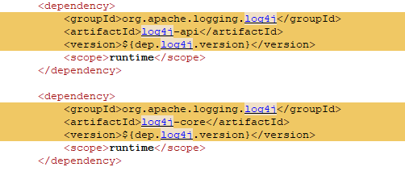
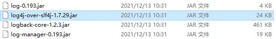
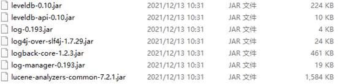
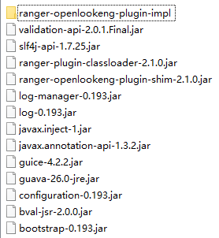
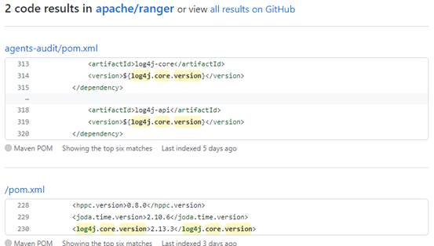

+++
title = ""
description = "Apache Log4j2 is a Java-based logging tool. The tool rewrites the Log4j framework and introduces a number of rich features. "
+++

## Overview

Apache Log4j2 is a Java-based logging tool. The tool rewrites the Log4j framework and introduces a number of rich features.

This log framework is used for service system development to record log information. In most cases, the developer may write the error information caused by user input into the log.

This vulnerability triggers remote code execution as long as data input by external users is logged.

CVSS score: 9.8. The vulnerability PoC is open and can be attacked successfully. The impact scope is wide and the harm is great.

### Affected Version

Apache log4j 2 is affected from versions 2.0 to 2.14. 1.

### openLooKeng Vulnerability Check

**Troubleshooting 1 : The ES Connector depends on log4j during running.**

Continue to check the JAR package when openLooKeng finally packs the server. Currently, the logging framework of JDK is used instead of log4j.

In the ES connector module, the analysis of the lib library shows that the library related to log4j is used.

**Troubleshooting 2 : The openLooKeng uses the airlift framework, which encapsulates the log framework of the JDK.** 

Also, sort out all JAR packages in the openLooKeng server lib library. You can see that log4j-api and log4j-core do not exist.

**Troubleshooting 3 : openLooKeng repository ranger plugin.**

Check the repository content and don't find dependency of the log4j.

In the POM file in the ranger, some version declarations about log4j were found, but were not used in subsequent builds.

The openLooKeng ranger plugin depends on Apache Ranger 2.1.0, and the ranger 2.1.0 depends on the log4j2 2.13X version.

In addition, in the current ranger, the module that depends on log4j is agents-audit.

openLooKeng's ranger plugin does not depend on log4j

### openLooKeng Community Restoration Program

Upgrade to the latest component log4j-2.15.0. The release date of 2.15.0 is 2021-12-09 23:46.

### Scenario 1 - Modify Code

Update the code for the ES connector and Ranger plugin to remove the dependency of log4j.

**Associated PRs are as follows:** 

<https://gitee.com/openlookeng/hetu-core/pulls/1312>

<https://gitee.com/openlookeng/openlookeng-ranger-plugin/pulls/10>

Note: The log4j issue has not been fixed in the Ranger community. Therefore, you are advised to set the openLooKeng parameter according to the suggestions in solution 2 when using the Ranger plugin. The openLooKeng community will update the ranger to the latest version after the log4j2 problem is fixed in the ranger community. 

### Solution 2: Modify the configuration to avoid the problem.

For environments where code cannot be modified, for example, openLooKeng versions earlier than 1.4.0 have been deployed in the production environment. You are advised to add the following configuration to the JVM.config file:

    -Dlog4j2.formatMsgNoLookups=true

