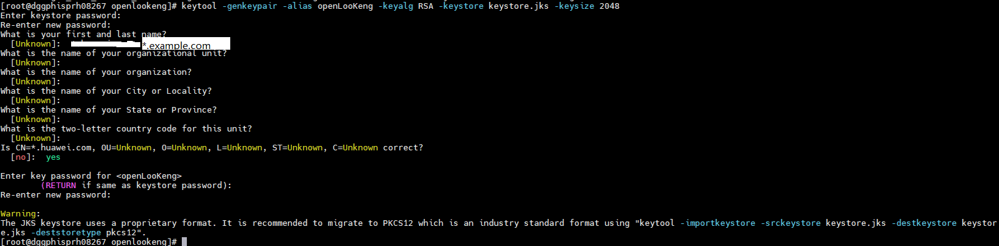
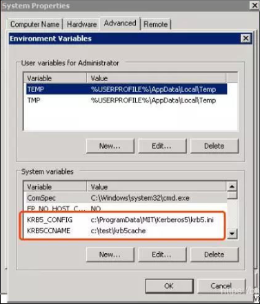
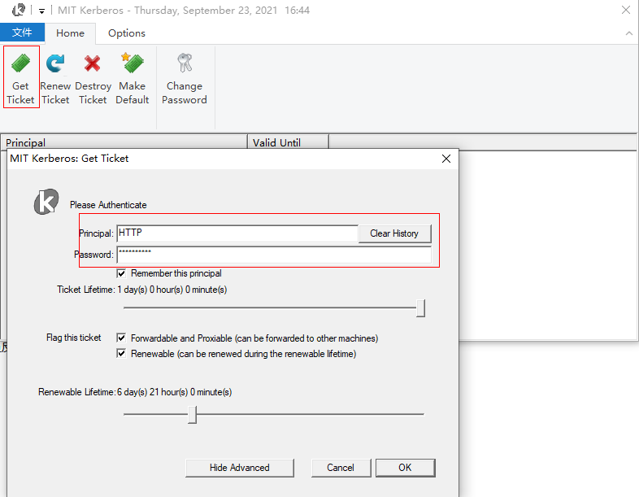
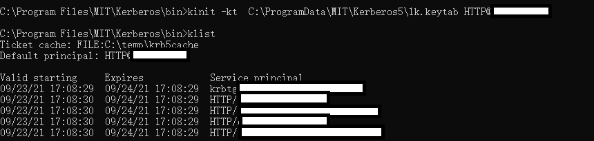
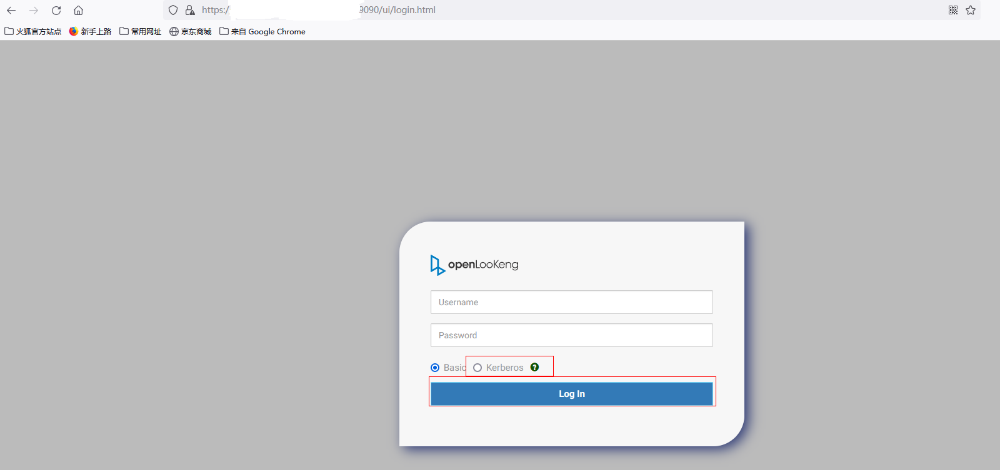
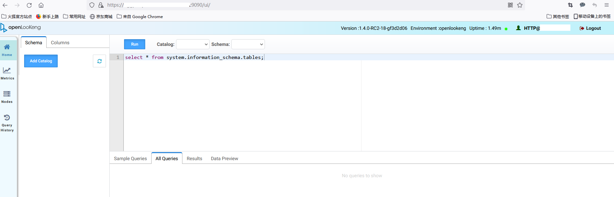

+++

title = "openLooKeng AA安全配置指导（一）----对接Kerberos"
date = "2021-09-24"
tags = ["openLooKeng", "Kerberos", "AA", " SSL", "webUI", "MIT"]
archives = "2021-09"
author = "senny456"
description = "指导如何配置openLooKeng AA开启https和Kerberos，以及开启Kerberos认证后，如何访问openLooKeng webUI"

+++

**环境信息**

| Role               | IP   | Hostname | Hostname+domain name |
| ------------------ | ---- | -------- | -------------------- |
| coordinator&worker | ip1  | host1    | host1.example.com    |
| coordinator&worker | ip2  | host2    | host2.example.com    |
| worker             | ip3  | host3    | host3.example.com    |
| Kerberos           | ip4  | host4    | host4.example.com    |

### 1  开启openLooKeng节点ssl通信

### 1.1  生成openLooKeng的keystore

```
keytool -genkeypair -alias openLooKeng -keyalg RSA -keystore keystore.jks -keysize 2048
```

创建所有coordinator和worker节点公用的keystore

修改coordinator、worker节点的hostname为主机+域名格式，如：host1.example.com，host2.example.com，host3.example.com

**创建keystore，“first and last name”选项必须填为*.域名，如\*.example.com**

假设keystore密码为123456



拷贝生成的keystore.jks到集群所有节点上

### 1.2  所有节点编辑/etc/hosts文件，在hostname后面增加example.com部分（因为上面创建的keystore是*.example.com），如下

```
ip1    host1     host1.example.com
ip2    host2     host2.example.com
ip3    host3     host3.example.com
```

### 1.3  配置openLooKeng的config.properties

所有节点配置：

```
node.internal-address=hostname.example.com //hostname为各节点主机名
http-server.http.enabled=false
http-server.https.enabled=true
http-server.https.port=9090 //设置https端口号
http-server.https.keystore.path=/opt/hetu/keystore.jks //keystore存放路径
http-server.https.keystore.key=123456  //生成keystore时输入的密码
internal-communication.https.required=true
internal-communication.https.keystore.path=/opt/hetu/keystore.jks  //keystore存放路径
internal-communication.https.keystore.key=123456  //生成keystore时输入的密码
```

**注：**文件路径和密码根据实际修改

### 1.4 验证

重启openLooKeng服务，使用hetu-cli连接：

```
java -jar hetu-cli-1.4.0-SNAPSHOT-executable.jar --server https://host1.example.com:9090 --keystore-path /opt/hetu/keystore.jks --keystore-password 123456
```

### 2  开启openLooKeng的Kerberos认证

### 2.1  安装Kerberos Server

#### 2.1.1   安装

```
yum install -y krb5-server krb5-lib krb5-workstation
```

#### 2.1.2   修改配置文件

**配置/etc/krb5.conf**

```
# Configuration snippets may be placed in this directory as well

includedir /etc/krb5.conf.d/
[logging]
 default = FILE:/var/log/krb5libs.log
 kdc = FILE:/var/log/krb5kdc.log
 admin_server = FILE:/var/log/kadmind.log
 
[libdefaults]
 dns_lookup_realm = false
 ticket_lifetime = 24h
 renew_lifetime = 7d
 forwardable = true
 rdns = false
 pkinit_anchors = FILE:/etc/pki/tls/certs/ca-bundle.crt
 default_realm = EXAMPLE.COM
 default_ccache_name = /tmp/krb5cc_%{uid} 

[realms]
 EXAMPLE.COM = {
  kdc = host4   //kerberos服务器主机名
  admin_server = host4
 }

[domain_realm]
 .example.com = EXAMPLE.COM
 example.com = EXAMPLE.COM
```

**注：**

1.  修改default_realm 与[realms]中命名相同；
2. kdc、admin_server配置为本地的hostname；
3. 配置default_ccache_name。

拷贝krb5.conf文件到openLooKeng集群所有节点上，config.properties认证配置会用到。

**配置** **/var/kerberos/krb5kdc/kdc.conf**

```
[kdcdefaults]
 kdc_ports = 88
 kdc_tcp_ports = 88
 
[realms]
 EXAMPLE.COM = {
  \#master_key_type = aes256-cts
  acl_file = /var/kerberos/krb5kdc/kadm5.acl
  dict_file = /usr/share/dict/words
  admin_keytab = /var/kerberos/krb5kdc/kadm5.keytab
  supported_enctypes = aes256-cts:normal aes128-cts:normal des3-hmac-sha1:normal arcfour-hmac:normal camellia256-cts:normal camellia128-cts:normal des-hmac-sha1:normal des-cbc-md5:normal des-cbc-crc:normal
 }
```

**注：**kdc.conf中realm名与krb5.conf相同

#### 2.1.3   创建数据库

```
/usr/sbin/kdb5_util create -r EXAMPLE.COM -s
```

其中需要设置管理员密码，创建完成会在/var/kerberos/krb5kdc/下面生成principal文件，若重建数据库则需先删除/var/kerberos/krb5kdc下面principal相关文件

#### 2.1.4   创建管理员账号

编辑/var/kerberos/krb5kdc/kadm5.acl，增加

```
*/admin@EXAMPLE.COM      *
```

**注：**代表全部权限

#### 2.1.5   重启kerberos服务

```
systemctl restart krb5kdc
systemctl restart kadmin
```

### **2.2**  **Kerberos client安装（client和server共部署时，不需要安装）**

#### 2.2.1   安装

```
yum install krb5-workstation krb5-libs krb5-auth-dialog
```

#### 2.2.2   配置 

复制kerberos的server的/etc/krb5.conf到client的/etc/krb5.conf

#### 2.2.3   验证客户端可以访问KDC

```
kinit admin/admin
kadmin -p 'admin/admin' -w '123456' -s 'ip4' -q 'list_principals'
```

**注：**-w为访问密码，-s为kerberos KDC IP

### 2.3  openLooKeng对接Kerberos

#### 2.3.1   生成openLooKeng的keytab

在装有Kerberos客户端的机器上执行下面语句（**生成服务名为HTTP，webUI访问会用到**）

创建principal：

```
kadmin -p admin/admin -q "addprinc -randkey HTTP@EXAMPLE.COM"
kadmin -p admin/admin -q "addprinc -randkey HTTP/host1@EXAMPLE.COM"
kadmin -p admin/admin -q "addprinc -randkey HTTP/host2@EXAMPLE.COM"
kadmin -p admin/admin -q "addprinc -randkey HTTP/host3@EXAMPLE.COM"
```

生成keytab：

```
kadmin -p admin/admin -q "ktadd -k /opt/openlookeng/lks/lk.keytab HTTP@EXAMPLE.COM"
kadmin -p admin/admin -q "ktadd -k /opt/openlookeng/lks/lk.keytab HTTP/host1@EXAMPLE.COM"
kadmin -p admin/admin -q "ktadd -k /opt/openlookeng/lks/lk.keytab HTTP/host2@EXAMPLE.COM"
kadmin -p admin/admin -q "ktadd -k /opt/openlookeng/lks/lk.keytab HTTP/host3@EXAMPLE.COM"
```

**注：**openLooKeng主机名必须为小写，如host1。所有节点主机名的principal都要创建

拷贝lk.keytab文件到openLooKeng集群所有节点上，config.properties认证配置会用到。

#### 2.3.2   配置openLooKeng的config.properties

所有节点增加：

```
http-server.authentication.type=KERBEROS
http.server.authentication.krb5.service-name= HTTP
http.server.authentication.krb5.keytab=/opt/openlookeng/lks/lk.keytab
http.authentication.krb5.config=/opt/openlookeng/lks/krb5.conf
internal-communication.kerberos.enabled=true
```

#### 2.3.4   配置openLooKeng的jvm.config

所有节点增加：

```
-Dsun.security.krb5.debug=true
-Dlog.enable-console=true
-Djava.security.krb5.conf=/opt/openlookeng/lks/krb5.conf
```

#### 2.3.5   验证：

重启openLooKeng服务，使用hetu-cli连接：

```
java  -Dsun.security.krb5.debug=true -jar hetu-cli-1.4.0-SNAPSHOT-executable.jar \
--server https://host1.example.com:9090 \
--keystore-path /opt/hetu/keystore.jks \
--keystore-password 123456 \
--krb5-config-path /opt/openlookeng/lks/krb5.conf \
--krb5-principal HTTP \
--krb5-keytab-path /opt/openlookeng/lks/lk.keytab \
--krb5-remote-service-name HTTP \
--debug
```

**注：**路径、密码、principal根据实际情况修改

### 3  openLooKeng（开启kerberos）浏览器访问webUI

openLooKeng开启kerberos认证，采用的是ticket的认证的方式，因此不管在浏览器输什么用户名、密码都无法认证通过。

**解决方法：**

**配置浏览器使用ticker认证方式，不用传统的用户名、密码认证方式。**

**当前对于ticket认证方式支持比较好的是firefox浏览器，以下以firefox浏览器配置为例说明如何配置ticket认证，访问开启kerberos认证的openLooKeng服务。**

### 3.1  安装windows Kerberos客户端

Kerberos windows客户端叫KFW，下载地址：http://web.mit.edu/kerberos/dist/index.html，默认安装即可。默认情况会安装到C:\Program Files\MIT\Kerberos 路径，同时在C:\ProgramData\MIT\Kerberos5 路径下生成kerberos的配置文件krb5.ini。

### 3.2  配置kerberos客户端

配置环境变量：

KRB5_CONFIG   ------kerberos配置文件

KRB5CCNAME   ------kerberos认证缓存文件路径



**注：**重启系统，使配置生效

### 3.3  配置浏览器

在浏览器输入about:config，搜索network.negotiate，配置如下：

- network.negotiate-auth.delegation-uris、network.negotiate-auth.trusted-uris为coordinator的hostname+域名，比如host1.example.com

- network.negotiate-auth.gsslib 为KFW安装路径下gssapid的路径（根据浏览器是32位、64位选择对应文件）

  比如：C:\Program Files\MIT\Kerberos\bin\gssapi64.dll

- network.negotiate-auth.using-native-gsslib 修改为false

- network.negotiate-auth.allow-non-fqdn修改为true

搜索network.auth.use-sspi ，设置为false

### 3.4  配置KFW

可以从KDC服务器上拷贝/etc/krb5.conf中的内容，然后写入krb5.ini文件中。

**注：**需要删除或者注释掉 default_ccache_name的设置

```
[logging]
default = FILE:/var/log/krb5libs.log
kdc = FILE:/var/log/krb5kdc.log
admin_server = FILE:/var/log/kadmind.log
[libdefaults]
dns_lookup_realm = false
dns_lookup_kdc = false
ticket_lifetime = 24h
\#renew_lifetime = 7d
forwardable = true
default_realm = EXAMPLE.COM

[realms]
EXAMPLE.COM = {
kdc = host4 
admin_server = host4
}

[domain_realm]
.example.com = EXAMPLE.COM
example.com = EXAMPLE.COM
```

### 3.5  完成认证

配置完成后，使用创建的用户认证（kerberos客户端或命令行）

使用Kerberos客户端：



使用命令行：


如果是机机用户，使用keytab认证，需要拷贝keytab文件到windows机器上，再使用命令认证



**注：**

1. 在C:\Windows\System32\drivers\etc\hosts中需增加KDC、coordinator节点hostname到IP的映射关系；
2. 使用KFW的kinit，不能使用java的kinit

### 3.6  登录openLooKeng WEB UI

https://host1.example.com:9090





**注：**

1. 配置openLooKeng的config.properties中http.server.authentication.krb5.service-name 必须为HTTP；