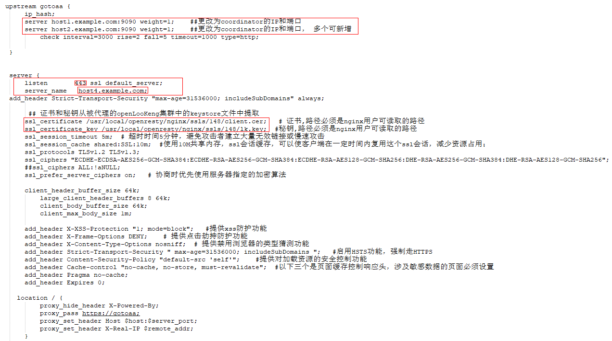
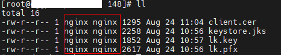

+++

title = "openLooKeng AA安全配置指导（二）----对接nginx"
date = "2021-09-24"
tags = ["openLooKeng", "Kerberos", "nginx"]
archives = "2021-09"
author = "senny456"
description = "指导如何配置openLooKeng AA开启Kerberos后，对接nginx代理执行sql"

+++

**环境信息**

| Role               | IP   | Hostname | Hostname+domain name |
| ------------------ | ---- | -------- | -------------------- |
| coordinator&worker | ip1  | host1    | host1.example.com    |
| coordinator&worker | ip2  | host2    | host2.example.com    |
| worker             | ip3  | host3    | host3.example.com    |
| Kerberos/nginx     | ip4  | host4    | host4.example.com    |

openLooKeng AA开启Kerberos，参见[openLooKeng AA安全配置指导（一）----对接Kerberos](https://openlookeng.io/zh-cn/blog/2021/09/24/2021-09-24-config-01.html )

### 1  openLooKeng（开启kerberos）对接Nginx

### 1.1  Nginx安装

1. 开源nginx的版本选型

   下载地址： http://openresty.org/cn/download.html

   选用openresty-1.15.8.2版本，需从nginx官网下载

2. 开源nginx的依赖模块组件

   nginx_upstream_check_module

   下载地址：https://github.com/yaoweibin/nginx_upstream_check_module

   ngx_http_consistent_hash

   下载地址：https://github.com/replay/ngx_http_consistent_hash

3. 安装步骤：

   - 依赖安装：

     ```
     yum -y install gcc zlib zlib-devel pcre-devel openssl openssl-devel
     ```

   -  安装openresty

     ```
     ./configure --prefix=/usr/local/openresty/ --with-http_stub_status_module --with-luajit --without-http_redis2_module --with-http_iconv_module --with-http_ssl_module --with-stream --add-module=/opt/nginx_upstream_check_module --add-module=/opt/ngx_http_consistent_hash
     ```

     gmake

     gmake install

   -  添加环境变量

     ```
     vi /etc/profile  
     添加： PATH=/usr/local/openresty/nginx/sbin:$PATH
     source /etc/profile
     ```

4. 启动、停止、重启的命令

   启动： nginx -c /usr/local/openresty/nginx/conf/nginx.conf

   重启： nginx -s reload

   停止： nginx -s stop

### 1.2  Nginx.conf 配置

 [nginx.conf](nginx.conf) 

注意修改以下内容



host1.example.com:9090为openlookeng coordinator节点的域名和端口号

client.cer 是从openLooKeng的keystore中提取的证书

lk.key是从openLooKeng的keystore中提取的私钥

**注意：证书和私钥，nginx用户需要用权限读取**



### 1.3  证书和私钥提取方式（参考）

提取私钥

1. 先转为pfs格式（使用openLooKeng中生成的keystore.jks）

   ```
   keytool -v -importkeystore -srckeystore keystore.jks -srcstoretype jks -srcstorepass 123456 -destkeystore lk.pfx -deststoretype pkcs12 -deststorepass 123456 -destkeypass 123456
   ```

2. 显示到界面

   ```
   openssl pkcs12 -in lk.pfx -nocerts -nodes
   openssl pkcs12 -in lk.pfx -nocerts -nodes -out lk.key (保存到key)
   ```

3. 导出证书

   ```
   keytool -export -alias openLooKeng -keystore keystore.jks -rfc -file client.cer
   ```

### 1.4  添加nginx的keytab

创建principal：

```
kadmin -p admin/admin -q "addprinc -randkey  HTTP/host4@EXAMPLE.COM"
```

添加keytab：

```
kadmin -p admin/admin -q "ktadd -k /opt/openlookeng/lks/lk.keytab HTTP/host4@EXAMPLE.COM"
```

**拷贝并替换openLooKeng集群所有节点上的keytab文件**

### 1.5  配置openLooKeng的config.properties

coordinator节点上增加如下配置：

```
failure-detector.http-client.authentication.krb5.service-principal-pattern=${SERVICE}@host4
query-info.http-client.authentication.krb5.service-principal-pattern=${SERVICE}@host4
workerInfo.http-client.authentication.krb5.service-principal-pattern=${SERVICE}@host4
memoryManager.http-client.authentication.krb5.service-principal-pattern=${SERVICE}@host4
scheduler.http-client.authentication.krb5.service-principal-pattern=${SERVICE}@host4
node-manager.http-client.authentication.krb5.service-principal-pattern=${SERVICE}@host4
exchange.http-client.authentication.krb5.service-principal-pattern=${SERVICE}@host4
event.http-client.authentication.krb5.service-principal-pattern=${SERVICE}@host4
discovery.http-client.authentication.krb5.service-principal-pattern=${SERVICE}@host4
http.server.authentication.krb5.principal-hostname=host4
```

worker节点上增加如下配置：

```
node-manager.http-client.authentication.krb5.service-principal-pattern=${SERVICE}@host4
exchange.http-client.authentication.krb5.service-principal-pattern=${SERVICE}@host4
event.http-client.authentication.krb5.service-principal-pattern=${SERVICE}@host4
discovery.http-client.authentication.krb5.service-principal-pattern=${SERVICE}@host4
http.server.authentication.krb5.principal-hostname=host4
```

**其中：host4为nginx节点的主机名**

### 1.6  验证

```
java -jar hetu-cli-1.4.0-SNAPSHOT-executable.jar \
--server https://host4.example.com:443 \
--keystore-path /opt/hetu/keystore.jks \
--keystore-password 123456 \
--krb5-config-path  /opt/openlookeng/lks/krb5.conf \
--krb5-principal HTTP \
--krb5-keytab-path /opt/openlookeng/lks/lk.keytab \
--krb5-remote-service-name HTTP \
--debug
```

