+++

title = "openLooKeng AA安全配置指导（三）----对接OpenLDAP"
date = "2021-09-24"
tags = ["openLooKeng", "SSL", "OpenLDAP"]
archives = "2021-09"
author = "senny456"
description = "指导在开启openLooKeng SSL后，如果对接OpenLDAP做用户认证"

+++

**环境信息**

| Role               | IP   | Hostname | Hostname+domain name |
| ------------------ | ---- | -------- | -------------------- |
| coordinator&worker | ip1  | host1    | host1.example.com    |
| coordinator&worker | ip2  | host2    | host2.example.com    |
| worker             | ip3  | host3    | host3.example.com    |
| Kerberos/OpenLDAP  | ip4  | host4    | host4.example.com    |

假设openLooKeng集群已配置好kerberos认证（当前对接OpenLDAP必须开启kerberos认证，参见连接：[openLooKeng AA安全配置指导（一）----对接Kerberos](https://openlookeng.io/zh-cn/blog/2021/09/24/2021-09-24-config-01.html )）

### 1  OpenLDAP安装

### 1.1  安装OpenLDAP

```
yum -y install openldap openldap-servers openldap-clients openldap-devel compat-openldap
```

### 1.2  初始化OpenLDAP配置

```
cp /usr/share/openldap-servers/DB_CONFIG.example /var/lib/ldap/DB_CONFIG

cp /usr/share/openldap-servers/slapd.ldif /root/.
```

### 1.3 修改配置文件slapd.ldif

```
###############################slapd.ldif 内容如下#####################3######

#
# See slapd-config(5) for details on configuration options.
# This file should NOT be world readable.
#
dn: cn=config
objectClass: olcGlobal
cn: config
olcArgsFile: /var/run/openldap/slapd.args
olcPidFile: /var/run/openldap/slapd.pid
# TLS settings TLS #
olcTLSCACertificatePath: /etc/openldap/certs
olcTLSCertificateFile: /etc/openldap/certs/ldap.crt
olcTLSCertificateKeyFile: /etc/openldap/certs/ldap.key
olcTLSVerifyClient: never 
# Schema settings
dn: cn=schema,cn=config
objectClass: olcSchemaConfig
cn: schema
#include: file:///etc/openldap/schema/core.ldif注意顺序.(高能预警:有坑)注意上面必须得有个空行,否则报错,随时空行就对了.
include: file:///etc/openldap/schema/corba.ldif
include: file:///etc/openldap/schema/core.ldif
include: file:///etc/openldap/schema/cosine.ldif
include: file:///etc/openldap/schema/duaconf.ldif
include: file:///etc/openldap/schema/dyngroup.ldif
include: file:///etc/openldap/schema/inetorgperson.ldif
include: file:///etc/openldap/schema/java.ldif
include: file:///etc/openldap/schema/misc.ldif
include: file:///etc/openldap/schema/nis.ldif
include: file:///etc/openldap/schema/openldap.ldif
include: file:///etc/openldap/schema/ppolicy.ldif
include: file:///etc/openldap/schema/collective.ldif
#
# Frontend settings
dn: olcDatabase=frontend,cn=config
objectClass: olcDatabaseConfig
objectClass: olcFrontendConfig
olcDatabase: frontend
#
# Configuration database
dn: olcDatabase=config,cn=config
objectClass: olcDatabaseConfig
olcDatabase: config
olcAccess: to * by dn.base="gidNumber=0+uidNumber=0,cn=peercred,cn=external,c
 n=auth" manage by * none
#
# Server status monitoring
# 自定义域 cn=Manager,dc=example,dc=com (example位置,随便填,但是下面统一)
#
dn: olcDatabase=monitor,cn=config
objectClass: olcDatabaseConfig
olcDatabase: monitor
olcAccess: to * by dn.base="gidNumber=0+uidNumber=0,cn=peercred,cn=external,c
 n=auth" read by dn.base="cn=Manager,dc=example,dc=com" read by * none
 
#
# Backend database definitions
dn: olcDatabase=hdb,cn=config
objectClass: olcDatabaseConfig
objectClass: olcHdbConfig
olcDatabase: hdb
olcSuffix: dc=example,dc=com
olcRootDN: cn=Manager,dc=example,dc=com
olcRootPW: 123456
olcDbDirectory:    /var/lib/ldap
olcDbIndex: objectClass eq,pres
olcDbIndex: ou,cn,mail,surname,givenname eq,pres,sub
olcDbIndex: uidNumber,gidNumber,loginShell eq,pres
olcDbIndex: uid,memberUid eq,pres,sub
olcDbIndex: nisMapName,nisMapEntry eq,pres,sub
########################################end###################################
```

\#附：生成密码(可以不管这里。上面的 olcRootPW 密文可以由这个生成并替换)
 \#slappasswd -s 123456
 \##{SSHA}R09wEQwdZ2PzL/9fbRGhfEzW6FR17Ioi

并修改对应的字段 

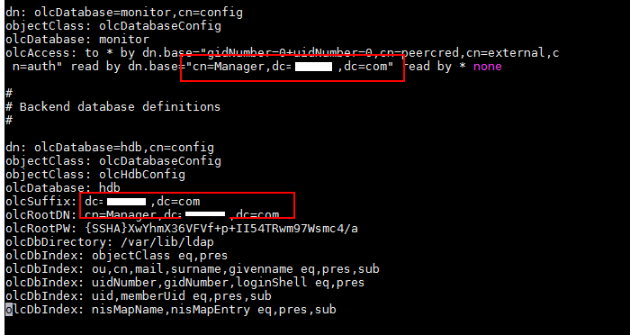

### 1.4  重新生成配置文件信息

rm -rf /etc/openldap/slapd.d/*                       ##删除之前配置

slapadd -F /etc/openldap/slapd.d -n 0 -l /root/slapd.ldif   ## 生成新配置

slaptest -u -F /etc/openldap/slapd.d                   ##测试配置

 

授权：chown -R ldap. /etc/openldap/slapd.d/

​           chown -R ldap. /var/lib/ldap/ 

重启服务：/etc/init.d/slapd restart(或者systemctl restart slapd)

### 1.5  导入管理员账号信息

生成root.ldif

```
dn: dc=example,dc=com
dc: example
objectClass: top
objectClass: domain

dn: cn=Manager,dc=example,dc=com
objectClass: organizationalRole
cn: Manager
```

```
ldapadd -D "cn=Manager,dc=example,dc=com" -W -x -f root.ldif 
```

\## 导入密码是:slapd.ldif中配置的123456

```
ldapsearch -h test -b "dc=example,dc=com" -D "cn=Manager,dc=example,dc=com" -W 
```

\##查看是否导入成功（test是hostname，可用ip代替）

### 1.6  界面端

1. 使用同一局域网windows下的LdapAdmin 

   1）点击start中的connect,并选择new connection。

   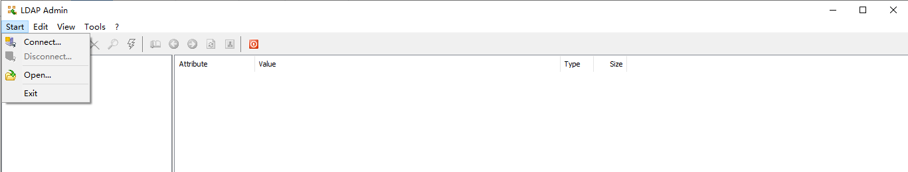

   2）点击fetch DNs获取基础DN

   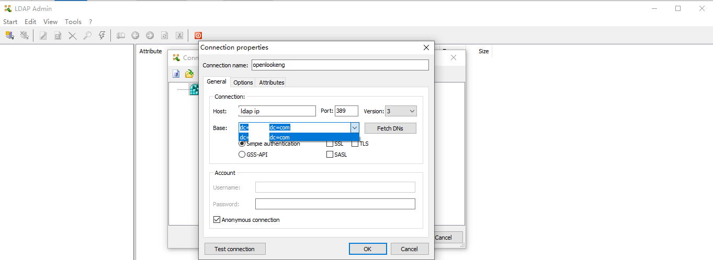

   3）去掉匿名连接的√，输入用户名密码，此处密码为前面配置的123456

   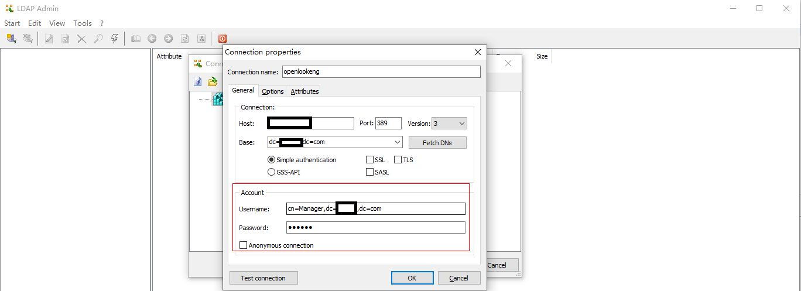

   点击Test connection测试是否连接成功

   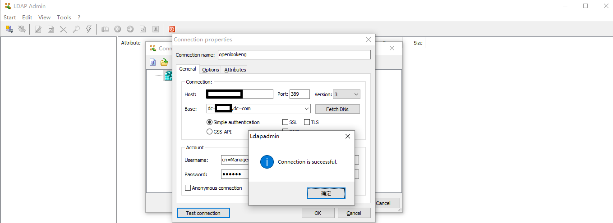


2. 创建用户：

   1）在根目录右键new中选择orgnaizational unit…

   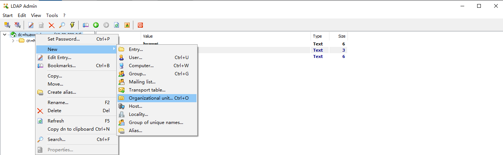

   2）Name中填People并在People下创建用户

   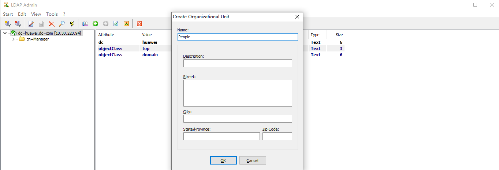

   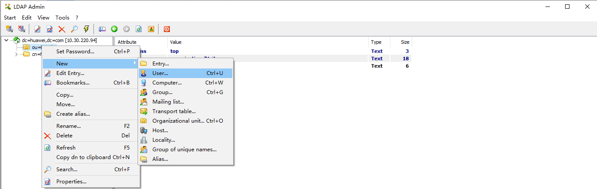

   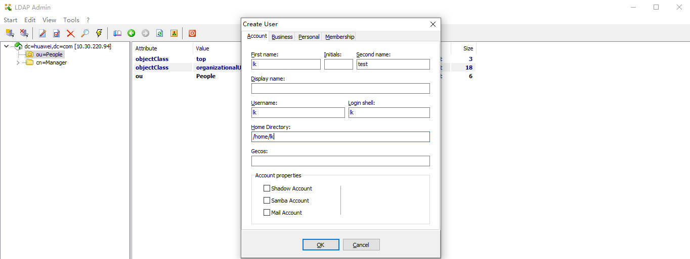

   3）设置用户密码

   

   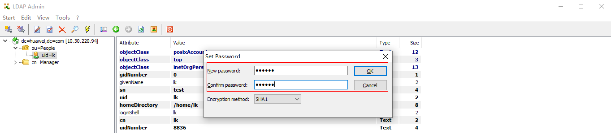

### 2  openlookeng对接OpenLDAP

### 2.1  修改openssl配置文件

1. 复制openssl配置文件到 /tmp 下：

   ```
   cp /etc/pki/tls/openssl.cnf /tmp/openssl.cnf
   ```

2. 编辑/tmp/openssl.cnf

   此文件的格式是类似 ini 的配置文件格式，找到 **[ req ]** 段落，加上下面的配置：

   ```
   req_extensions = v3_req
   ```

   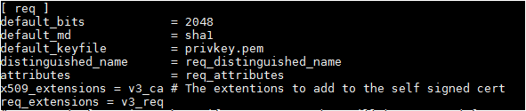

   这段配置表示在生成 CSR 文件时读取名叫 v3_req 的段落的配置信息，因此我们再在此配置文件中加入一段名为 v3_req 的配置：

   ```
   [ v3_req ]
   # Extensions to add to a certificate request
   basicConstraints = CA:FALSE
   keyUsage = nonRepudiation, digitalSignature, keyEncipherment
   subjectAltName = @alt_names
   ```

   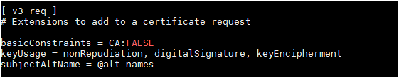

   这段配置中最重要的是在最后导入名为 alt_names 的配置段，因此我们还需要添加一个名为 [ alt_names ] 的配置段：

   [ alt_names ]

   IP = ip4

   注：ip为OpenLDAP服务器ip

### 2.2  生成openldap证书

```
cd /etc/openldap/certs/
openssl genrsa -out ldap.key 1024
openssl req -new -key ldap.key -out ldap.csr -config /tmp/openssl.cnf
```

查看证书请求文件的内容:

```
openssl req -text -noout -in ldap.csr
```

生成签名

```
openssl x509 -req -days 3650 -in ldap.csr -signkey ldap.key -out ldap.crt -extensions v3_req -extfile /tmp/openssl.cnf
```

### 2.3  配置ldap开启ssl

#### 2.3.1  编辑/root/slapd.ldif

```
olcTLSCACertificatePath: /etc/openldap/certs
olcTLSCertificateFile: /etc/openldap/certs/ldap.crt
olcTLSCertificateKeyFile: /etc/openldap/certs/ldap.key
olcTLSVerifyClient: never
```

**注：配置的证书路径应与[2.2](#_生成openldap证书)步骤中生成的一致**

#### 2.3.2  编辑/etc/openldap/ldap.conf

```
TLS_REQCERT allow
TLS_CERT /etc/openldap/certs/ldap.crt
TLS_KEY /etc/openldap/certs/ldap.key
URI ldaps://ip4  //需修改为OpenLDAP服务器ip
BASE dc=example,dc=com
```

#### 2.3.3  重新生成配置并重启服务

service slapd stop(或者systemctl stop slapd)

rm -rf /etc/openldap/slapd.d/*                       ##删除之前配置

slapadd -F /etc/openldap/slapd.d -n 0 -l /root/slapd.ldif   ## 生成新配置

slaptest -u -F /etc/openldap/slapd.d                   ##测试配置

授权：chown -R ldap. /etc/openldap/slapd.d/

​           chown -R ldap. /var/lib/ldap/ 

#### 2.3.4  配置同时启动ldap和ldaps

编辑/etc/sysconfig/ldap (没有就手动创建)

SLAPD_LDAP=yes

SLAPD_LDAPI=no

SLAPD_LDAPS=yes

#### 2.3.5  启动并查看是否已经成功

service slapd restart(或者systemctl start slapd)

netstat -tnlp |grep 389

netstat -tnlp |grep 636

**注：若636未启动**

**vi  /etc/sysconfig/slapd**

**SLAPD_URLS="ldapi:///  ldap:///  ldaps:///"  //配置slapd启用监听ldaps**

### 2.4  导入证书

在openldap和openLooKeng服务器上使用keytool导入证书 （密码：changeit）

（拷贝openldap的ldap.crt证书到openLooKeng服务器）

```
keytool -import -trustcacerts -file ldap.crt -alias ldapserver -keystore /opt/jdk1.8.0_191/jre/lib/security/cacerts
```

### 2.5  配置openlookeng

**新增配置**

1. 配置config.properties，增加

   ```
   http-server.authentication.type=PASSWORD,KERBEROS
   ```

2. 配置jvm.config，增加

   ```
   -Djavax.net.ssl.trustStore=/opt/jdk1.8.0_191/jre/lib/security/cacerts
   -Djavax.net.ssl.trustStorePassword=changeit
   ```

3. 增加password-authenticator.properties配置文件

   ```
   password-authenticator.name=ldap
   ldap.url=ldaps://ip4:636
   ldap.user-bind-pattern=cn=${USER},ou=People,dc=example,dc=com
   ldap.cache-ttl=1s
   ```

​       **注：**

​        **ldap.url：ldap服务器的ip和端口**

​        **ldap.user-bind-pattern=cn：根据为ldap上用户配置**

### 2.6  重启openlookeng服务

```
./bin/launcher restart
```

### 2.7  验证

**webUI:**

登录https://ip1:9090/ui/login.html

IP：openLooKeng coordinator节点的IP或者域名

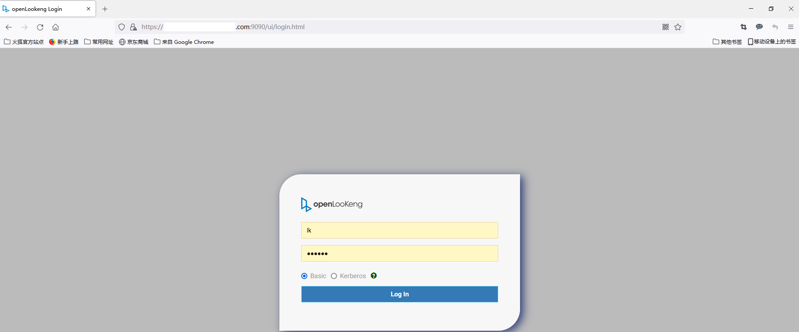

**CLI：**

```
java -jar hetu-cli-1.4.0-SNAPSHOT-executable.jar \
--server https://ip1.example.com:9090 \
--keystore-path /opt/hetu/keystore.jks \
--keystore-password 123456 \
--user lk \
--password
```

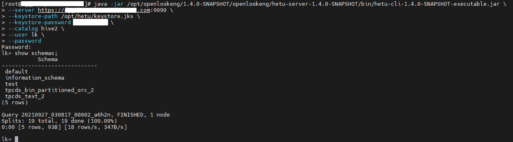

