+++

title = "openLooKeng AA安全配置指导（四）----对接ranger"
date = "2021-09-24"
tags = ["openLooKeng", "ranger", "OpenLDAP"]
archives = "2021-09"
author = "senny456"
description = "指导配置openLooKeng对接ranger做权限控制"

+++

### 1  Ranger编译和部署

代码路径：https://github.com/apache/ranger/tree/release-ranger-2.1.0， release-ranger-2.1.0分支。

在Ranger的2.1.0版本上开发openLookeng插件，所以需要编译和部署ranger-2.1.0。

### 1.1  代码编译

```
git clone https://github.com/apache/ranger.git  --branch  release-ranger-2.1.0
\# 进入代码根目录
cd ranger
mvn clean compile package install -DskipTests
ls target/
\# target 目录下为所有压缩包
```

### 1.2  安装MySQL

安装可参考网上教程：https://www.cnblogs.com/lzhdonald/p/12511998.html

本地安装完成后，连接数据库：mysql -u root -p，新增openlookeng用户并赋予权限

```
create database ranger;
CREATE USER 'openlookeng'@'%' IDENTIFIED BY 'openlookeng123';
GRANT ALL ON ranger.* TO 'openlookeng'@'%';
FLUSH PRIVILEGES;
```

### 1.3  安装Ranger Admin

安装可参考官方教程：https://cwiki.apache.org/confluence/display/RANGER/Ranger+Installation+Guide

```
# 进入Ranger代码编译生成的target目录下
tar -zxf ranger-2.1.0-admin.tar.gz
cd ranger-2.1.0-admin/
vi install.properties
```

install.properties修改如下部分

```
#mysql 数据库信息
db_root_user=root
db_root_password=xxxx
db_host=xxx.xxx.xxx.xxx

# DB UserId used for the Ranger schema
# 提前在mysql中创建数据库和用户
db_name=ranger
db_user=openlookeng
db_password=XXXXXX

# 禁用审计功能
#audit_store=solr
```

将mysql的驱动包放置到/usr/share/java/mysql-connector-java.jar。

```
CREATE USER 'openlookeng'@'%' IDENTIFIED BY 'Huawei@123';
GRANT ALL ON ranger.* TO 'openlookeng'@'%';
FLUSH PRIVILEGES;
```

执行./setup.sh

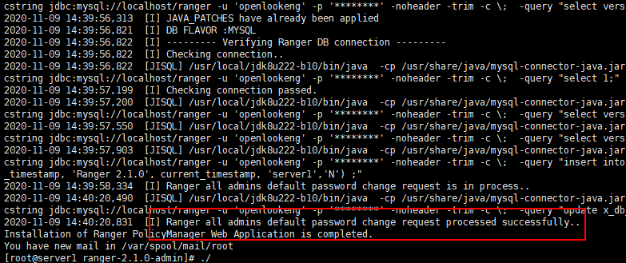

启动Ranger Admin服务: service ranger-admin start

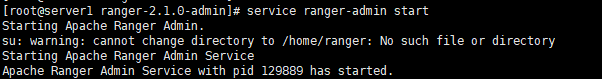

### 1.4  检查是否成功

访问Ranger控制台：http://ranger-IP:6080，默认账号密码：admin/admin，出现登录界面且登录成功，说明Ranger Admin安装成功

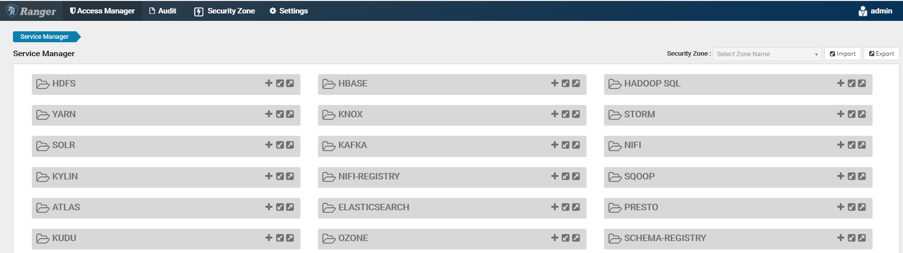

### 2  安装Ranger openLooKeng Plugin

代码路径：https://gitee.com/chen-peikun/openlookeng-ranger-plugin， master分支。

按照下面操作指导进行编译和部署即可（基于Ranger的2.1.0版本）。

### 2.1  代码编译

```
git clone https://gitee.com/chen-peikun/openlookeng-ranger-plugin.git
# 进入代码根目录
cd openlookeng-ranger-plugin
mvn clean compile package install
ls target/
# target 目录下为所有压缩包
```

### 2.2  在Ranger Admin中安装Ranger openLooKeng的服务端插件

```
# 代码openlookeng-ranger-plugin根目录
# 进入Ranger代码编译生成的target目录下
cd target
tar -zxf ranger-2.1.0-admin-openlookeng-plugin.tar.gz
cd  ranger-2.1.0-admin-openlookeng-plugin/

# 将openlookeng目录拷贝到Ranger Admin的ranger-plugins目录下
# 示例：Ranger Admin路径为/home/ranger-2.1.0-admin
cp -r openlookeng  /home/ranger-2.1.0-admin/ews/webapp/WEB-INF/classes/ranger-plugins/

# 使用curl命令，将service-defs目录下的ranger-servicedef-openlookeng.json服务定义文件注册到Ranger Admin服务中
# "password"是Ranger Admin的admin账户密码
# "ranger-admin-host:port"使用对应的Ranger Admin配置的host和port
curl -u admin:password -X POST -H "Accept: application/json" -H "Content-Type: application/json" -d @service-defs/ranger-servicedef-openlookeng.json http://ranger-admin-host:port/service/plugins/definitions

# 【重启Ranger Admin服务】
service ranger-admin restart
```

### 2.3  在Ranger控制台新增openlookengdev服务

访问Ranger控制台：http://ranger-IP:6080，默认账号密码：admin/admin，新增openLooKeng服务：

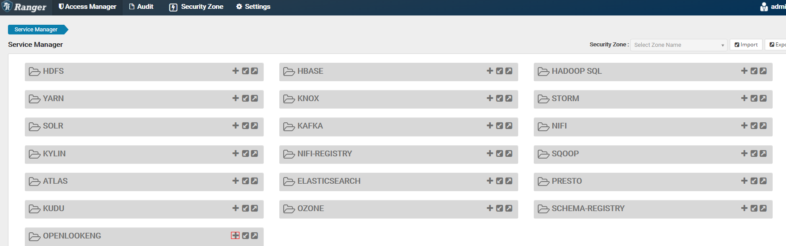

Username填写：**lk**, openLooKeng控制台（http://openLooKeng-IP:8080）默认使用**lk用户**进行数据查询和展示，使用**lk用户**创建服务，ranger默认会给创建服务用户全部权限。

Passworld：对接openLDAP需填写；未对接openLDAP不用填写。

jdbc.url填写：

​	非安全openLooKeng集群：jdbc:lk://openLooKeng-IP:http-port/catalog

​	安全openLooKeng集群：jdbc:lk://openLooKeng-IP:https-port/hive?SSL=true

​	如果配置nginx：jdbc:lk://nginx-IP:https-port/hive?SSL=true


测试连接成功，可以使用。

### 2.4  在openLooKeng中安装Ranger openLooKeng的客户端插件

```
# 代码openlookeng-ranger-plugin根目录
# 进入Ranger代码编译生成的target目录下
cd target
tar -zxf ranger-2.1.0-openlookeng-plugin.tar.gz
cd ranger-2.1.0-openlookeng-plugin/
vi install.properties
```

install.properties修改如下部分

```
# Location of Policy Manager URL
# Example: POLICY_MGR_URL=http://policymanager.xasecure.net:6080
POLICY_MGR_URL=ttp:///ranger-IP:6080
 
# This is the repository name created within policy manager
# Example: REPOSITORY_NAME=openlookengdev
# Ranger 控制台创建的Service名
REPOSITORY_NAME=openlookengdev  
 
#Presto component installed directory
#COMPONENT_INSTALL_DIR_NAME=../openlookeng
COMPONENT_INSTALL_DIR_NAME=/root/hetu-server-1.0.0-SNAPSHOT
 
#为了简单，此处不开启审计功能
XAAUDIT.SOLR.ENABLE=false
 
#虽然文档中没有提及，不设置的话，enable-presto-plugin.sh脚本执行出错
XAAUDIT.SUMMARY.ENABLE=false
```

以root用户执行脚本: ./enable-presto-plugin.sh

**如果是AA环境，coordinator节点上都需要执行上面脚本**

检查openLooKeng配置文件目录是否生成access-control.properties

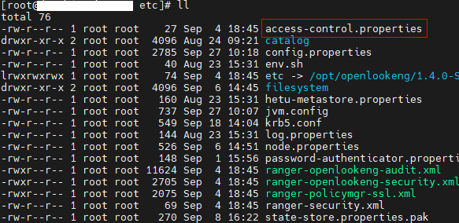

检查openLooKeng的plugin目录下是否生成ranger目录,其中jar包连接到ranger-2.1.0-openlookeng-plugin/lib

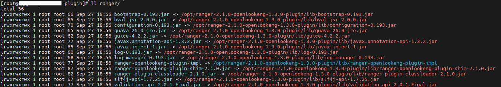

重启openLookeng**

进入openLookeng安装目录下的bin子目录，新建lk用户并授权，使用lk用户执行：./launcher restart

### 2.5  添加权限控制，验证是否成功

访问Ranger控制台：http://ranger-ip:6080，点击openlookengdev服务，进行权限控制：

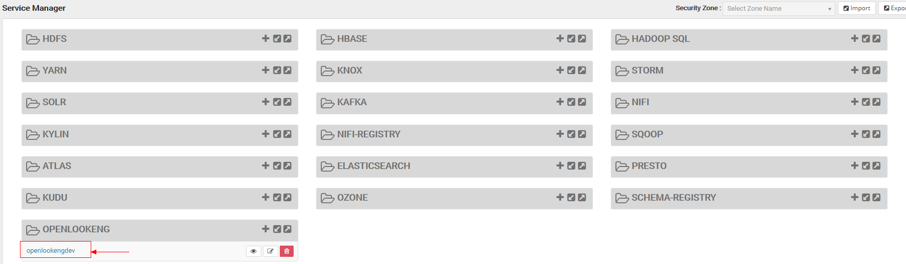

添加资源权限控制：

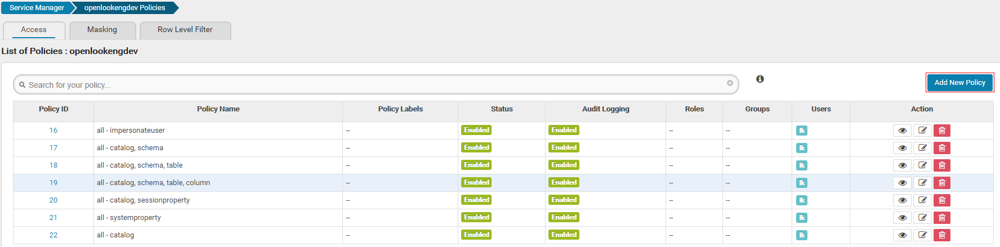

show schemas/tables/columns等显示元数据信息操作，对应的catalog/schema/table/column需要授权select权限，还必须给对应Catalog/Schame（information_schema)/Table(schemata，tables，columns)/Column(*)授予select权限）

**示例如下：**

【配置前】test账号没有配置权限

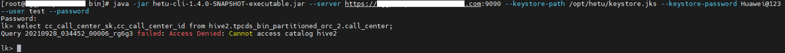

1）在Ranger上授权test访问Catalog（hive2)的use权限，**注意：管理表权限必须先设置catalog的use权限**

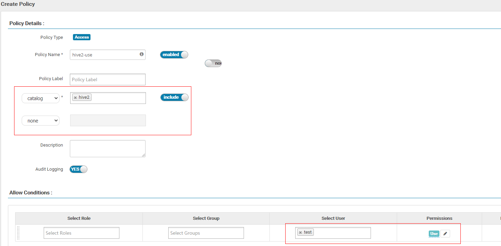

2）在Ranger上授权test访问Catalog（hive2)/Schame（default)/Table(user)/Column(id,info_age)数据的权限

【配置权限】给cc_call_center_sk,cc_call_center_id两个列访问权限

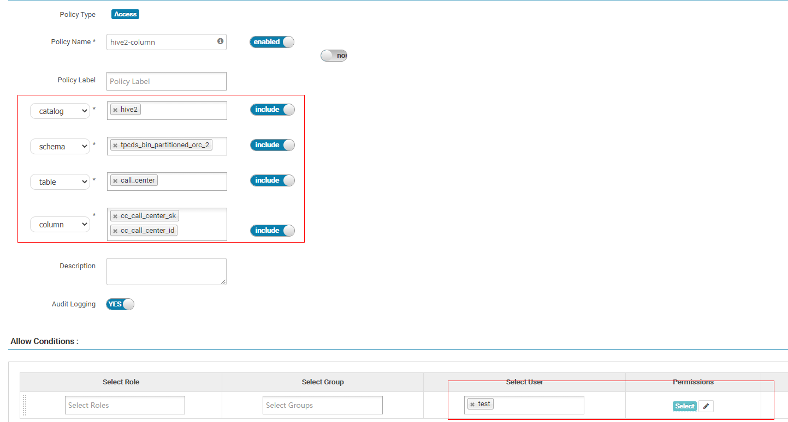

【配置后】

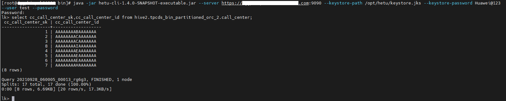