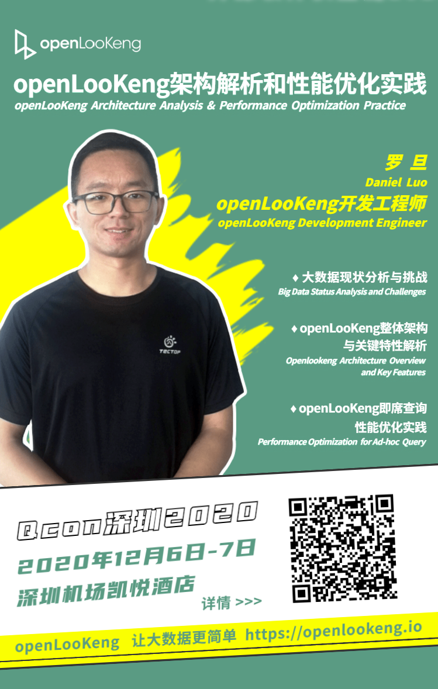

+++ 
author = "openLookeng"
time = "2020.12.06-2020.12.07" 
title = "QCon深圳2020 — openLooKeng架构解析和性能优化实践" 
location = "深圳" 
tag = "会议"
img = "./events/2020-12-06/banner.png" 
img_mobile = './events/2020-12-06/banner.png'
link = "./events/2020-12-06/architecture-analysis.html"
eventtype = "upComing"
description = ""
weight = 95
+++

### 点击阅读原文

<a href="https://mp.weixin.qq.com/s?__biz=MzU0MTQyMDc4OA==&mid=2247487008&idx=1&sn=7bf7c4723305e0db8f3870749cb910c6&chksm=fb2b73bbcc5cfaade3d7ca97876e32f804e99575686126ab6b4f3b396bcb44c507293795c5a8&token=280810305&lang=zh_CN#rd" target="_blank">阅读原文</a>

### 资料下载

<a href="2020-12-6-Shenzhen-QCon-openLooKeng.pdf" download>资料下载</a>

### 活动详情

### 更多详情，请关注

openLooKeng 官方公众号       openLooKeng微信小助手

