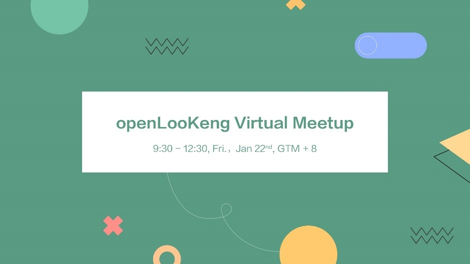

+++ 
author = "openLooKeng"
time = "2021.01.22" 
title = " openLooKeng Virtual Meetup，邀您一起共建社区" 
location = "线上" 
tag = "聚会"
img = "./events/2021-01-22/banner.jpg" 
img_mobile = './events/2021-01-22/banner.jpg'
link = "./events/2021-01-22/20210122.html"
eventtype = ""
description = ""
weight = 95
+++

纯线上的会议空间，让志同道合的朋友们无惧疫情齐聚在一起，共享大数据领域的技术知识，还可以跟国外的大拿们直接对话，共同探讨未来的无尽可能。2021年1月22日，openLooKeng 2021首场线上Meetup，诚邀小伙伴们关注参加！

### 如何参加

点击链接 https://www.eventbrite.com/e/openlookeng-virtual-meetup-tickets-136748657917 进行报名

或者扫描下方二维码报名

### 如果你不方便参加但又不想错过

可以扫描以下二维码关注直播间

### 活动亮点

<strong>1新面貌 openLooKeng Release V1.1</strong>

新年有新衣，openLooKeng新年也有新的一面。openLooKeng新版本V1.1正式发布。新版本带来哪些性能提升？比旧版本好在哪里？在处理复杂多变的大数据世界中将发挥什么优势作用？1月22日，openLooKeng Virtual Meetup，技术专家将现场面对面为大家作答。

<strong>2倾听心声 Vioce of Users</strong>

数据虚拟化引擎openLooKeng能不能用？用在哪里？好不好用？the Vioce of Users就是最好的答案。1月22日openLooKeng Virtual Meetup，欢迎朋友们关注，一起倾听使用者最真实的声音。

<strong>3首次公开 Community Update and Plan</strong>

这是openLooKeng第一次线上公开自己的社区计划。小伙伴们可以在线全面认识了解openLooKeng社区以及社区未来规划。幸运的小伙伴还可以直面运营大大，为可爱和谐的openLooKeng社区提供宝贵意见。

### 如果你有任何问题或建议

欢迎发邮件到 contact@openlookeng.io

也可以联系openLooKeng小助手哦

小助手微信：

openLooKeng, Big Data Simplified