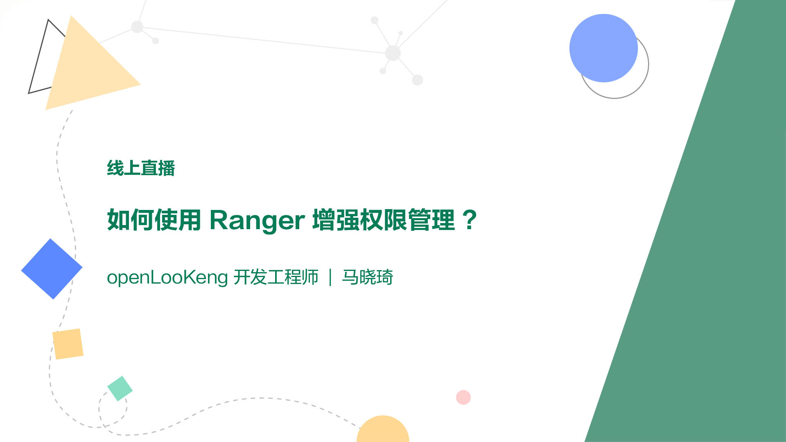

+++
author = "openLooKeng"
time = "2021.04.15"
title = "如何使用Ranger增强权限管理？"
location = "线上"
tag = "直播"
img = "./events/2021-04-15/poster.jpg"
img_mobile = "./events/2021-04-15/poster.jpg"
link = "./events/2021-04-15/range.html"
eventtype = "lookBack"
description = ""
+++

想让除了Admin之外的用户对元数据只有只读权限，该怎么配置？集成Ranger后，openLooKeng权限管理有哪些新功能？本期直播回顾为您带来相关解答。

### 视频回顾链接

https://www.bilibili.com/video/BV1kb4y1D7GK

### 资料下载地址

<a href="openLooKeng_Ranger权限管理.pdf" download="">点击下载资料</a>

### 更多详情，请关注

openLooKeng 官方公众号

openLooKeng小助手

