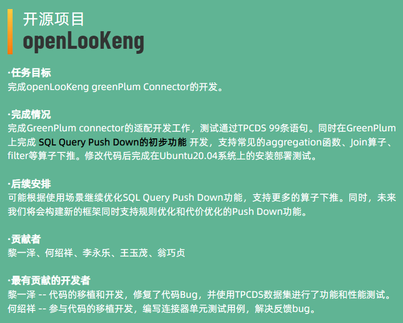
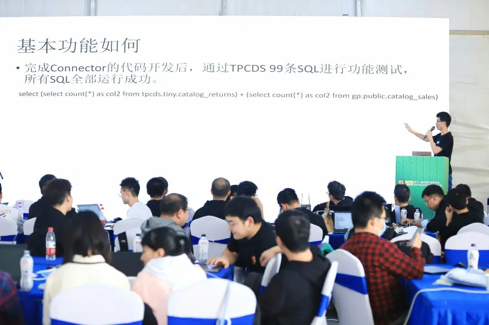
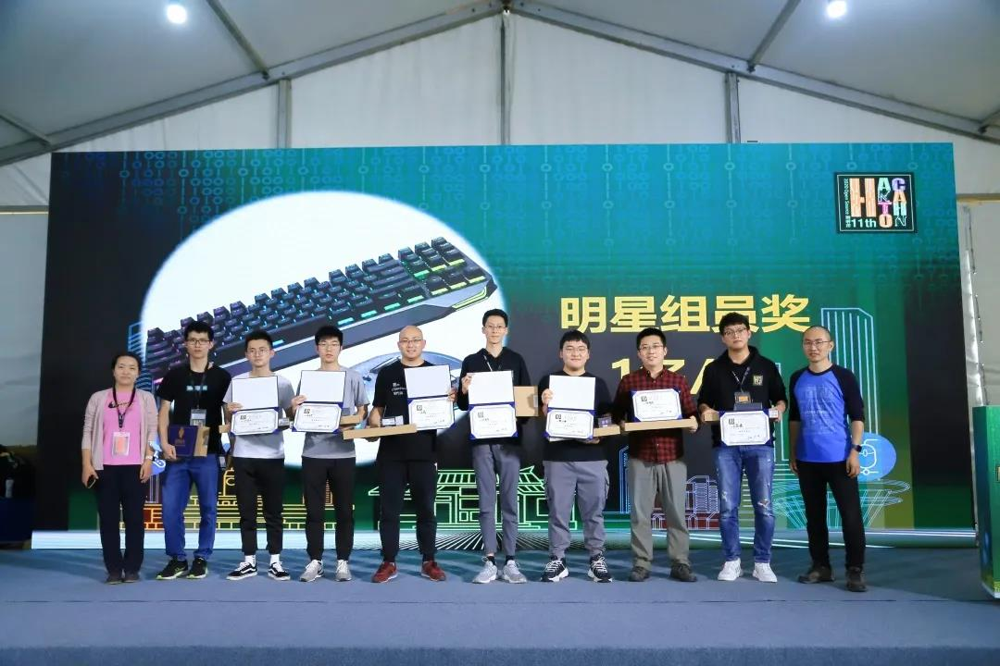
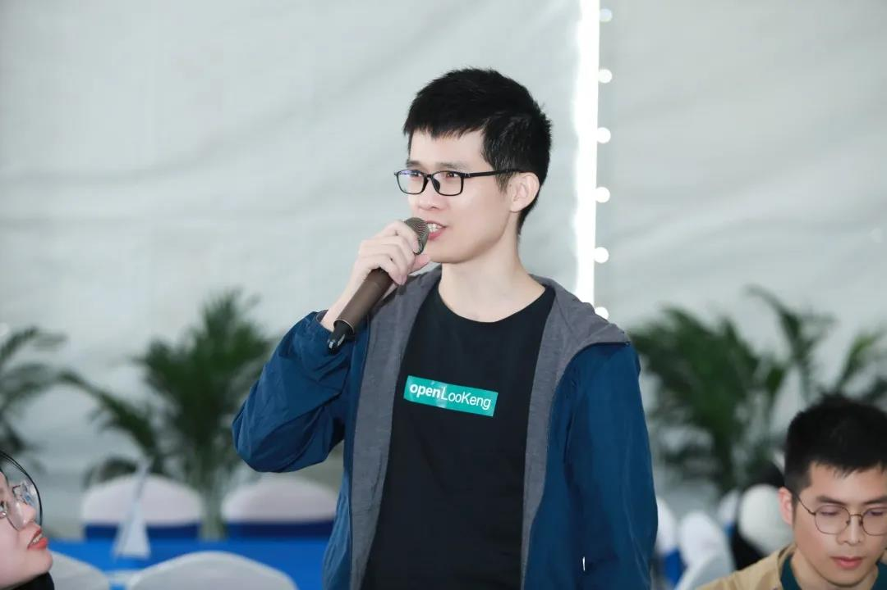
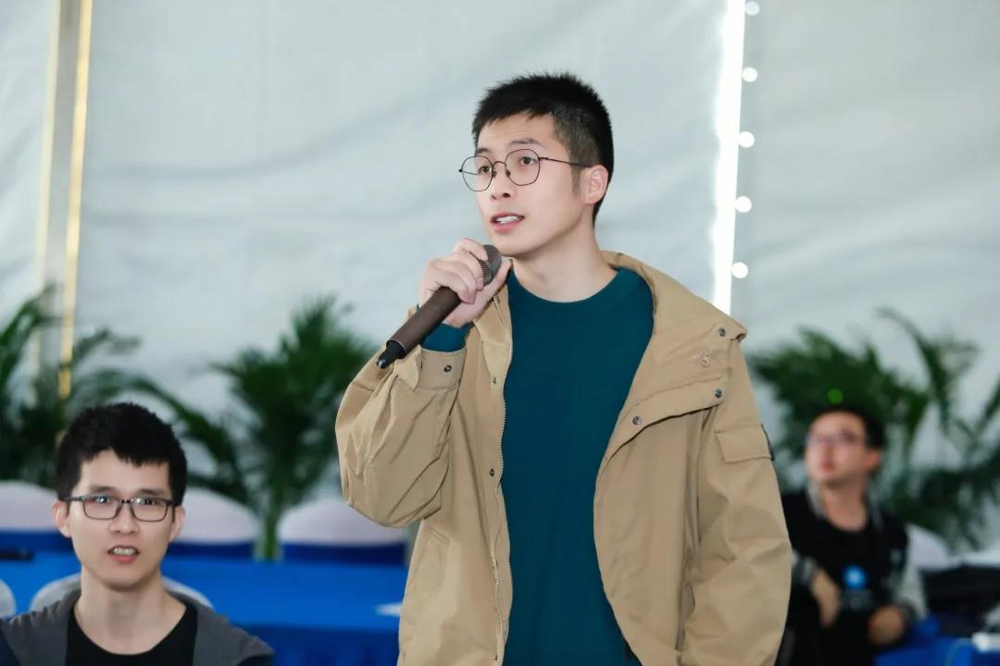
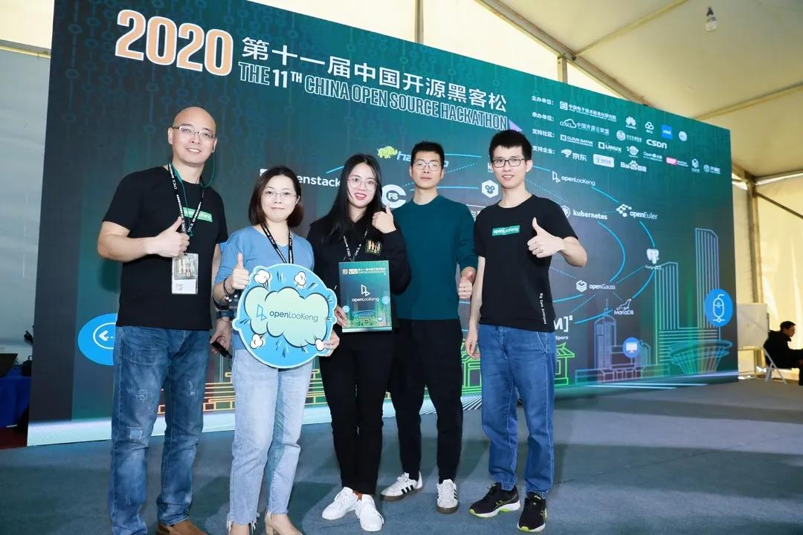
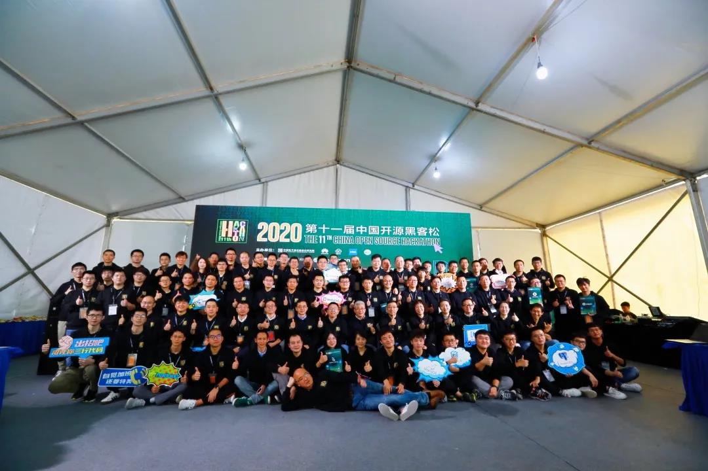
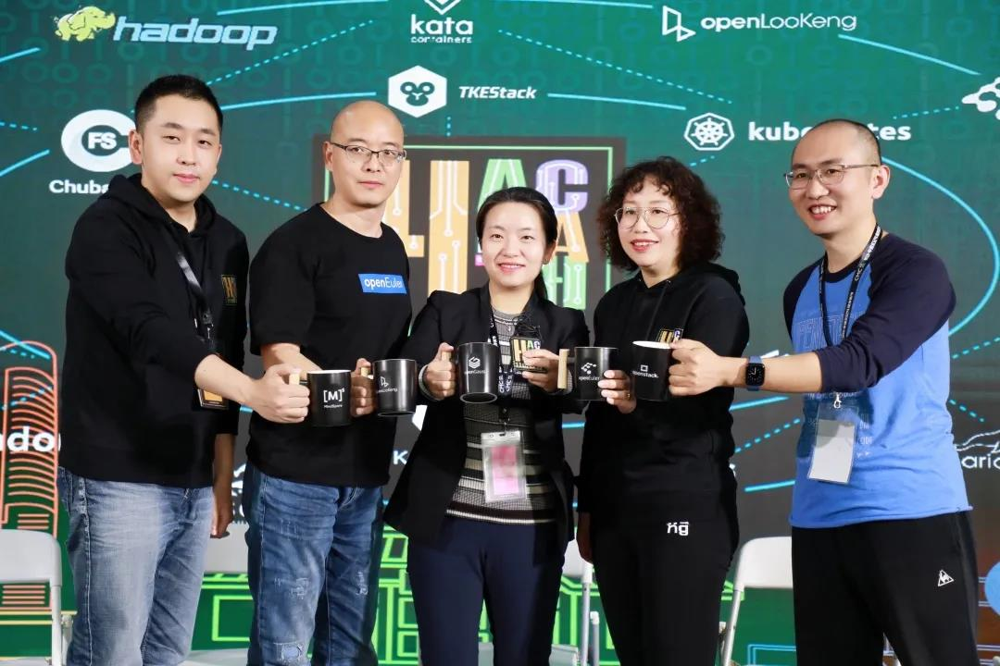
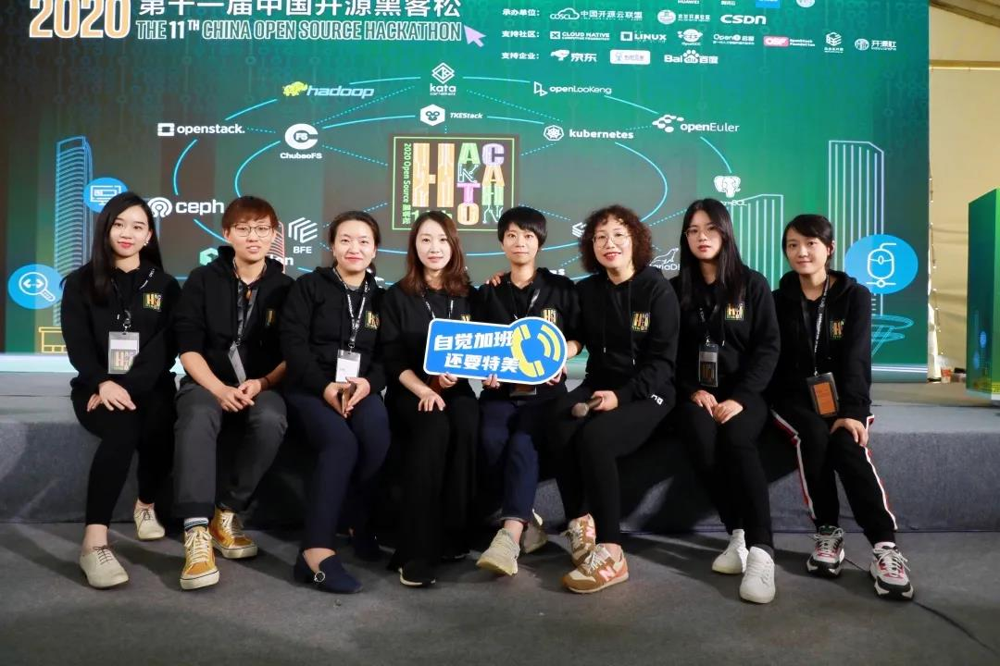
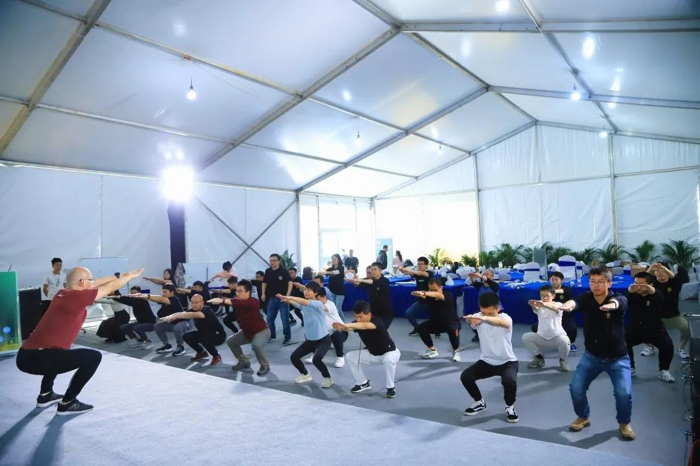

+++
title = "未来可期 | openLooKeng首次亮相第十一届中国开源黑客松"
date = "2020-10-26"
categories = ["Announcement"]
author = "openLooKeng"
description = "10月25日，为期3天的第十一届中国开源黑客松在长沙马栏山视频文创园完美落幕。作为开源界的新成员，同时首次亮相黑客松活动的数据虚拟化引擎 openLooKeng，便完成了GreenPlum connector的适配开发，同时在GreenPlum上完成开发 SQL Query Push Down的初步功能 。"
+++

10月25日，为期3天的第十一届中国开源黑客松在长沙马栏山视频文创园完美落幕。作为开源界的新成员，同时首次亮相黑客松活动的数据虚拟化引擎 openLooKeng，便完成了<strong>GreenPlum connector的适配开发，</strong>同时在GreenPlum上完成开发 <strong>SQL Query Push Down的初步功能。</strong>团队代表成员之一，黎一泽荣获黑客松明星组员奖。

openLooKeng成果分享

(左二)黎一泽，荣获明星组员奖

<i class="gray">小小的团队，大大的能量，在openLooKeng团队身上得到最大的诠释。</i>

作为开源界一颗冉冉升起的新星，作为黑客松参与项目的“新客”，在上百人的现场，十来个团队中，5人团的openLooKeng显得格外"娇小"，但首次出场便交出不菲的成绩。这份认真干劲与毅力，值得我们的称赞和鼓励。我们也有幸能与团队中的贡献最大的2位成员进行一次交流。

 访谈嘉宾
 

<strong>黎一泽丨华为 软件开发工程师</strong>

参与openLooKeng项目北向、南向接入生态构建和内核算子下推相关研发工作。
 

<strong>何绍祥丨北明软件 大数据研发工程师</strong>

从事数据资产管理平台研发工作，在管理平台集成openLooKeng，提供融合分析能力。

Q1：听说你们都是第一次参与黑客松，有感觉到紧张吗？
 

黎老师&何老师：有些紧张，毕竟任务在身。但跟想象中严肃作业的场景不同，比较自由，类似freetalk。而且能与朋友们在技术上面对面深入探讨，蛮享受的。

Q2：对开源开发的朋友们来说，openLooKeng是个新成员，可以给我们介绍介绍？

黎老师：当然可以。openLooKeng是一款开源的高性能数据虚拟化引擎，提供统一SQL接口，具备跨数据源/数据中心分析能力以及面向交互式、批、流等融合查询场景。我们致力于为大数据用户提供极简的数据分析体验，让用户像使用“数据库”一样使用“大数据”。感兴趣的朋友可以到社区https://openlookeng.io 作进一步了解。

Q3：本次黑客松活动，openLooKeng带来了什么任务？

黎老师：我们基于openLooKeng的框架开发一个GreenPlum connector，并在上面做了一些算子下推的优化。GreenPlum是一个强大计算能力的数据库。为了更好地使用数据库的计算能力，我们加了过滤条件、多表合并等计算算子的下推，从而节省带宽的延时，提升了作业的处理性能。

Q4：时间充足吗？

黎老师：够的。因为Connector的框架和SQL 算子下推框架的优良拓展性，所以我们基本在1-2天开发完成，完全没问题。

Q5：我了解到，openLooKeng近期会推出新的版本，而且比原先会有比较大的“变化”，能透露下吗？

黎老师：嗯……一起期待吧，朋友们。

Q6：据我所知，北明软件跟openLooKeng交流互动蛮久的。这次一起作为团队代表，可见北明软件对openLooKeng给予很大的肯定和支持。何老师，您怎么评价openLooKeng？

何老师：作为一款高效的大数据分析引擎，openLooKeng实施便捷，易用性强，上手快，真正能解决跨库查询语法不统一，聚合困难等问题。给用户提供极简的数据分析体验。很看好openLooKeng在数据分析领域的潜力。

Q7：那对openLooKeng的未来会有哪些期望？

何老师：希望openLooKeng在未来能多扩展一些国产数据库connector，并对原有connector算子的下推功能做更细致优化，来应对各种复杂数据分析场景。

Q8：感谢两位的采访，期待下次黑客松活动再次看到你们合作的身影。

黎老师&何老师：一定，谢谢。

（左）黎一泽，（右）何绍祥

活动现场的openLooKeng团队

openLooKeng团队 代表

10月23日-10月25日，由中国电子标准化研究院、华为、腾讯云，Intel，鹏程实验室联合主办的2020第十一届中国开源黑客松在长沙·马栏山视频文创园圆满落幕。活动吸引了来自华为、Intel、腾讯云、麒麟、浪潮、烽火、CSU、HNU、移动、中兴、蚂蚁、湖南大学、桂林电子科技大学、湖南师范大学、中南大学等30家不同企业单位和高校的参与，100余位开源开发者们的参加。

<video controls>
    <source src="./hackathon/hackathon1.mp4" type="video/mp4">
</video>

2020第十一届中国开源黑客松

2020第十一届中国开源黑客松大合照

第十一届中国开源黑客松志愿者代表们

代码世界的女团

黑客松压轴活动，让运动唤醒身体

<video controls>
    <source src="./hackathon/hackathon2.mp4" type="video/mp4">
</video>

