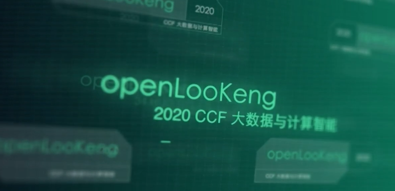

+++
title = "开源数据虚拟化引擎openLooKeng助力CCF大数据与计算智能大赛"
date = "2020-11-11"
categories = ["Announcement"]
author = "openLooKeng"
description = "近日，开源项目openLooKeng迎来了一个大动作——2020 CCF大数据与计算智能大赛 (CCF Big Data & Computing Intelligence Contest，以下简称CCF BDCI)"
+++

近日，开源项目openLooKeng迎来了一个大动作——<strong>2020 CCF大数据与计算智能大赛</strong>  (CCF Big Data & Computing Intelligence Contest，以下简称CCF BDCI)

<strong>CCF BDCI是国际最著名的大数据与AI赛制之一。</strong>作为本次大赛的合作伙伴，也是大数据领域中的关键项目，openLooKeng贡献了赛题<strong>「openLooKeng性能优化」，</strong>并设置高额奖金，诚邀朋友们报名参加。

随着大数据技术的应用和发展，数据种类越来越多，数据分布越来越广，查询场景也越来越复杂，这使得大数据使用更加困难。

<strong>openLooKeng是一款开源的高性能数据虚拟化引擎，提供统一SQL接口，为大数据用户提供极简的数据分析体验，让用户像使用“数据库”一样使用“大数据”。</strong>因此，openLooKeng极致性能是十分重要的一个维度，也是openLooKeng社区一直以来所追求的目标。

<strong>本次赛题「openLooKeng性能优化」，是针对openLooKeng社区进行端到端的性能优化，不限方法，开放思维。另外，idea一经采用，有机会在openLooKeng社区提交PR，亲身参与开源社区运作。</strong>目前，该赛题已经吸引了国内外110+队伍共130+人参加。

据了解，本次大赛参赛队伍不仅有机会得到<strong>丰厚奖金</strong>（高达5万人民币），而且能获得由<strong>教育部计算机类教学指导委员会、中国计算机学会颁发的权威证书。</strong>入围决赛的队伍，还有机会得到<strong>大赛创业投资委员会创投孵化机会。</strong>

openLooKeng团队负责人表示，非常欢迎朋友们报名参与，一起拥抱开源，共建开源项目社区。

CCF BDCI大赛由中国计算机学会于2013年创办，目前已成功举办7届，参赛规模与影响力逐年提升，已经成为中国大数据与人工智能领域最具影响力的活动之一。自创办以来，大赛累计吸引来自全球25个国家、1500余所高校、1800家企事业单位及80余所科研机构的9万余人参与，有100多所高校将赛题作为大作业及毕业设计选题。今年的CCF BDCI大赛设置了多维度、多形式的创业扶持与激励计划，还通过开放全新的自主平台赛道，助力国产AI框架的应用落地，希望通过打通赛、练、用的壁垒，推动整个产业生态的良性发展。