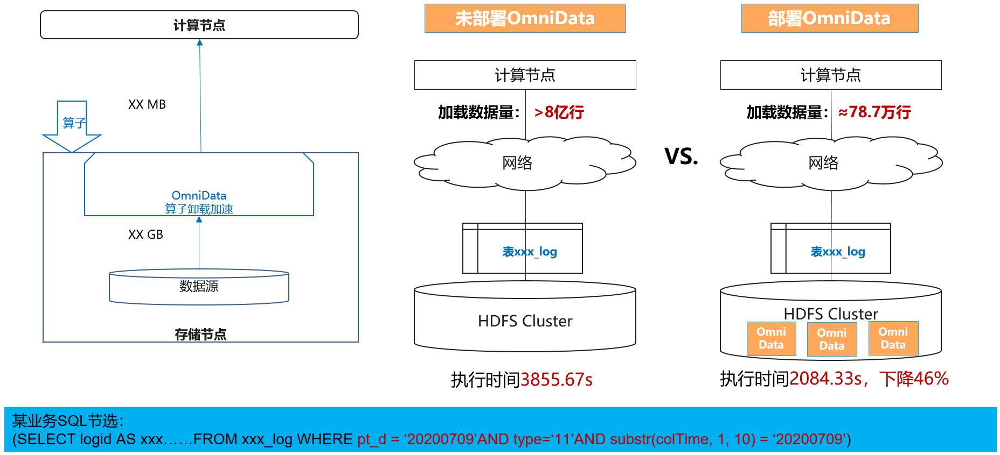
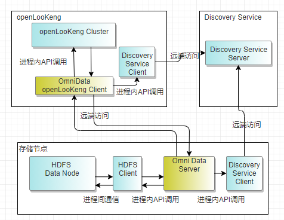

+++ 
title = "openLooKeng v1.4.1正式发布 - OmniData 实现算子近数据计算"
date = "2021-11-12"
categories = ["Announcement"]
author = "openLooKeng"
description = "11月12日，openLooKeng v1.4.1正式上线。除了对旧版本进行一些优化外，v1.4.1版本还引入了OmniData Connector。作为OmniRuntime的组件之一，OmniData 特性的引入，将进一步提升openLooKeng引擎性能。"
+++
 
在刚过去不久的Apache Hadoop Meetup 2021上，openLooKeng社区PMC主席Ken Zhang 分享的 OmniData 受到不少朋友的关注。

11月12日，openLooKeng v1.4.1正式上线。除了对旧版本进行一些优化外，v1.4.1版本还引入了OmniData Connector。

那 OmniData 是什么？有什么作用？小助手将为大家娓娓道来。

### 关于 OmniData

OmniData 算子下推特性，适用于大数据存算分离场景或大规模融合部署场景。当大量计算节点从存储节点读取数据时，大量原始数据从存储节点通过网络传输到计算节点进行处理，有效数据占比低，极大浪费网络带宽。

OmniData旨在减少数据存储层和计算层之间的无效数据传输。 

此外，OmniData算子下推特性将计算侧的Filter、Aggregation、Limit算子下推到存储节点执行，实现近数据计算，利用多样算力缓解计算侧CPU的压力。

OmniData服务将算子处理结果通过网络传输到计算节点，从而减少无效数据在网络上的传输，有效提升大数据计算性能。

**OmniData适用范围：**

1. 支持openLooKeng v1.4.0和Spark 3.0.0，提供对应的引擎侧OmniData插件。
 
2. 支持算子下推到HDFS，支持S3的存储访问接口。

3. 支持数据格式包括：TXT、ORC、Parquet。

4. TaiShan服务器，支持鲲鹏处理器的体系架构。

OmniData在大数据存算分离场景或大规模融合场景的适用性，极大符合openLooKeng的愿景：让大数据更简单。

OmniData特性的引入，将进一步提升openLooKeng引擎性能。

OmniData Connector更多详情请参考：
<https://openlookeng.io/docs/docs/connector/omnidata.html>

OmniData更多详情请参考：
<https://www.hikunpeng.com/zh/developer/boostkit/big-data?accelerated=3>

### openLooKeng v1.4.1 优化

**ARM 架构下支持JDK8**

消除因JDK卡顿问题导致ARM架构下对java版本的强制要求，支持ARM架构下使用jdk1.8.262及以上版本。

欢迎下载并使用openLooKeng: <https://openlookeng.io/zh-cn/download.html>

体验过程中有任何感受与建议，欢迎在openLooKeng代码仓上提Issue，或发邮件至<users@openlookeng.io>告知我们。您的声音或将成为openLooKeng引擎性能提升的关键。

openLooKeng代码仓地址:<https://gitee.com/openlookeng>

openLooKeng，让大数据更简单！ 
 