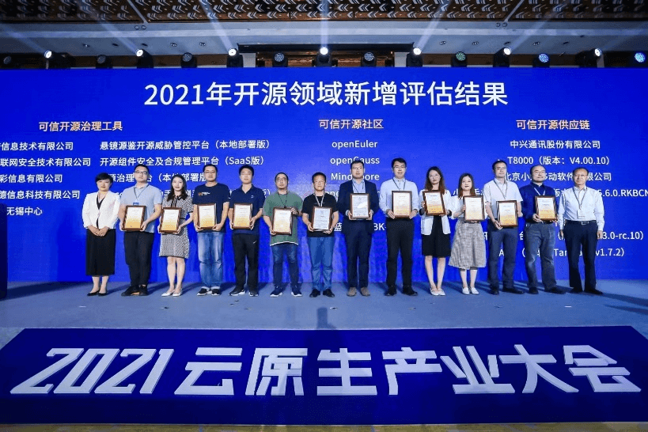
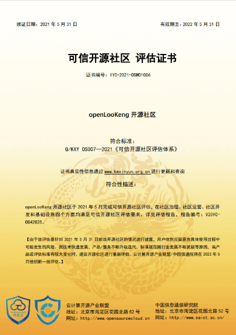
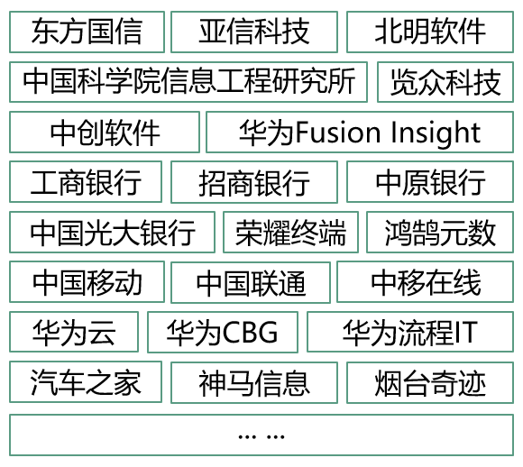
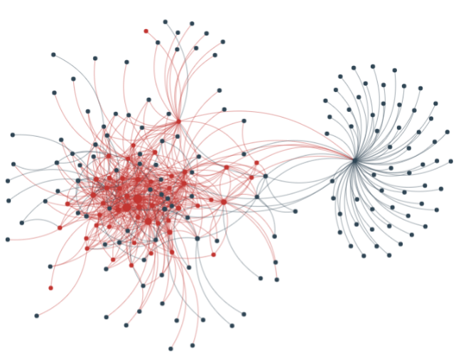
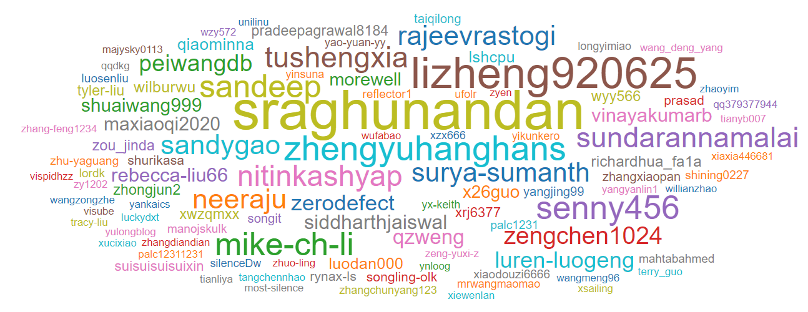

+++ 
title = "openLooKeng: 感恩同行，美好相伴"
date = "2021-11-25"
categories = ["Announcement"]
author = "openLooKeng"
description = "自2020年6月30日开源以来，openLooKeng在大家的关注下不断成长。那些熠熠生辉的瞬间，都是社区朋友们点亮的星火。"
+++

自2020年6月30日开源以来，openLooKeng在大家的关注下不断成长。那些熠熠生辉的瞬间，都是社区朋友们点亮的星火。

2021年，在临近1周岁生辰的日子里，openLooKeng成为首批获得 **“可信开源社区评估体系”** 认证的开源社区之一。这是大家的认可，也是社区收到的最好的礼物之一。而随着社区蓬勃发展，openLooKeng引擎不仅更强大，社区在其他方面也得到了非常健康的成长。

 

2021云原生产业大会：openLooKeng获得“可信开源社区评估体系”认证证书

当前，已有包括招商银行、光大银行、亚信科技、中科院、中国移动、中国联通等不同行业的30+家合作伙伴加入openLooKeng社区，并在多个关键特性上积极贡献。openLooKeng社区还与行业解决方案软件伙伴紧密合作，针对行业场景的特点，联合推出对应解决方案：

+ 与北明软件推出数据资产管理平台v4.0，提供数据交换共享服务;
+ 与览众科技推出资蛛侠数据服务平台等。

 

以上排序不分先后

在吸引一批批领先企业与科研机构加入的同时，openLooKeng有许许多多开源大数据爱好者的参与。我们感谢招行大数据技术专家吴酋珉、光大银行程小舰、鸿鹄元数总经理胡继云、学生开发者何正杰以及社区其他朋友们带来的分享与贡献，让社区迸发新的生命力。

openLooKeng社区用户间的协作联接图

社区用户通过一次次的贡献与交流，互相联接，共同构筑openLooKeng社区美好蓝图

当然，还有很多开源爱好者们也在幕后默默支持社区，他们不断在社区组织、社区论坛、交流群内穿梭，积极提问、热心解答、互相帮助，让社区愈加有活力。

openLooKeng社区贡献者（Gitee ID）

* openLooKeng下载量已突破90000+； 
* 社区贡献者300+；
* 累计Pull Request提交达到 1900+；
* 累计Commit数达到 1400+；
* 社区交流群人数达到 600+。

### 感谢所有与openLooKeng相伴的人，未来路上我们一起同行。
### openLooKeng，Make Big Data Simplified. 