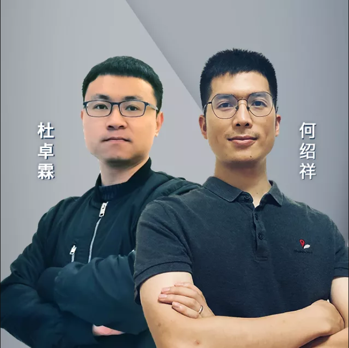
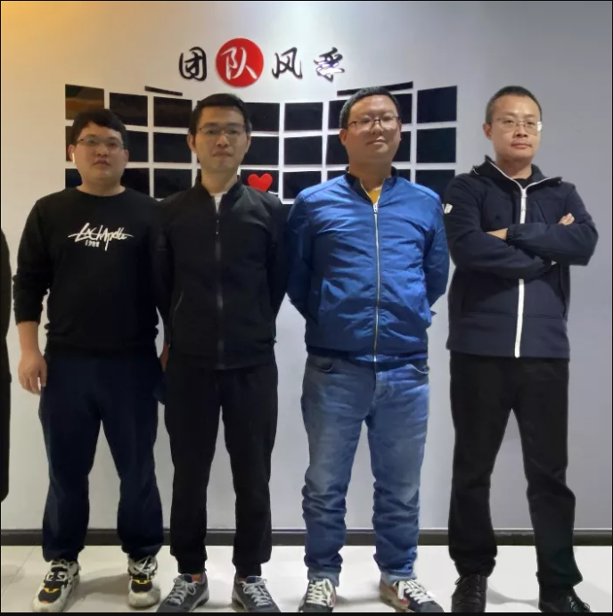

+++ 
title = "2021信创“大比武”鲲鹏赛道总决赛圆满落幕，openLooKeng两支队伍获奖"
date = "2021-11-29"
categories = ["Announcement"]
author = "openLooKeng"
description = "信创“大比武”总决赛圆满落幕，全国十强队伍上线，参与openLooKeng赛题的两支队伍，北明大数据团队与鸿鹄团队分别荣获铜奖与优胜奖。恭喜！"
+++
 
​11月29日，2021信创“大比武”鲲鹏基础软件开发赛道（以下简称“鲲鹏赛道”）总决赛圆满落幕。四个多月以来，选手们一路披荆斩棘，带来了一场又一场精彩绝伦的比赛。总决赛现场，经过评委老师们认真审核、综合评定，最终决出十支队伍荣获赛事大奖。

其中，参与openLooKeng赛题的两支队伍，北明大数据团队与鸿鹄团队分别荣获铜奖与优胜奖。恭喜。

---

## 
铜奖

### 
北明大数据团队

### 
参赛宣言

数据北明，罗庚引擎，融合分析，点数成金！

### 
作品名称

查询日志持久化

### 
作品简介

基于openLooKeng大数据技术，开发了数据服务跨源分析和日志持久化功能，实现了数据服务数据跨库融合分析，持久化日志，多维度查询增强，查询条件日志查询的性能提升，落地于政务、交通、金融行业等行业项目，应用在数据免搬迁，跨源数据融合分析场景。

### 
获奖感言

感谢主办方、各位评委老师辛苦付出、感谢团队的小伙伴，感谢华为通过软件开源的方式，共享在基础软件领域的多年积累，使能伙伴发行openEuler和openGauss商业版，繁荣基础软件产业生态。参加本次鲲鹏赛道活动，不仅可以通过赛事掌握领域最新技术，还能在赛事过程中提升技术水平，夯实公司团队对信创基础软件能力掌握与重视。同时希望有更多数据开发者加入到openlookeng开源社区。目前，我们已经深入融合openlookeng形成商业解决方案，希望未来为鲲鹏产业发挥价值，提升鲲鹏生态的影响力。

---

## 
优胜奖

### 
鸿鹄团队

### 
参赛宣言

鸿鹄展翅，鹏程万里！
 

### 
作品名称

SQL历史记录查询功能增强

### 
作品简介

基于openLooKeng大数据技术，开发增强了SQL历史记录查询能力，对执行跨源分析SQL进行持久化处理，支持数据库和文件存储方式，便于历史SQL解析关系分析。同时，在SQL记录查询UI方面提升了交互性，丰富了筛选条件，优化了列表布局。目前，已将该成果落地于国内多家金融、政府、交通等行业数据中台项目，得到广泛好评。

### 
获奖感言

感谢主办方给予我们展示团队的机会，通过本次比赛，我们感受到了开源的魅力，与其他优秀团队竞技的过程，使我们明白了自身的不足，促使我们去改正进步，比赛虽然已经结束了，但是我们拥抱开源和提升自我的脚步不会停止，最后希望能有越来越多的人能参与和支持国产开源项目。

---

## 
2021 信创“大比武”鲲鹏赛道总决赛获奖名单

识别二维码观看总决赛回放

---

## 
关于 2021 信创“大比武”

本届2021信创“大比武”鲲鹏赛道总决赛由信息技术应用创新工作委员会指导，华为主办，重庆鲲鹏创新中心、北京鲲鹏联合创新中心、openEuler开源社区、openGauss开源社区及openLooKeng开源社区共同承办。自开赛以来，来自各行业近百家企业以及高校的300余位开发者踊跃报名参赛，产生了数百个优秀作品。

信创技术应用创新工作委员会副秘书长王莉和中国工程院院士、信创专家委主任委员廖湘科为鲲鹏赛道总决赛致辞，他们表示，鲲鹏赛道吸引了全国的操作系统、数据库及大数据从业者和爱好者，加入到基础软件的生态建设和完善，促进了技术创新和人才培育的结合，搭建了信创资源和行业应用的对接平台，推动了信息技术应用创新产业的良性发展。华为计算开源业务总经理堵俊平也在致辞中强调了在基础软件领域构建核心产业链的重要性，开源社区能够为计算产业持续发展奠定良好的基础。

本次鲲鹏赛道搭建了一个开放交流、施展才能的舞台，华为作为主办方，通过命题设置、为参赛团队提供一对一的专家指导和关键技术深度指导，帮助参赛团队开发更具竞争力的优质项目，以赛促学，以赛促建，进一步深化了技术赋能商业、商业牵引技术，相互融合的良性循环。

鲲鹏计算产业是基于鲲鹏处理器的基础软硬件设施、行业应用及服务，涵盖从底层硬件、基础软件到上层行业应用的全产业链条。作为鲲鹏计算产业的发起者和重要成员，华为秉持“硬件开放、软件开源、使能伙伴，发展人才”的策略，通过战略性、长周期的研发投入，和产业伙伴一起，持续推进全栈计算技术的创新发展。

未来，华为还将持续投入开源技术创新、开源基础设施建设、开源软件能力建设，为汇聚产业伙伴的力量，吸引全球开发者共同构建开源社区，促进我国的开源生态和海外主流开源社区充分融合共享。

---

欢迎关注openLooKeng，加小助手微信(openLooKengoss)进入专属技术交流群。

社区代码仓 <https://gitee.com/openlookeng>

openLooKeng，让大数据更简单！ 
 