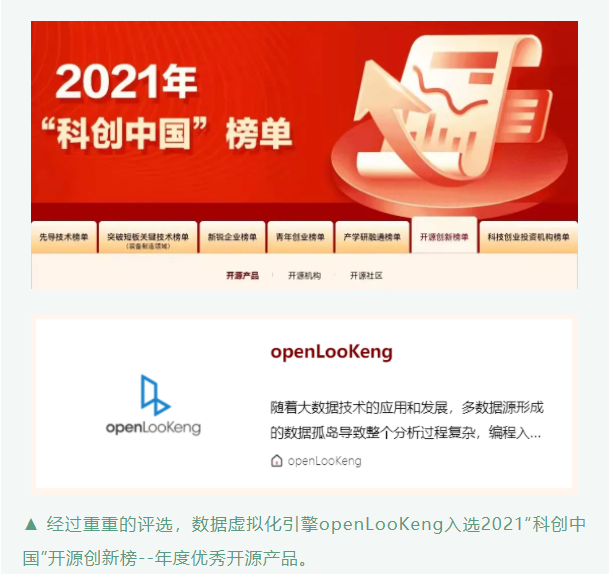

+++ 
title = "2021“科创中国”开源创新榜单公布，openLooKeng入选年度优秀开源产品"
date = "2022-03-01"
categories = ["Announcement"]
author = "openLooKeng"
description = "2021“科创中国”开源创新榜单公布，openLooKeng入选年度优秀开源产品。此次上榜也代表着“科创中国”对openLooKeng在开源创新方面取得的成绩的认可。"
+++
 

​近日， 中国科协召开的2022“科创中国”年度会议上，中国工程院院士周济发布了2021“科创中国”开源创新榜单。**数据虚拟化引擎openLooKeng入选了“科创中国”开源创新榜年度优秀开源产品**。此次上榜也代表着“科创中国”对openLooKeng在开源创新方面取得的成绩的认可。

▲ 2022“科创中国”年度会议
 

“科创中国”开源创新榜由中国科学技术协会主办，“科创中国”开源创新联合体、中国科协科学技术传播中心、中国通信学会、中国电子学会、中国科学院软件研究所、中国开发者社区共同承办，评审工作于2021年9月24日在中关村论坛-开源创新发展论坛上启动。经全域宣传推广征集，榜单评审触达1869项开源产品以及230家社区和企业机构。经过20位来自全国学会、中国开源软件推进联盟、Apache基金会、清华、北大、北航等机构的开源专家评审，最终推出年度优秀开源机构4家，优秀开源社区10家，优秀开源产品50项。

开源至今，openLooKeng健康积极的成长态势离不开许多朋友们的支持和贡献。正因如此，openLooKeng才得以入选此次优秀开源产品的榜单。这是对openLooKeng开源成果的肯定，也是对社区成长路上的认可。

感谢一直以来陪伴openLooKeng的朋友们，未来让我们继续携手前行，共话大数据引擎技术；也欢迎更多的朋友们加入openLooKeng这个大家庭，在享受技术盛宴的同时一起努力，Make Big Data Simplified ！

2021“科创中国”榜单：

<https://www.kczg.org.cn/meetspecial/ranklist?belong_type=6&open_source_type=1&page=3>

---

欢迎关注openLooKeng，加小助手微信(openLooKengoss)进入专属技术交流群。

社区代码仓 

<https://gitee.com/openlookeng>

<https://github.com/openlookeng>

openLooKeng，让大数据更简单！ 
 