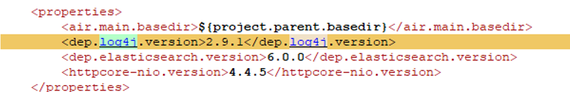
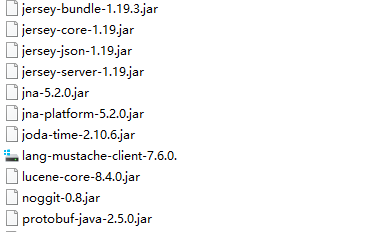

+++
title = ""
description = "Apache Log4j2是一个基于Java的日志记录工具。该工具重写了Log4j框架，并且引入了大量丰富的特性。 "
+++

## 概述

Apache Log4j2是一个基于Java的日志记录工具。该工具重写了Log4j框架，并且引入了大量丰富的特性。

该日志框架被大量用于业务系统开发，用来记录日志信息。大多数情况下，开发者可能会将用户输入导致的错误信息写入日志中。

此次漏洞触发条件为只要外部用户输入的数据会被日志记录，即可造成远程代码执行。

CVSS 9.8分，漏洞PoC公开且可攻击成功，影响范围广，危害大。

### 受影响版本

Apache log4j 2 在 2.0 至 2.14.1 （均含）版本均受影响。

### openLooKeng漏洞排查

**问题排查一： ESconnector在运行时依赖log4j**

继续排查openLooKeng最终打包server时的jar包，当前使用的是JDK自己的logging框架，没有使用log4j。

在对应的ES connector模块下，对lib库的分析，发现的确使用了log4j相关的库。

**问题排查二：openLooKeng使用的是airlift，封装的JDK本身的log框架** 

同样对打包后的openLooKeng server lib库下所有的jar包进行梳理，可以看到没有log4j-api以及log4j-core。

**问题排查三 ：openLooKeng仓库ranger plugin代码** 

通过排查仓库的内容，并未发现相关log4j相关代码的依赖。

在ranger中的POM文件中，发现了部分关于log4j的版本声明，但是并未在后续的构建中使用。

当前openLooKeng ranger plugin依赖于apache ranger 2.1.0组件，而ranger 2.1.0组件依赖log4j2 2.13X版本，为间接依赖关系。

并且，当前ranger中，对于log4j有依赖的模块是agents-audit

openLooKeng的ranger plugin并不依赖log4j

### openLooKeng社区修复方案

升级至最新组件：log4j-2.15.0，其中2.15.0的发布时间应该为2021-12-09 23:46的版本！

#### 方案1 - 修改代码
1、 针对ES connector 和Ranger plugin，更新代码，移除log4j的依赖。**关联PR如下** ：

<https://gitee.com/openlookeng/hetu-core/pulls/1312>

<https://gitee.com/openlookeng/openlookeng-ranger-plugin/pulls/10>

备注：由于Ranger社区尚未修复log4j问题，因此建议用户在使用ranger plugin时，按照方案2的建议配置openLooKeng参数。openLooKeng社区会在ranger社区修复log4j2问题之后更新ranger到最新版本。

#### 方案2 - 修改配置规避问题
针对无法做代码改动的环境，如已在生产环境部署openLooKeng 1.4.0之前的版本。建议在JVM.config文件中，添加如下配置。

    -Dlog4j2.formatMsgNoLookups=true

